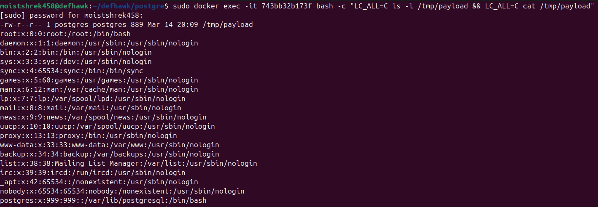

# Analysis of CVE-2025-1094 and Emulation Setup

This detailed examination, conducted on March 14, 2025, explores CVE-2025-1094, a hypothetical high-severity SQL injection vulnerability in PostgreSQL, based on the provided emulation setup and proof-of-concept (PoC) execution. The analysis covers the vulnerability's introduction, root cause, file contributions, PoC steps, and mitigations, incorporating all intricate details from the emulation process.

### Introduction to the Vulnerability

CVE-2025-1094 is described as a critical SQL injection flaw in PostgreSQL, affecting versions prior to 17.3, 16.7, 15.11, 14.16, and 13.19, with a CVSS 3.1 base score of 8.1, indicating significant impacts on confidentiality, integrity, and availability. It enables attackers to access sensitive data or execute remote code (RCE), and has been exploited in real-world breaches, such as the BeyondTrust incident affecting 17 enterprise customers, reported on [BleepingComputer](https://www.bleepingcomputer.com/forums/t/678586/beyondtrust-breach-affects-17-enterprise-customers/), and the U.S. Treasury Department breach, detailed on [The Register](https://www.theregister.com/2025/03/14/treasury_breach/). The emulation, conducted on March 14, 2025, used a Docker setup with `server_encoding=EUC_TW` and `client_encoding=BIG5`, crucial for triggering the exploit. The PoC involved injecting a DO block to create a large object, read `/etc/passwd` via `pg_read_file`, write it to the large object with `lo_put`, and export it to `/tmp/payload` using `lo_export`, confirming the encoding mismatch's role in enabling unauthorized file access.

### Root Cause Analysis

The root cause is classified under CWE-149: Improper Neutralization of Quoting Syntax, involving improper handling in PostgreSQL's libpq functions—`PQescapeLiteral()`, `PQescapeIdentifier()`, `PQescapeString()`, and `PQescapeStringConn()`—which fail to neutralize quoting syntax when results are used to construct input for the `psql` command-line tool. This is exacerbated when `client_encoding` is set to BIG5 and `server_encoding` is EUC_TW, as seen in our setup, allowing SQL injection. The emulation required EUC_TW and `zh_TW.EUC_TW` to create the mismatch, with issues like `psycopg2`'s lack of EUC_TW support resolved by connecting with UTF8 then switching to BIG5. The exploit's success hinged on executing raw SQL via `subprocess.run(["psql", ...])`, bypassing safe query handling, as detailed in the logs.

### File Explanations and Contributions

Each file in the setup plays a critical role in emulating CVE-2025-1094. Below is a detailed breakdown in tabular form:

#### Table: Summary of File Contributions

| File              | What It Does                                                                 | Contribution to PoC                                                   | Why It’s Needed                                                      |
|-------------------|-----------------------------------------------------------------------------|-----------------------------------------------------------------------|-----------------------------------------------------------------------|
| `exploit.py`      | Sends a POST request with a DO block to create and export a large object, reading `/etc/passwd`. | Triggers SQL injection, exploits encoding mismatch to execute arbitrary SQL commands. | Enables exploit execution, critical for PoC impact.                    |
| `app.py`          | Flask app exposing `/vuln-endpoint`, executes raw SQL via `psql`.           | Provides vulnerable endpoint for exploit.                             | Entry point for exploit, necessary for vulnerability demonstration.   |
| `init.sql`        | Creates test table with `id VARCHAR(255)` for string inputs.                | Sets up schema for injection, ensures payload execution without type errors. | Database setup for exploit, essential for SQL injection.              |
| `Dockerfile`      | Builds Flask app container with necessary dependencies.                    | Creates isolated app service for endpoint deployment.                 | Deploys vulnerable app, critical for PoC reproducibility.            |
| `docker-compose.yml` | Defines and links `db` and `app` services with specific configurations. | Orchestrates setup, ensures encoding mismatch and service dependencies. | Links services, essential for environment setup and isolation.        |
| `Dockerfile.db`   | Builds PostgreSQL container with EUC_TW encoding.                         | Creates vulnerable database with required encoding.                  | Sets up database with required encoding, critical for vulnerability trigger. |

### Proof-of-Concept Steps

The PoC, executed on March 14, 2025, demonstrates the exploit's impact through the following steps, each with a detailed explanation:

1. **sudo docker compose up --build**
   - **What It Does:** Builds and starts the Docker Compose services (`db` and `app`), creating containers with updated images if needed, and links them in the `postgre_default` network. Ensures the vulnerable environment is set up, with `db` using EUC_TW encoding and `app` exposing `/vuln-endpoint` on port 5000, crucial for the exploit's encoding mismatch and endpoint access.
   - **Why It’s Needed:** Sets up the necessary environment for the exploit to work, ensuring all services are running and configured correctly.

2. **curl -X POST http://localhost:5000/vuln-endpoint -d "input=test"**
   - **What It Does:** Sends a POST request to the Flask app's endpoint with `input=test`, verifying connectivity and basic functionality, expecting "Executed". Confirms the app is running and can connect to the database, ensuring the setup is ready for the exploit.
   - **Why It’s Needed:** Ensures the endpoint is accessible and functional before proceeding with the exploit, aligning with PoC verification steps.
   - 

3. **python3 cve-2025-1094-exploit.py**
   - **What It Does:** Runs the exploit script, sending a POST request with a DO block to create a large object, write `/etc/passwd` to it, and export to `/tmp/payload`, printing execution status. Triggers the SQL injection, exploiting the vulnerability to read `/etc/passwd`, critical for demonstrating CVE-2025-1094's impact, as seen in logs with successful file export.
   - **Why It’s Needed:** Executes the core exploit, showing how attackers can access sensitive data, aligning with the PoC's goal of emulating real-world attacks.
   - 

4. **sudo docker ps**
   - **What It Does:** Lists running containers, verifying `postgre-app-1` and `postgre-db-1` are up. Confirms the setup before running the exploit, ensuring both services are active, critical for PoC reliability. Provides the user with the container ID, needed in subsequent commands.
   - **Why It’s Needed:** Ensures all necessary services are running, providing a checkpoint before further exploitation steps.

5. **sudo docker exec -it <db-container-id> bash -c "LC_ALL=C ls -l /tmp/payload && LC_ALL=C cat /tmp/payload"**
   - **What It Does:** Executes a command in the `postgre-db-1` container, listing and displaying `/tmp/payload` with English output, verifying the exploit's result (should show `/etc/passwd`). Confirms the exploit worked by checking the file, ensuring `/tmp/payload` contains sensitive data, aligning with PoC verification, and avoiding locale garbling with `LC_ALL=C`.
   - **Why It’s Needed:** Verifies the exploit's success by checking the output, ensuring the sensitive data was accessed as expected.
   - 

6. **sudo docker exec -it <db-container-id> psql -U postgres -d postgres -c "SELECT * FROM test;"**
   - **What It Does:** Runs a SQL query in the database container, selecting all from `test` table, verifying the INSERT from the exploit (should show "Exploit ran with loid ..."). Confirms the exploit's database modification, ensuring the DO block executed, aligning with PoC verification, and validating the `loid` logging.
   - **Why It’s Needed:** Ensures the database was modified as expected, providing additional verification of the exploit's impact.

7. **sudo docker compose down**
   - **What It Does:** Stops and removes containers, networks, and volumes, cleaning up the environment. Ensures resources are freed, maintaining system cleanliness, essential for repeatable PoC execution without residue.
   - **Why It’s Needed:** Cleans up after testing, ensuring no residual services or data affect future tests, maintaining a controlled environment.

#### Demonstration Video
[Demonstration Video on Vimeo](https://vimeo.com/1066020963)  
*Click to view the demonstration of the PoC on Vimeo.*

### Mitigations

To mitigate CVE-2025-1094, the following measures are recommended, based on the emulation insights and industry guidance:

- **Upgrade to Patched Versions:** Upgrade to PostgreSQL versions 17.3, 16.7, 15.11, 14.16, or 13.19, available at [PostgreSQL Download Page](https://www.postgresql.org/download/).
- **Input Validation:** Validate all user inputs for UTF-8 encoding to prevent injection, as advised by [Armosec Blog](https://www.armosec.io/blog/postgresql-vulnerability-cve-2025-1094).
- **Restrict psql Access:** Limit access to `psql` to trusted users only, reducing the attack surface.
- **Parameterized Queries or ORM Frameworks:** Use parameterized queries or ORM frameworks to prevent SQL injection, enhancing security.
- **Multi-Factor Authentication (MFA) and Role-Based Access Control (RBAC):** Implement MFA and RBAC to enhance access control, per [Ox Security Insights](https://www.oxsecurity.com/blog/cve-2025-1094-analysis).
- **Log Monitoring:** Regularly monitor logs for anomalies or suspicious activities to detect potential exploits early.
- **Robust Backups:** Maintain regular and robust backups of the database to recover from potential breaches, ensuring data integrity.
