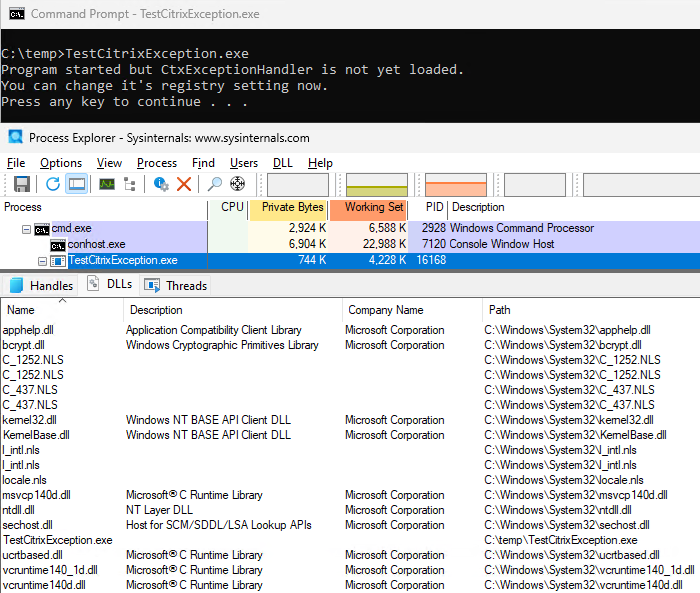

# Test Citrix Exception (test CVE-2025-6759 mitigation)
Citrix documentation about [CVE-2025-6759](https://support.citrix.com/support-home/kbsearch/article?articleNumber=CTX694820) contains alternative mitigation by disabling Citrix exception handler from registry.

However, that documentation does not answer the question: _Will this change need VDA service or server restart or not?_ so this tool was built do test it.

Sources:
* [CTX676735](https://support.citrix.com/external/article?articleUrl=CTX676735-ctxexceptionhandler-dump-under-cprogramdatacitrixcdfreports&language=en_US) provides a bit more information about how that exception handling and its registry keys works.
* [Blog post from Rapid 7](https://www.rapid7.com/blog/post/cve-2025-6759-citrix-virtual-apps-and-desktops-fixed/) tells us that processes related to this vulnerability are `GfxMgr.exe` and `CtxGfx.exe`
  * **NOTE!** It seems that file `GfxMgr.exe` does not exist at all in environments which do not have [HDX 3D Pro/HDX Graphics](https://docs.citrix.com/en-us/citrix-daas/graphics/hdx-3d-pro.html) feature installed so most likely this vulnerability do not even affect those but _it is impossible to be certain about that unless Citrix provices us more information about this issue_.

# Research
## How exception handler is loaded?
On standard installation exception handler is located to folder `C:\Program Files\Citrix\ExceptionHandler` and with [Process Explorer](https://learn.microsoft.com/en-us/sysinternals/downloads/process-explorer) we can see that `CtxGfx.exe` processes running in VDA servers _do not_ have exception handler DLLs loaded.

It means that those DLLs are loaded dynamically only when needed and that why changes to registry settings should activate immediately even for already running VDA processes.

## Testing with TestCitrixException.exe
You can find binary version of TestCitrixException.exe from [releases](https://github.com/olljanat/TestCitrixException/releases).

When runned, it stops to wait "Press any key to continue..." and you can see with Process Explorer that in this point exception handler DLLs are not yet loaded:

When you continue that process, the exception handler will create folder `C:\ProgramData\Citrix\CDF\Reports\TestCitrixException.exe` and memory dump to there.

When you do same again but this time change registry key, memory dump _will not_ be created :tada:
