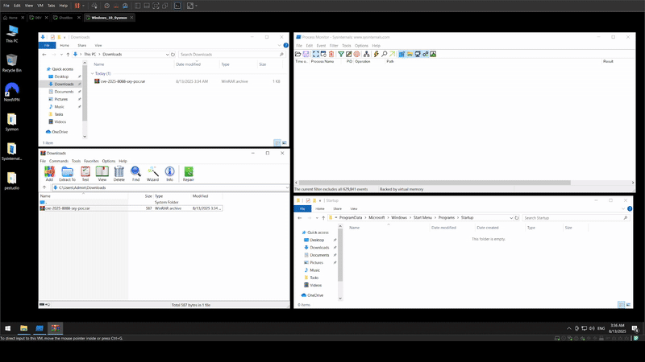

# CVE-2025-8088 WinRAR Proof of Concept (PoC-Exploit)



This repository contains a Proof of Concept (PoC) script for **CVE-2025-8088**, a path traversal vulnerability in WinRAR versions up to **7.12**.
This PoC demonstrates how attackers could exploit the vulnerability to place malicious files outside the intended extraction directory using **alternate data streams (ADSes)** and crafted archive files.

> **Disclaimer:** This tool is for educational and research purposes only. Do not use it to harm systems or networks. The author is not responsible for misuse or damage caused by this script.

---

## Overview of CVE-2025-8088

**CVE-2025-8088** (CVSS 8.4) is a path traversal vulnerability in WinRAR, affecting Windows versions up to **7.12**, as well as related tools like **UnRAR.dll** and its portable source code.
The flaw allows attackers to embed malicious payloads in **ADSes** within specially crafted RAR files, enabling extraction to sensitive system locations (e.g., the Windows Startup folder).
This can lead to automatic execution of malicious files, such as **DLLs** or shortcut (`.lnk`) files, upon system reboot.

### Key Details
- **Affected Versions:** WinRAR ≤ 7.12
- **First Observed:** Exploitation in the wild began on **July 18, 2025** (per ESET)
- **Patch Availability:** Fixed in WinRAR **7.13**, released on **July 30, 2025**
- **Attackers:** Linked to the Russia-aligned **RomCom** group (aka Storm-0978, Tropical Scorpius, UNC2596), known for cyberespionage and financially motivated attacks
- **Attack Method:** Spearphishing emails with RAR files disguised as job applications, targeting finance, defense, manufacturing, and logistics sectors in Europe and Canada

---

## How the Exploit Works

The exploit leverages **path traversal sequences (`..`)** in ADS paths within a RAR archive.
A seemingly harmless file (e.g., a resume) masks malicious ADS entries, which may include:

---

## PoC Usage

This script creates a malicious RAR archive to demonstrate the CVE-2025-8088 vulnerability.
It requires **Python** and access to `rar.exe` (WinRAR's command-line tool).


Ensure `rar.exe` is in your system PATH or specify its path using the `--rar` argument.

### Command-Line Arguments

| Argument         | Description                                                                                   | Required? | Default                          |
|------------------|-----------------------------------------------------------------------------------------------|-----------|----------------------------------|
| `--decoy`        | Path to decoy file (existing or will be created)                                               | Yes       | -                                |
| `--payload`      | Path to harmless payload file (existing or will be created)                                    | Yes       | -                                |
| `--drop`         | Absolute path to benign folder (e.g., `C:\Users\you\Documents`)                             | Yes       | -                                |
| `--rar`          | Path to `rar.exe` (auto-discovered if omitted)                                                 | No        | Auto-discovered                  |
| `--out`          | Output RAR filename                                                                            | No        | `cve-2025-8088-sxy-poc.rar`      |
| `--workdir`      | Working directory                                                                              | No        | Current directory (`.`)          |
| `--placeholder_len` | Length of ADS placeholder (auto: ≥ max(len(injected), 128))                                 | No        | Auto-calculated                  |
| `--max_up`       | Number of `..` segments to prefix                                                              | No        | 16                               |
| `--base_out`     | Name for intermediate base RAR                                                                 | No        | `<out>.base.rar`                 |

---

## Example Usage

Create a malicious RAR archive with a decoy file, a payload, and a target drop folder, specifying the path to `rar.exe`:

```bash
python poc.py --decoy resume.txt --payload payload.bat --drop "C:\Users\you\Documents" --rar "C:\Program Files\WinRAR\rar.exe"
```

---

## Attribution

This vulnerability was first observed in the wild by **ESET** on **July 18, 2025**, and is attributed to the **RomCom** hacking group.
For more on RomCom's tactics, see **SOCRadar Threat Actor Intelligence**.
