> [!NOTE]
> see CVE-2025-24813/ for python exploit example.
> Ref: https://unit42.paloaltonetworks.com/apache-cve-2025-24813-cve-2025-27636-cve-2025-29891/

CVE-2025-24813 exploit breakdown:

### Executive Summary

##

In March 2025, Apache disclosed CVE-2025-24813, a vulnerability impacting Apache Tomcat. This is a widely used platform that allows Apache web servers to run Java-based web applications. The flaw allows remote code execution, affecting Apache Tomcat versions 9.0.0.M1 to 9.0.98, 10.1.0-M1 to 10.1.34 and 11.0.0-M1 to 11.0.2.

The same month, Apache revealed two additional vulnerabilities in Apache Camel, a message routing middleware framework. These vulnerabilities are CVE-2025-27636 and CVE-2025-29891, two flaws that allow remote code execution, affecting Apache Camel versions 4.10.0 to 4.10.1, 4.8.0 to 4.8.4 and 3.10.0 to 3.22.3.

These vulnerabilities are significant because millions of developers rely on the platform provided by the Apache Foundation. Successful exploitation of these vulnerabilities can allow attackers to execute arbitrary code with Tomcat/Camel privileges.

Apache has released patches, and researchers quickly published proof‑of‑concept (PoC) exploits. Scans and probes for vulnerable servers were seen in the wild shortly after the disclosures. We have confirmed the potential for remote code execution from these three vulnerabilities.

Palo Alto Networks blocked 125,856 probes/scans/exploit attempts related to these vulnerabilities in March 2025. We advise organizations to apply patches promptly.

### CVE-2025-24813: Apache Tomcat

##

### Vulnerability Overview

CVE-2025-24813 is a vulnerability in Apache Tomcat's partial PUT feature that can allow attackers to overwrite serialized session files on disk, leading to arbitrary code execution.

This vulnerability arises when Tomcat is configured to persist HTTP session data, because unpatched Tomcat systems improperly handle partial PUT requests containing the Content-Range header.

### Partial PUT

The term “partial PUT” refers to an HTTP PUT request that updates only part of a resource instead of replacing it entirely. When supported, partial PUT typically uses the Content-Range header in an HTTP request to specify which part of the resource should be modified.

This allows clients to upload or overwrite resource segments in chunks. Partial PUT can be exploited to perform incremental file uploads, overwrite specific parts of files, or bypass certain security checks if not properly handled.

### Session Persistence Feature in Apache Tomcat

Apache Tomcat's HTTP session manager includes a session persistence feature. This feature saves session data to a file or database when the server is shut down, and it reloads this cached data when the server is restarted. Session data contains information such as user login status and preferences, and this feature helps preserve a user's session data across server restarts.

Tomcat encodes this saved session data as a stream of bytes using a process called serialization and stores the serialized data in the local file system. It serializes all session attributes stored in the HttpSession object. This includes any data your web application explicitly places in the session using session.setAttribute(). The information is typically stored somewhere under $TOMCAT_HOME/webapps/ROOT/.

However, the serialized session data is stored in the same directory used by Tomcat's executePartialPut function. Users can craft HTTP requests to control the session ID and the filename of the cached data in this directory. This could allow an attacker to intentionally set the session ID to match the cached filename of malicious code previously saved to the cache. This can result in deserialization of the cached file, triggering the embedded malicious code.

### Preconditions

The Content-Range header is often used with partial updates. This header indicates the request body contains a portion of the resource rather than the entire resource. If an HTTP PUT request contains a Content-Range header, Tomcat saves the content (body) of the PUT request to the cache location. The following code snippet shows that Tomcat saves the data from an HTTP PUT request that contains content.

```html
if (range != null) {

File contentFile = executePartialPut(req, range, path);
```

A vulnerable Tomcat configuration must have two preconditions to exploit this vulnerability:

    A disabled readonly parameter in the Tomcat configuration file at $TOMCAT_HOME/conf/web.xml. The section of web.xml that contains a disabled readonly parameter follows.


```xml
<init-param>

<param-name>readonly</param-name>

<param-value>false</param-value>

</init-param>

[end code]

Session persistence is enabled in the Tomcat configuration file at $TOMCAT_HOME/conf/content.xml. The section of content.xml that demonstrates enabled session persistence follows.

[begin code]

<Manager className="org.apache.catalina.session.PersistentManager">

<Store className="org.apache.catalina.session.FileStore" />

</Manager>
```

### Exploiting the Vulnerability
##

We tested the exploitation of CVE-2025-24813 in March 2025. Exploiting this vulnerability consists of two steps:

First, stage the payload by ending it as a file through an HTTP PUT request with content range and a self-defined filename in the URL. This file contains serialized malicious code for later deserialization.

Next, trigger the exploit by sending an additional HTTP GET request containing a cookie consisting of JSESSIONID= immediately followed by the self-defined filename prefixed by a period. In this case, the cookie line would read Cookie: "JSESSIONID=.[filename]" as Figure 1 below shows. This will trigger deserialization of the cache to run the malicious code.


<p align="center">
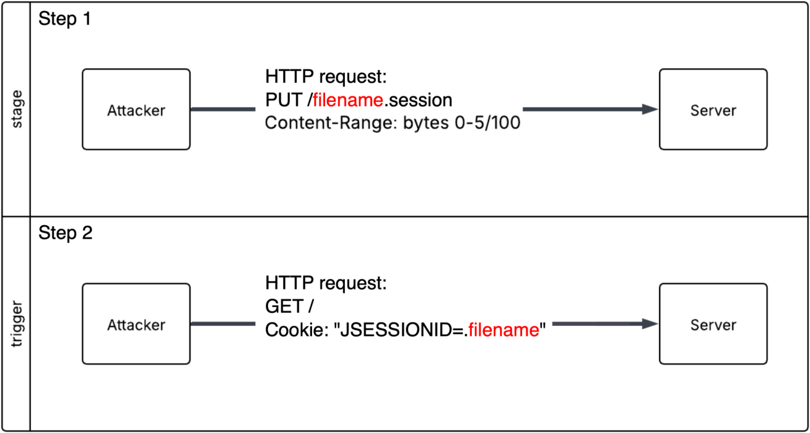
</p>
Figure 1. Two steps of the exploit.

### Step 1: Stage the Serialized Malicious Code
##

This first step consists of sending a file of serialized malicious code as the body of an HTTP PUT request. Apache Tomcat will cache the malicious code as a session file on the local file system, since the name of the file in the URI ends in .session as Figure 2 shows in the PUT header line.

Figure 2 shows the first step’s PUT request with gopan.session as a filename. The format of this HTTP PUT request from the traffic is: PUT /[filename].session HTTP/1.1

<p align="center">
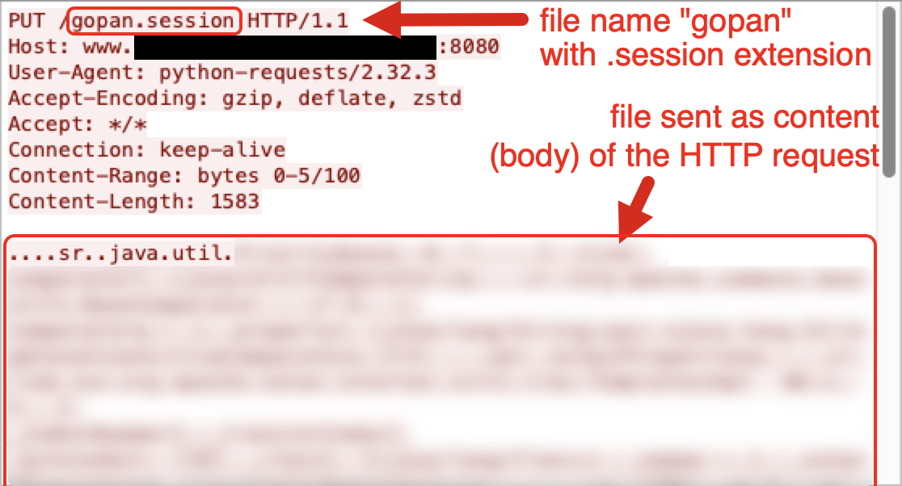
</p>
Figure 2. Payload in step 1.

### Step 2: Trigger the Exploit
##

The second step consists of sending a follow-up HTTP GET request to trigger the exploit and run the malicious code. Figure 3 shows the HTTP GET request with the JSESSIONID cookie value used in the previous step. The format of this cookie is: Cookie: JSESSIONID=.[filename]

<p align="center">
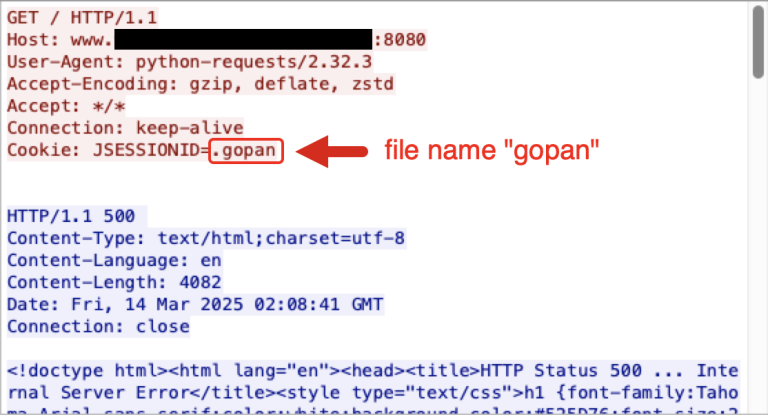
</p>
Figure 3. Exploiting the vulnerability to run the payload previously sent in step 1.


The cookie value for this exploit uses a period (.) before the filename value of the JSESSIONID. This leading period will lead Tomcat to save the session file with the leading dot.

### Source Code Analysis
##

How Tomcat Caches the PUT Body to a File

As Figure 4 shows, Tomcat first checks if the readonly flag is enabled in the configuration file. If so, Tomcat does not write any code to the cache, including the malicious code.

<p align="center">
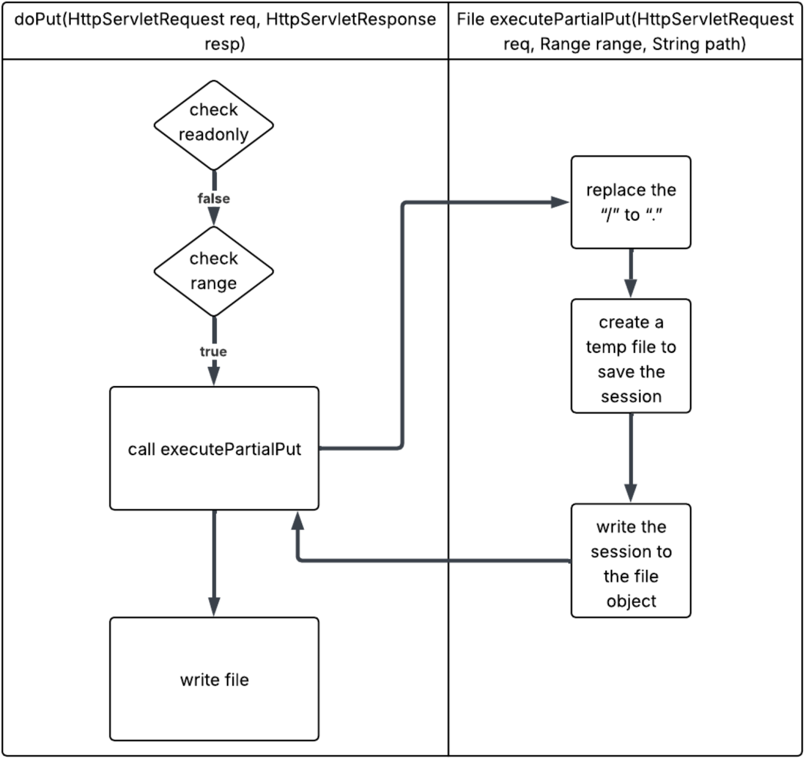
</p>
Figure 4. Step one: From PUT to write a file.

    If the readonly flag is not enabled, Tomcat will also check the Content‑Range field in the HTTP header

    If the request lacks a Content‑Range header, Tomcat ends the process

    If the request has a Content‑Range header, Tomcat saves the session data from the HTTP PUT request, in this case gopan.session, in two locations as shown in Figure 5

        The first is saved as a normal cache file under $TOMCAT_HOME/webapps/ROOT/ without the leading period

        The second is saved as a temporary file with a leading period under the work directory at $TOMCAT_HOME/work/Catalina/localhost/ROOT/


<p align="center">
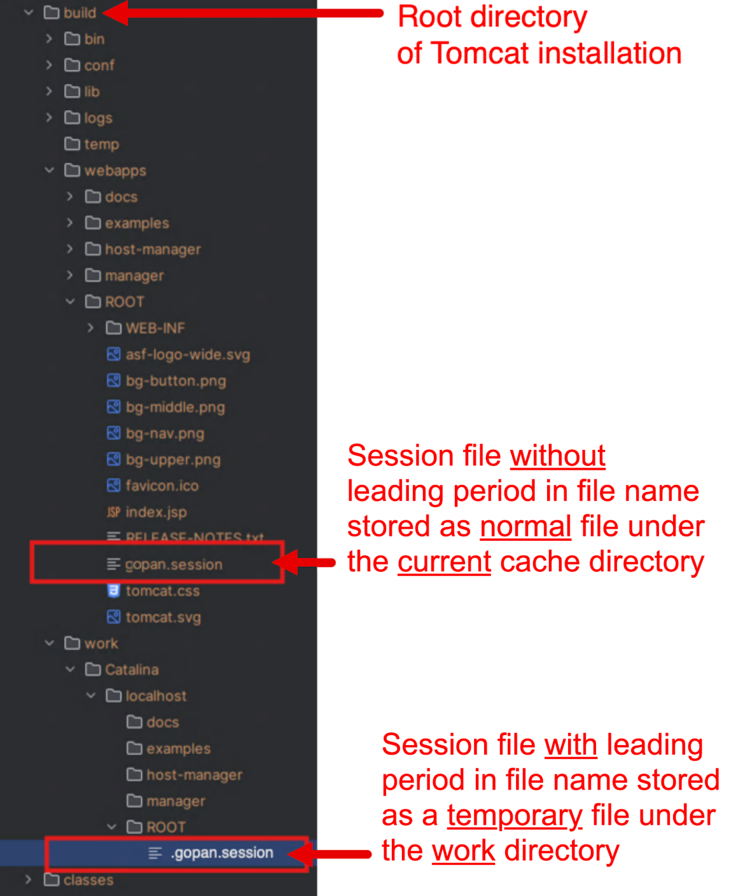
</p>
Figure 5. Cached session file.

Crucially, when Tomcat restores a session, it also loads the cached session file from the same work folder.

Figures 6 and 7 show code segments from the default Java servlet that Tomcat uses to load cached session files when restoring a session at java/org/apache/catalina/servlets/DefaultServlet.java. Comments in yellow describe actions taken by the code.

<p align="center">
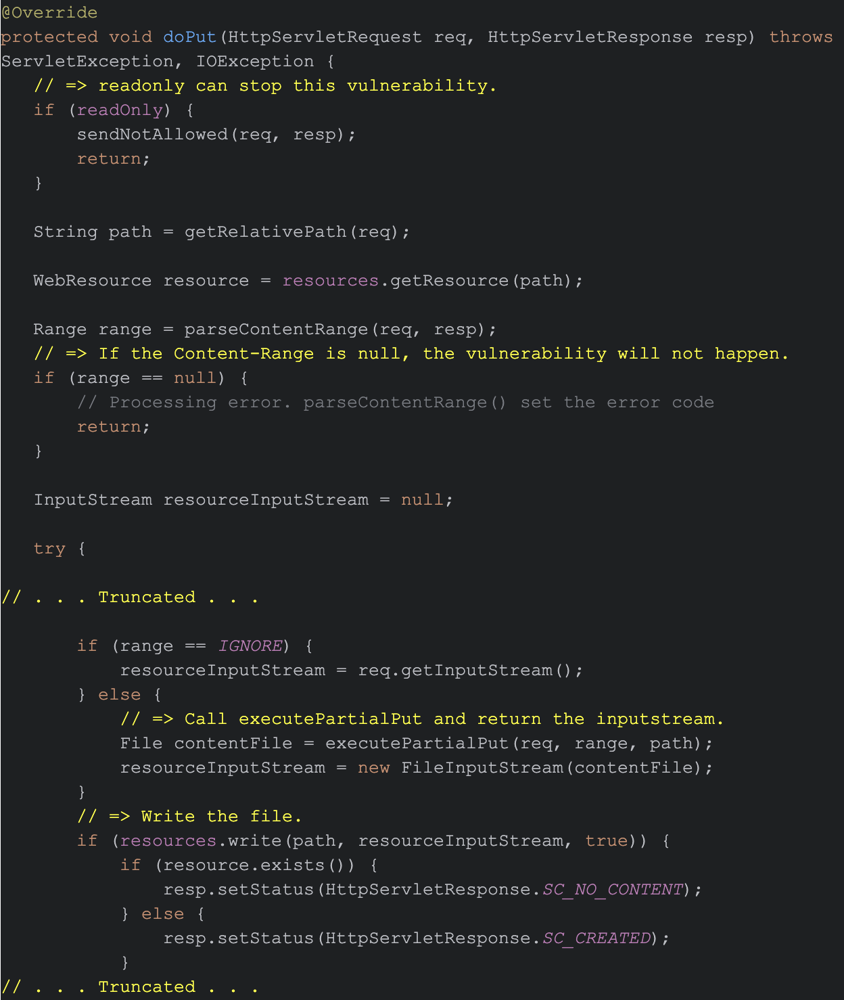
</p>
Figure 6. First code segment from Apache's default Java servlet used by Tomcat.


<p align="center">
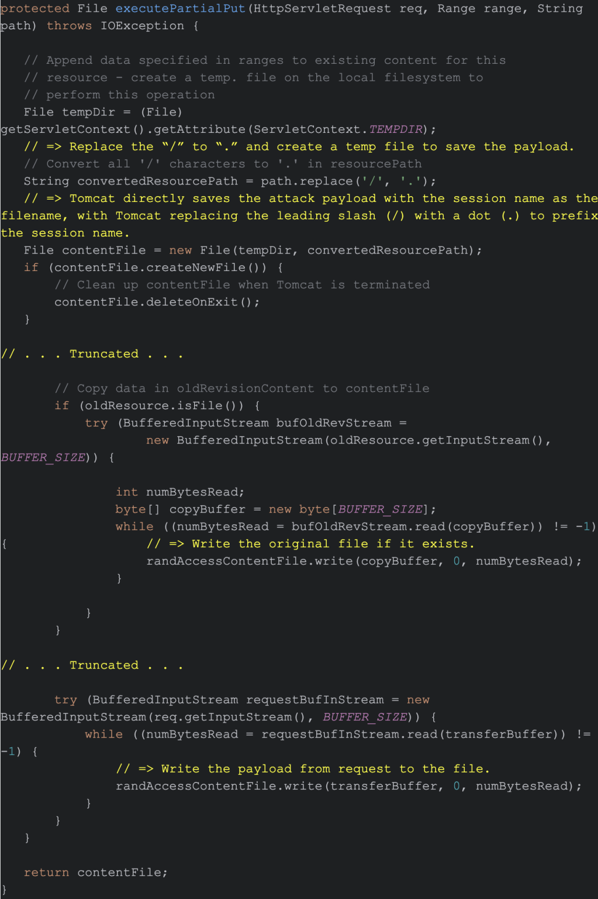
</p>
Figure 7. Second code segment from Apache's default Java servlet used by Tomcat.

How the Vulnerability Is Triggered by an HTTP Request

When Tomcat receives an HTTP request with a session ID, if session persistence is enabled in the configuration, it will try to find the session in memory. If Tomcat cannot find the session in memory, it restores the session from the saved cache file. At that point, Tomcat deserializes the session file, as shown in Figure 8.

<p align="center">
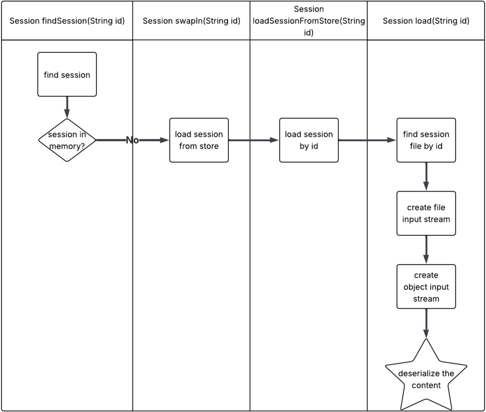
</p>
Figure 8. Step two: From sessionID to deserialization.

Figure 8 illustrates Tomcat’s session management flow. The code that locates sessions, loads them from disk and deserializes their contents is implemented in the following files:

    java/org/apache/catalina/session/PersistentManagerBase.java

    java/org/apache/catalina/Store.java

    java/org/apache/catalina/session/FileStore.java

Figure 9 shows a code segment from java/org/apache/catalina/session/PersistentManagerBase.java that directs Tomcat to find a file for the session data, if the session data is not available in memory.

<p align="center">
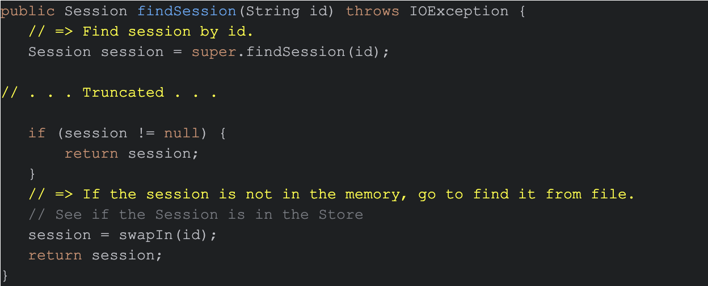
</p>
Figure 9. Code segment from PersistentManagerBase.java to find session data as a file if not in memory.

Figures 10 and 11 show code segments from the same PersistentManagerBase.java file that illustrate how it loads the session data from a saved cache file.

<p align="center">
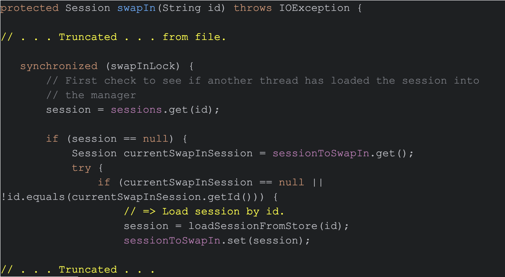
</p>
Figure 10. Code segment from PersistentManagerBase.java to load session from file (1 of 2).

<p align="center">
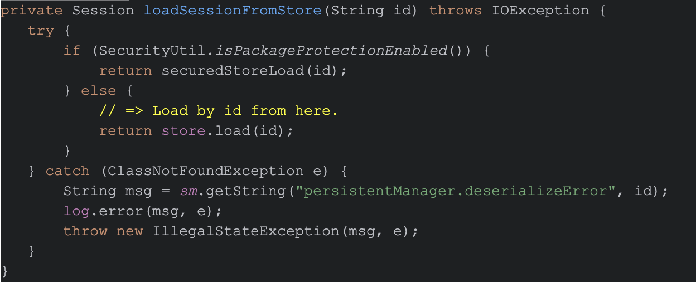
</p>
Figure 11. Code segment from PersistentManagerBase.java to load session from file (2 of 2).

As Figure 11 shows, store.load(id) triggers deserialization, awakening the malicious code previously embedded in the file by the attacker. This results in arbitrary code execution.

Reviewing this source code first reveals how Tomcat saves session data from an HTTP PUT request, a process by which an attacker can store malicious code. This review also provides insight on how an exploit for the CVE-2025-24813 vulnerability can be triggered by a single follow-up HTTP GET request.

But Tomcat is not the only Apache software that we've seen exploit attempts for in the wild. We have also noted exploit attempts for two vulnerabilities in Apache Camel.

