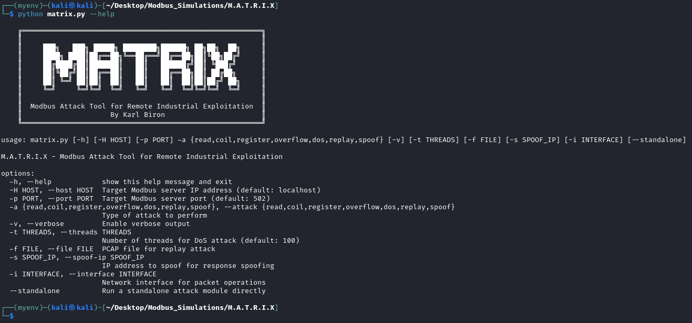

[](https://www.python.org/downloads/release/python-390/)
[](https://github.com/yourusername/matrix/releases)
[](https://opensource.org/licenses/MIT)
[](https://github.com/yourusername/matrix/issues)
[](https://www.trustwave.com/en-us/resources/blogs/spiderlabs-blog/lights-out-and-stalled-factories-using-matrix-to-learn-about-modbus-vulnerabilities/)

## Featured Technical Article
📝 **[Lights Out and Stalled Factories: Using M.A.T.R.I.X to Learn About Modbus Vulnerabilities](https://www.trustwave.com/en-us/resources/blogs/spiderlabs-blog/lights-out-and-stalled-factories-using-matrix-to-learn-about-modbus-vulnerabilities/)**
Check out the Trustwave SpiderLabs technical article that demonstrates M.A.T.R.I.X in action against a vulnerable Modbus TCP server dockerized target. The article provides detailed walkthroughs of each attack module, complete with practical examples and security insights tailored to industrial control systems in the energy and manufacturing sectors. A must-read for anyone looking to understand the practical applications of this tool in ICS security testing. 


# M.A.T.R.I.X

**Modbus Attack Tool for Remote Industrial eXploitation**

M.A.T.R.I.X is a comprehensive security testing tool for Modbus TCP protocol implementations. It provides multiple attack modules for security research and penetration testing of industrial control systems.

> ⚠️ **WARNING**: This tool is designed for authorized security testing only. Using this tool against systems without proper permission is illegal and unethical.

## Features

M.A.T.R.I.X includes the following attack modules:

- **Unauthorized Read**: Scans and reads values from Modbus registers and coils
- **Coil Attack**: Unauthorized writes to coil registers
- **Register Attack**: Unauthorized writes to holding registers
- **Overflow Attack**: Tests for integer overflow vulnerabilities
- **DoS Attack**: Denial of Service attack through connection flooding
- **Replay Attack**: Captures and replays Modbus traffic
- **Spoof Attack**: Spoofs Modbus responses with falsified data

## Installation

in container:
```bash
# replace with your interface
podman build -t matrix --build-arg interface=wlo1 .
podman run -it --name matrix matrix

$ python3 matrix.py -h

    ╔═════════════════════════════════════════════════════════╗
    ║                                                         ║
    ║     ███╗   ███╗ █████╗ ████████╗██████╗ ██╗██╗  ██╗     ║
    ║     ████╗ ████║██╔══██╗╚══██╔══╝██╔══██╗██║╚██╗██╔╝     ║
    ║     ██╔████╔██║███████║   ██║   ██████╔╝██║ ╚███╔╝      ║
    ║     ██║╚██╔╝██║██╔══██║   ██║   ██╔══██╗██║ ██╔██╗      ║
    ║     ██║ ╚═╝ ██║██║  ██║   ██║   ██║  ██║██║██╔╝ ██╗     ║
    ║     ╚═╝     ╚═╝╚═╝  ╚═╝   ╚═╝   ╚═╝  ╚═╝╚═╝╚═╝  ╚═╝     ║
    ║                                                         ║
    ║  Modbus Attack Tool for Remote Industrial eXploitation  ║
    ║                     By Ghost                            ║
    ╚═════════════════════════════════════════════════════════╝
    
usage: matrix.py [-h] [-H HOST] [-p PORT] -a {read,coil,register,overflow,dos,replay,spoof} [-v] [-t THREADS] [-f FILE] [-s SPOOF_IP] [-i INTERFACE] [--standalone]

M.A.T.R.I.X - Modbus Attack Tool for Remote Industrial eXploitation

options:
  -h, --help            show this help message and exit
  -H, --host HOST       Target Modbus server IP address (default: localhost)
  -p, --port PORT       Target Modbus server port (default: 502)
  -a, --attack {read,coil,register,overflow,dos,replay,spoof}
                        Type of attack to perform
  -v, --verbose         Enable verbose output
  -t, --threads THREADS
                        Number of threads for DoS attack (default: 100)
  -f, --file FILE       PCAP file for replay attack
  -s, --spoof-ip SPOOF_IP
                        IP address to spoof for response spoofing
  -i, --interface INTERFACE
                        Network interface for packet operations
  --standalone          Run a standalone attack module directly
```

on host:

1. Clone the repository:
   ```
   cd matrix
   ```

2. Set up the virtual environment (optional but recommended):
   ```
   python3 -m venv venv
   source venv/bin/activate  # On Windows, use 'venv\Scripts\activate'
   ```

3. Install dependencies:
   ```
   pip install -r requirements.txt
   ```

4. Ensure you have proper permissions for packet operations (for spoof and replay attacks):
   ```
   sudo apt-get install libpcap-dev  # On Debian/Ubuntu
   ```

## Usage

M.A.T.R.I.X Help Output:

Banner ASCII Font: [ANSI Shadow](https://patorjk.com/software/taag/#p=display&f=ANSI%20Shadow&t=MATRIX)



Basic usage:
```
python matrix.py -H <target_ip> -p <port> -a <attack_type>
```

Attack types:
- `read`: Unauthorized read operation
- `coil`: Coil register write attack
- `register`: Holding register write attack
- `overflow`: Register overflow attack
- `dos`: Denial of Service attack
- `replay`: Traffic replay attack
- `spoof`: Response spoofing attack

### Examples

Perform unauthorized read on a local Modbus server:
```
python matrix.py -H localhost -p 502 -a read
```

Launch DoS attack with 50 threads:
```
python matrix.py -H 192.168.1.10 -p 502 -a dos -t 50
```

Replay Modbus traffic from a PCAP file:
```
python matrix.py -H 192.168.1.10 -p 502 -a replay -f captured_traffic.pcap
```

Spoof Modbus responses:
```
python matrix.py -H 192.168.1.10 -p 502 -a spoof -s 192.168.1.20 -i docker0
```

## Project Structure

```
matrix/
├── matrix.py                                      # Main tool script
├── requirements.txt                               # Dependencies
├── README.md                                      # Documentation
└── attacks/                                       # Attack modules
    ├── __init__.py                                # Package initialization
    ├── modbus_unauthorized_read.py                # Unauthorized read module
    ├── modbus_coil_write_attack.py                # Coil attack module
    ├── modbus_holding_registers_write_attack.py   # Register attack module
    ├── modbus_overflow_attack.py                  # Overflow attack module
    ├── modbus_dos_attack.py                       # DoS attack module
    ├── modbus_replay_attack.py                    # Replay attack module
    └── modbus_spoof_response.py                   # Response spoofing module
```

## Architecture

The M.A.T.R.I.X tool is designed with a modular architecture that separates the command-line interface from the individual attack modules. This section provides insights into the tool's structure through class diagrams, package organization, and attack workflow visualization.

### Class Diagram


The class diagram illustrates the object-oriented architecture of M.A.T.R.I.X:

- **MatrixCLI**: The central command-line interface class that processes user arguments and orchestrates the execution of attack modules.
  - Contains methods for parsing arguments, displaying help information, and initializing attack modules.
  - Manages the execution flow and reporting of results.

- **Attack Modules**: Each specialized attack functionality is encapsulated in its own class:
  - **ModbusUnauthorizedReader**: Implements functions for scanning and reading values from Modbus registers and coils without authorization.
  - **ModbusUnauthorizedCoilWriter**: Contains methods for unauthorized manipulation of coil states.
  - **ModbusUnauthorizedHoldingRegisterWriter**: Handles unauthorized writing to holding registers.
  - **ModbusOverflowAttacker**: Implements methods to test for integer overflow vulnerabilities in Modbus implementations.
  - **ModbusReplayAttacker**: Provides functionality to capture, analyze, and replay Modbus traffic for attack simulation.
  - **ModbusResponseSpoofer**: Implements methods to craft and send falsified Modbus responses.
  - **ModbusDosAttacker**: Contains methods for executing denial-of-service attacks through connection flooding.

Each attack module inherits common attributes like host IP, port, and ModbusTcpClient instances, while implementing unique attack functionality through specialized methods.

### Package Structure


The package organization of M.A.T.R.I.X follows a logical structure:

- **The M.A.T.R.I.X Project** (Yellow container): The overall project boundary.
  - **matrix.py**: The main CLI interface file that serves as the entry point for the tool.
  - **README.md**: Documentation for the project.
  - **requirements.txt**: Lists the project dependencies.

- **The 'attacks' Folder** (Orange container): Contains all attack module implementations.
  - **__init__.py**: Package initialization file that enables importing from the attacks package.
  - **Individual attack modules**: Seven Python files implementing specific attack functionalities.

- **External Dependencies** (Blue container): Shows the third-party libraries required by the project.
  - **pymodbus**: Primary library for Modbus protocol implementation.
  - **scapy**: Used for packet manipulation in spoofing and replay attacks.
  - **tabulate**: Provides formatted table output for better readability of results.

The arrows between components represent import relationships, showing how the modules connect and depend on each other.

### Attack Workflows


The workflow diagram outlines the execution process for each attack type:

- **Unauthorized Read Attack**: 
  - Connects to the target Modbus server
  - Sequentially reads values from coils, discrete inputs, holding registers, and input registers
  - Reports the discovered information

- **Unauthorized Coils/Registers Write Attack**:
  - Establishes a connection to the target
  - Writes unauthorized values to coils or registers
  - Reads back the changed values to verify the attack was successful
  - Confirms changes were applied to the target system

- **DoS Attack**:
  - Initializes multiple threads for concurrent connections
  - Creates numerous connections to the target
  - Floods the server with Modbus requests
  - Continuously monitors target response to determine impact

- **Replay Attack**:
  - Loads captured Modbus traffic from a PCAP file
  - Extracts and analyzes Modbus packet structures
  - Replays captured request packets to the target
  - Compares original and new responses to identify discrepancies

- **Spoof Attack**:
  - Crafts custom Modbus responses with falsified data
  - Sets the source address to match a legitimate Modbus server
  - Sends the spoofed packets to the target
  - Observes system behavior to assess impact

All attack workflows conclude with a comprehensive results report.

### Implementation Notes

The modular design allows for:
- Easy extension with new attack modules
- Independent testing and development of individual attack types
- Consistent interface across different attack functionalities
- Simplified maintenance and updates

## Design Pattern

M.A.T.R.I.X follows the [Command pattern](https://www.oreilly.com/library/view/head-first-design/9781492077992/ch06.html), where each attack module encapsulates a specific action with a consistent execution interface. This design allows the main program to invoke different attacks without knowing their specific implementation details.

Key aspects of the Command pattern implementation:
- Each attack module represents a command with methods like `run_test()`, `launch_attack()`, or `run_comprehensive_scan()`
- The main program (`matrix.py`) acts as the invoker that selects and executes the appropriate command
- All commands share similar initialization parameters (host, port) for consistent interface
- Each command encapsulates all the logic needed for its specific attack type

This design makes it easy to add new attack types without modifying existing code, adhering to the Open/Closed Principle.

## Dependencies

M.A.T.R.I.X relies on the following key dependencies:

- **pymodbus**: Core library for Modbus TCP protocol communication, used for reading and writing to Modbus registers and coils
- **scapy**: Powerful packet manipulation library used for crafting custom packets in spoof attacks and analyzing PCAP files in replay attacks
- **tabulate**: Used to create formatted tables for displaying attack results in a readable format

Additional system requirements:
- **libpcap-dev**: Required for the packet capture functionality used in replay and spoof attacks
- **Root privileges**: Required for sending raw packets in spoofing attacks and capturing packets in replay attacks

## Advanced Usage

### Standalone Mode

Some attack modules can be run in standalone mode with elevated privileges:

```
sudo python matrix.py -H 192.168.1.10 -p 502 -a replay --standalone -f traffic.pcap
```

```
sudo python matrix.py -H 192.168.1.10 -p 502 -a spoof --standalone -s 192.168.1.20 -i eth0
```

Standalone mode is particularly useful for attacks that require root privileges or direct system access.

## Legal Disclaimer

This tool is provided for educational and authorized testing purposes only. Users are responsible for obtaining proper authorization before testing any systems. The authors accept no liability for misuse of this software.

## License

This project is licensed under the MIT License, meaning you are free to use, modify, and distribute it under proper ethical guidelines.
