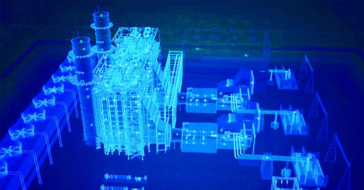

### Industrial Control Systems / SCADA
##

  

Threat actors utilize a variety of attack vectors to compromise ICS and SCADA systems, which manage critical infrastructure and industrial processes. 

### Common Attack Vectors:

    Outdated Software: 
    
    Legacy systems often run on outdated software with limited security features, making them vulnerable.
    
    Insecure Network Connections:
    
    Poorly secured networks, including remote access points, can be exploited to gain unauthorized access. These connections can include unsecured remote access of ICS components.

    Social Engineering and Phishing: 
    
    Attackers use deception to trick personnel into revealing credentials or installing malware.

    Supply Chain Compromise: 
    
    Threat actors may target vendors to inject malicious code during the production or update process, bypassing perimeter defenses.

    Insider Threats: 
    
    Malicious or careless employees or contractors can exploit their access to cause harm.

    Malware and Ransomware: 
    
    These threats can disrupt production, disable safety systems, and cause costly downtime in OT environments.

    Insecure Communication Protocols: 
    
    Many legacy systems utilize protocols lacking encryption, making them susceptible to data interception and manipulation.

    Insufficient Network Segmentation: 
    
    A lack of segmentation allows attackers to move freely across the network once they gain access, increasing the potential impact of a breach.

    Weak Authentication and Authorization: 
    
    Inadequate authentication mechanisms can enable unauthorized access and privilege escalation.

    Physical Security Weaknesses: 
    
    Unsecured locations can lead to direct tampering or intrusions. 

### Factors Contributing to Vulnerability:

    Lack of security by design: 
    
    Many older ICS/SCADA systems were not built with modern security in mind.

    Convergence of IT and OT: 
    
    Connecting operational technology (OT) with information technology (IT) networks expands the attack surface and increases exposure to threats.

    Lack of network segmentation: 
    
    Insufficient network segmentation makes it easier for attackers to move laterally.

    Unpatched vulnerabilities: 
    
    Difficulty in patching systems in critical environments without affecting operations leaves vulnerabilities exposed.

    Inadequate security policies and training: 
    
    Lack of awareness and formal training can make personnel susceptible to social engineering attacks.

    Unsecure remote access: 
    
    Necessary remote access features, if not properly secured, can create gateways for attackers. 