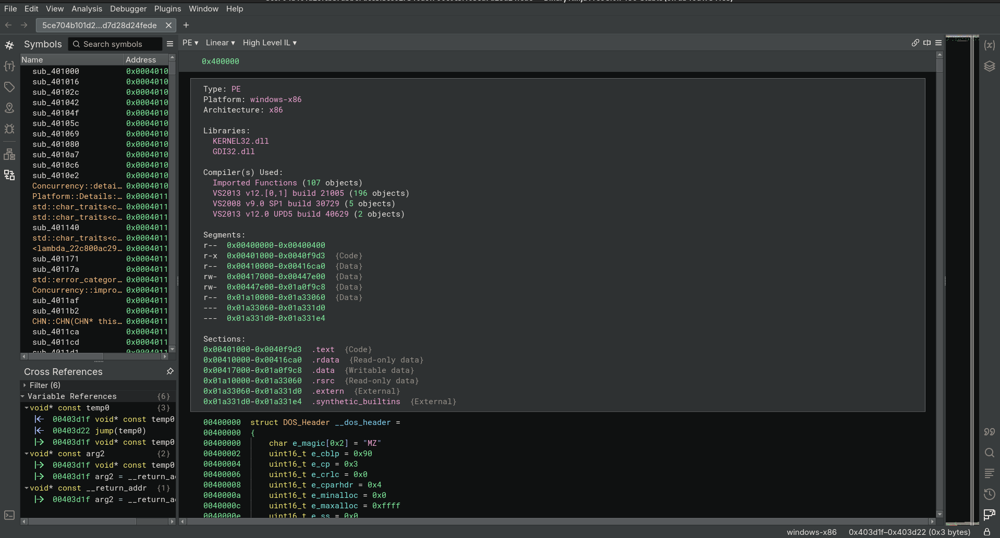
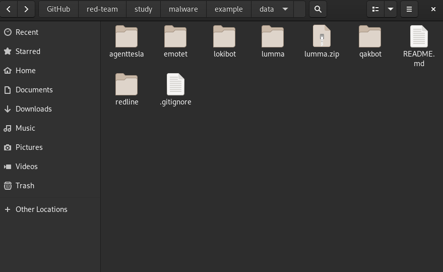
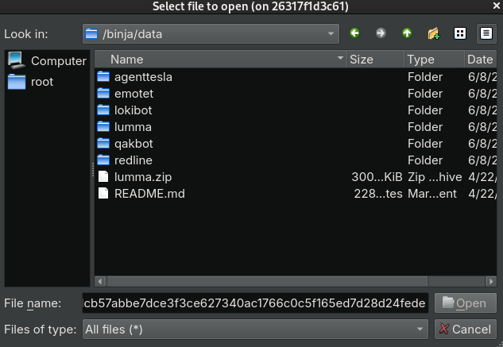
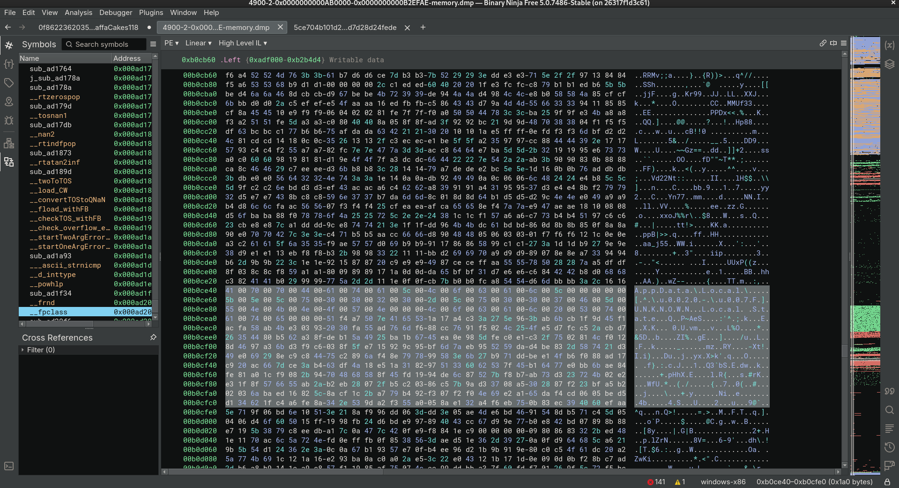

## Example, Lumma

Static & Behavioral Analysis:

https://tria.ge/250608-xbtrmsyyav/behavioral1

> [!NOTE]
>
> Notice that static analysis picked up nothing.  Traditional anti-malware won't pick up much of anything these days.

## Decompile, Disassemble, Debug

```sh
podman build -t binja -f binja.Dockerfile

xhost +local:podman

mkdir ./data

podman run --rm -it --name binja \
    --security-opt label=type:container_runtime_t \
    -v /tmp/.X11-unix:/tmp/.X11-unix \
    -v ./data:/binja/data:Z \
    -e DISPLAY=$DISPLAY \
    -e XDG_RUNTIME_DIR=$XDG_RUNTIME_DIR \
    binja

# select cancel on prompt
```

##

Load lumma stealer binary example:

<p align="center">
  
</p>

##

Analyze with binja:

<p align="center">
  
</p>

##

Load samples into ./data directory and reverse your heart away.

<p align="center">
  
</p>

##

Select malware to have a looksies.

<p align="center">
  
</p>

##

Now pretend you are with the NSA.

<p align="center">
  
</p>

##

<p align="center">
  
</p>