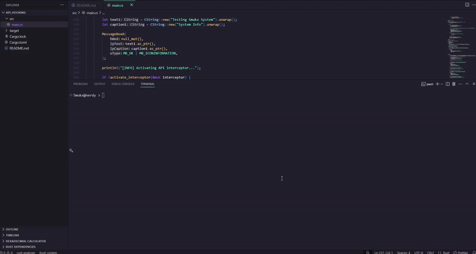

# API Hooking using Trampoline

## Explanation
The System API Interceptor is a Rust-based utility for intercepting and monitoring Windows API calls, specifically targeting the `MessageBoxA` function in `user32.dll`. It employs inline function hooking via a trampoline to redirect calls to a custom handler, log parameters, and invoke `MessageBoxW` with modified text.
d
### How It Works [Step-By-Step]
1. **Interceptor Structure (`ApiInterceptor`)**:
   - Stores the target function address (`MessageBoxA`), replacement function address, original code bytes, and original memory protection state.
   - Uses a fixed-size array (`INTERCEPTOR_SIZE`) for storing original bytes (14 bytes for 64-bit, 5 bytes for 32-bit).

2. **Setup (`setup_interceptor`)**:
   - Resolves `MessageBoxA` address using `GetModuleHandleA` and `GetProcAddress`.
   - Copies the first `INTERCEPTOR_SIZE` bytes of `MessageBoxA` to preserve the original code.
   - Changes memory protection to `PAGE_EXECUTE_READWRITE` using `VirtualProtect` to allow code modification.

3. **Activation (`activate_interceptor`)**:
   - Constructs a trampoline to redirect execution:
     - **64-bit**: Uses `jmp [rip+0]` (6 bytes) followed by an 8-byte absolute address of the custom handler.
     - **32-bit**: Uses `jmp <relative>` (5 bytes) with a relative offset to the custom handler.
   - Writes the trampoline to the `MessageBoxA` entry point, ensuring minimal instruction overwriting.

4. **Custom Handler (`custom_dialog`)**:
   - Logs input parameters (`lpText`, `lpCaption`) using `CStr::to_string_lossy`.
   - Converts new text to UTF-16 using `WideCString` for `MessageBoxW`.
   - Calls `MessageBoxW` with modified text ("Smukx Is Good") and caption ("System Dialog").

5. **Deactivation (`deactivate_interceptor`)**:
   - Restores the original `MessageBoxA` bytes from the stored copy.
   - Reverts memory protection to its original state using `VirtualProtect`.
   - Clears the interceptor structure to prevent reuse.

6. **Safety Considerations**:
   - Uses `unsafe` blocks for WinAPI calls and pointer operations, ensuring controlled access.
   - Validates pointers and handles errors from WinAPI functions (e.g., `GetLastError`).
   - Maintains thread safety by avoiding shared mutable state.

### Key Features
- **Cross-Architecture**: Adapts trampoline construction for 32-bit and 64-bit systems.
- **Non-Invasive**: Preserves original function behavior during deactivation.
- **Error Handling**: Checks for null pointers and failed WinAPI calls.
- **Logging**: Outputs parameter details for debugging and monitoring.

## How to Compile and Use It

1. **Compilation**:
   - Build: `cargo build --release`.
   - Output: `target/release/Api_Hooking.exe`.

2. **Execution**:
   - Run: `target/release/Api_Hooking.exe`.
   - Behavior:
     - Displays an initial `MessageBoxA` dialog.
     - Activates interceptor, showing a modified `MessageBoxW` dialog.
     - Deactivates interceptor and shows a final `MessageBoxA` dialog.
     - Exits on Enter key press.
   - Run as administrator if memory protection changes fail.

3. Download the Snippet: [Download](https://download.5mukx.site/#/home?url=https://github.com/Whitecat18/Rust-for-Malware-Development/tree/main/Api_Hooking)

## Credits

- https://github.com/ZeroMemoryEx/TrampHook
- https://www.ired.team/offensive-security/code-injection-process-injection/how-to-hook-windows-api-using-c++
- https://www.packtpub.com/en-us/product/mastering-malware-analysis-9781789610789/chapter/inspecting-process-injection-and-api-hooking-6/section/inline-api-hooking-with-trampoline-ch06lvl1sec86

