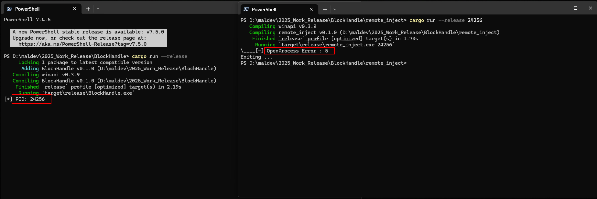

# BlockHandle

The idea is to modify the Security Descriptor of the current process to control who can interact with it. (e.g read its memory, terminate it, etc). It uses a Security Descriptor Definition Language (SDDL) string to define these permissions and applies them to the process using Windows api functions.

## PoC



## Features

1. Deny all access to "Everyone" (any user or process not explicitly allowed).

2. Allow full access to the SYSTEM account and the process owner.

3. This makes the process "protected" against unauthorized access. For example:
    * ther users (even administrators) cannot easily terminate it, attach a debugger, or inspect its memory unless they escalate to SYSTEM or use the owner’s credentials.
    * Tools like Task Manager might fail to kill the process if run by a non-owner/non-SYSTEM user.

## How it works !

```
D:P(D;OICI;GA;;;WD)(A;OICI;GA;;;SY)(A;OICI;GA;;;OW)
```

`D:` - Specifies the Discretionary Access Control List (DACL), which defines permissions for the process. <br>

`P` - Indicates the DACL is protected (cannot be modified by inheritable permissions from parent objects).

1. `(D;OICI;GA;;;WD)`:
    * D: Deny access.
    * OICI: Object Inherit and Container Inherit (applies to child objects if relevant).
    * GA: Generic All (full access).
    * WD: "World" (Everyone group).
    * Meaning: Denies all access to the "Everyone" group (i.e., any user or process not explicitly allowed).

2. `(A;OICI;GA;;;SY)`:
    * A: Allow access.
    * OICI: Object Inherit and Container Inherit.
    * GA: Generic All (full access).
    * SY: SYSTEM account.
    * Meaning: Grants full access to the SYSTEM account (a highly privileged account on Windows).

3. `(A;OICI;GA;;;OW)`:
    * A: Allow access.
    * OICI: Object Inherit and Container Inherit.
    * GA: Generic All (full access).
    * OW: Owner of the object (the user who created/launched the process).
    * Meaning: Grants full access to the process owner (the user running the program).


## Credits and Resources

* https://learn.microsoft.com/en-us/windows/win32/secauthz/security-descriptor-definition-language
* https://www.lewisroberts.com/2010/09/16/getting-started-with-sddl/
* https://learn.microsoft.com/en-us/windows/win32/api/securitybaseapi/nf-securitybaseapi-setkernelobjectsecurity
* https://github.com/mtth-bfft/winsddl

By 