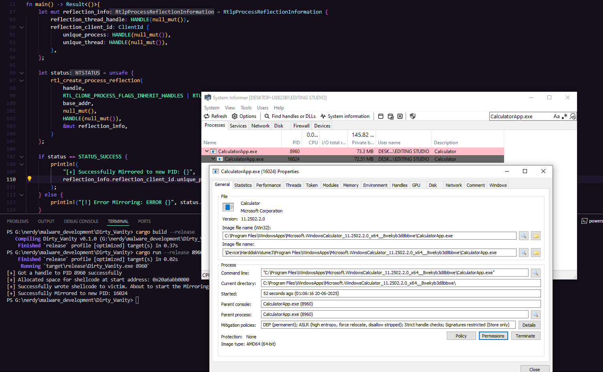

## Dirty Vanity

Dirty Vanity is a sophisticated code injection technique that exploits the Windows operating system's forking mechanism, specifically through process reflection and snapshotting, to evade Endpoint Detection and Response (EDR) systems. Unlike traditional code injection methods that follow a predictable "Allocate, Write, Execute" pattern, Dirty Vanity introduces a "Fork" primitive that disrupts EDR detection by separating the write and execution phases across different processes. This technique leverages the Windows fork APIs, such as RtlCreateProcessReflection or NtCreateProcessEx, to create a cloned process with the injected payload, which executes without triggering typical EDR monitoring hooks.

## How does it work ?

Dirty Vanity manipulates the Windows forking mechanism to bypass EDRs by executing malicious code in a forked process that appears clean to detection systems

1. Traditional Injection: Involves three steps:

    * Allocate: Reserve memory in the target process
    * Write: Inject shellcode into the allocated memory 
    * Execute: Run the shellcode  
    
    EDR's detect injections by correlating these three operations on the same process.

Here, The Dirty Vanity's approach is to split the execution phase into a separate forked process, breaking the correlation EDRs rely on. The forked process inherits the shellcode but appears untouched by write operations, evading detection.

Click here to : [Download PoC](https://download.5mukx.site/#/home?url=https://github.com/Whitecat18/Rust-for-Malware-Development/tree/main/Dirty_Vanity) 
## Credits / Resources

* https://www.deepinstinct.com/blog/dirty-vanity-a-new-approach-to-code-injection-edr-bypass
* https://github.com/deepinstinct/Dirty-Vanity

Written in Rust By 