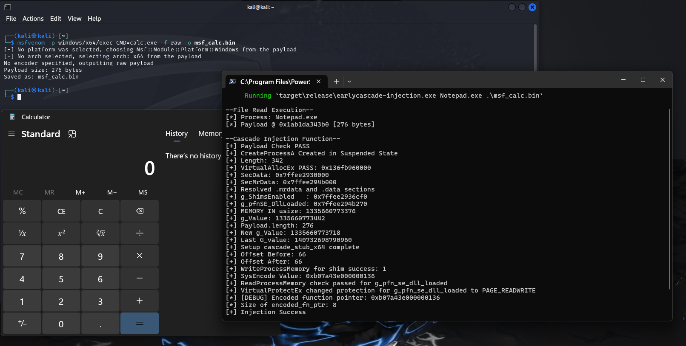

## EARLYCASCADE INJECTION IN RUST

This is just a simple PoC implementation of the early cascade injection technique documented by the Outflank blog post.

Special Thanks to [@C5pider](https://x.com/C5pider) for his POC for Early-Cascade Injection.

This code was tested on Microsoft Windows 11 Home [Version	10.0.22631]

## PoC 

Executing Calc.exe Shellcode



Download Earlycascade PoC: [Download](https://download.5mukx.site/#/home?url=https://github.com/Whitecat18/Rust-for-Malware-Development/tree/main/Early%20Cascade%20Injection)


### USAGE: 

```
cd earlycascade-injection

cargo run --release Notepad.exe .\w64-exec-calc-shellcode.bin
```

> Note: This PoC Only Supports x64 shellcodes. 

## Reference / Credit:

* https://github.com/Cracked5pider/earlycascade-injection?tab=readme-ov-file
* https://malwaretech.com/2024/02/bypassing-edrs-with-edr-preload.html
* https://www.outflank.nl/blog/2024/10/15/introducing-early-cascade-injection-from-windows-process-creation-to-stealthy-injection/


You can replace any shellcode if you need. I Just used calc.bin shellcode !

By 

For More PoC Codes. Please Check: [Rust for Malware Development](https://github.com/Whitecat18/Rust-for-Malware-Development/) Repository. 

