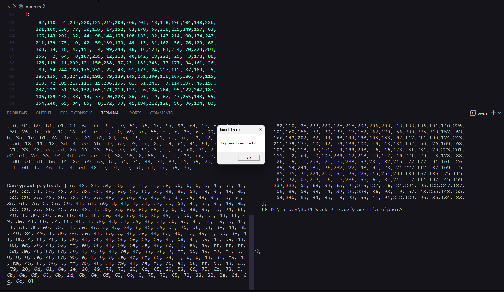

## Camellia Cipher with S-Box Randon Generator(Custom SEED)

The Camellia cipher is a block cipher, meaning it processes fixed-size chunks of data (blocks) at a time, typically 128 bits (16 bytes). It is often compared to AES (Advanced Encryption Standard) because both are highly secure and efficient.



## Usage and Works

```
cargo build --release

cargo run --release
```

### How it works ?

Camellia encrypts or decrypts data using a key. Encryption scrambles the data into an unreadable format, while decryption restores it back to its original form. This ensures that even if someone intercepts your data, they can't make sense of it without the correct key.

## Credits and Resources

* Grasp of Inner Workings: https://www.tutorialspoint.com/cryptography/cryptography_camellia_encryption_algorithm.htm
* Inspired By Cocomelonc: https://cocomelonc.github.io/malware/2024/12/29/malware-cryptography-38.html

Author
