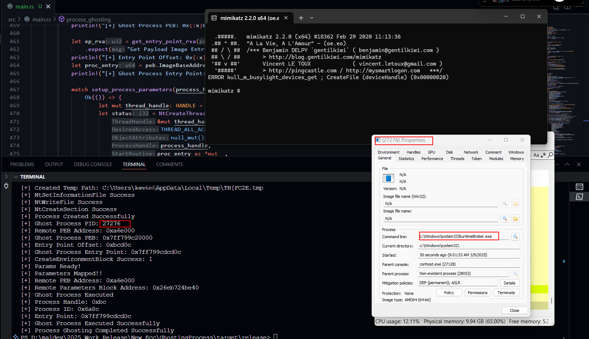

## ProcessGhosting in Rust

Process ghosting is an advanced technique used in Windows systems to create a new process in a way that hides or manipulates its presence from typical security tools or monitoring mechanisms. Imagine you’re playing a game of hide-and-seek with a computer’s security system. Normally, when a program (or process) starts, it creates a file on the disk, loads it into memory, and runs it, leaving traces that security software can easily detect. Process ghosting, however, tricks the system by using a special method: it creates a temporary file, marks it for deletion (so it’s not easily visible), writes the program’s code into this file, and then maps it directly into memory as a section without leaving a permanent file on the disk. This new process is then launched from this in-memory section, making it look like a "ghost" because it doesn’t have a clear file origin that traditional antivirus or monitoring tools can trace.

### POC Image..

Download Process Ghosting PoC : [Download](https://download.5mukx.site/#/home?url=https://github.com/Whitecat18/Rust-for-Malware-Development/tree/main/GhostingProcess)

## Credits and Reference

* https://github.com/hasherezade/process_ghosting.git
