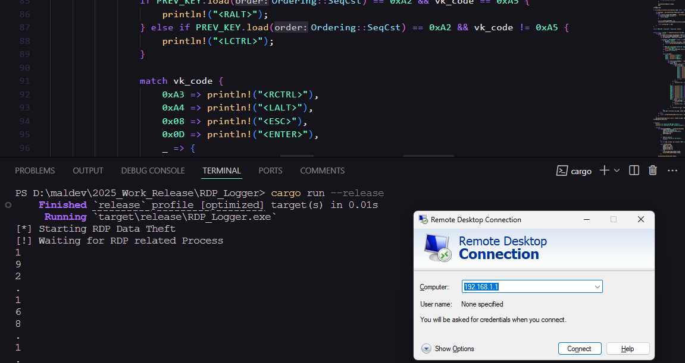

## RDP_Logger

A keystroke logger targeting the Remote Desktop Protocol (RDP) related processes, It utilizes a low-level keyboard input hook, allowing it to record keystrokes in certain contexts in mstsc.exe and CredentialUIBroker.exe



## Usage 

```
cargo build --release

./target/release/RDP_Logger.exe
```

Credits: 

* https://github.com/SaadAhla/TakeMyRDP.git


Author: 