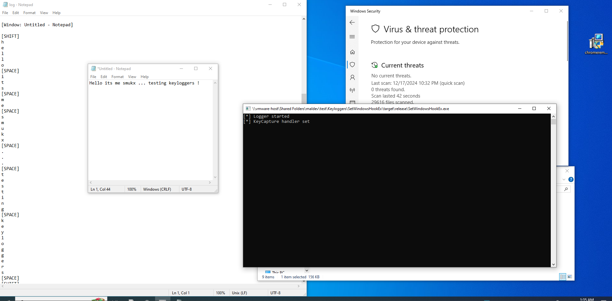

# Keylogger using SetWindowsHookEx

Written an keylogger for Windows using the SetWindowsHookEx fn. The keylogger captures keystrokes system-wide by setting a low-level keyboard hook to intercept and log all keyboard events.

> Uncomment the `#![windows_subsystem = "windows"]` line to run without console.

# Proofs

# Credits & Resources

* https://www.synacktiv.com/en/publications/writing-a-decent-win32-keylogger-13
* https://www.elastic.co/security-labs/protecting-your-devices-from-information-theft-keylogger-protection

Author: