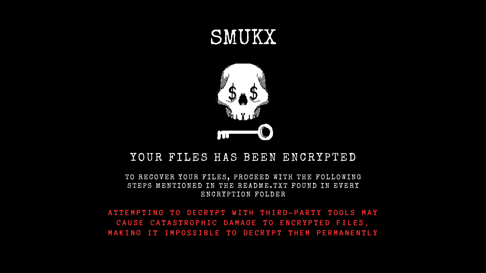

# Encryfer-X Ransomware V1.1 [Demo]

Pronunciation: **En-cry-fer-X**

<div align="center">
  
  <p><b>Encryfer-X</b> is malicious software written in <b>Rust</b>, designed to encrypt files on an infected system. It recursively scans the system and applies strong encryption algorithms to render files inaccessible. A decryption tool is required to recover encrypted files.</p>
  <p>Created by <a href="https://x.com/5mukx"></a></p>
</div>

**Algorithms Used**: AES-256, ChaCha20Poly1305

> ⚠️ **Note**: This ransomware is in an early stage, created for educational and research purposes only. It is not intended to harm or disrupt others. Significant changes have been made in the private repository, with advanced techniques to be released later.

## Features

- Parallel data encryption for stealth and speed
- Anti-debug techniques (99% pass rate)
- Anti-VM techniques
- Enhanced encryption methods
- Volume-based decryption
- Random delay (10-100ms) during encryption to evade detection
- Self-deletion techniques (on timer or reboot)

**Future Plans (Private)**:
- Polymorphic implementations
- Fileless execution
- Network propagation
- Data exfiltration
- Code obfuscation
- Time bombs

## How to Execute

> ⚠️ **Warning**: This content is for educational purposes only. The author is not responsible for misuse or negative consequences resulting from the use of this tool.

> ⚠️ **Note**: All features, including recursive volume encryption, are enabled by default. To test safely, comment out or modify the relevant functions.

To build the code:

```bash
cargo build --release
```

The binary file is located at: `./target/release/Encryfer-X.exe`

> ⚠️ **Note**: You need two components: a 32-byte AES key and an encrypted hex value containing AES-256 with ChaCha20Poly1305.

- **Demo Video**: [Tweet](https://x.com/5mukx/status/1829094735988076900)
- **Decryption Tool**: [Encryfer-X-Decryptor](../Encryfer-X-Decryptor/)
- **Key Generator**: [Random-Keys-Generator](../Random-Keys-Generator/)
- **More Offensive Code**: [Rust for Malware Development](https://github.com/Whitecat18/Rust-for-Malware-Development)
- **Download Bundle (Decryptor + Key Generator)**: [Link](https://download.5mukx.site/#/home?url=https://github.com/Whitecat18/Rust-for-Malware-Development/tree/main/Malware-Samples/Encryfer)
- **Download Encryfer-X**: [Link](https://download.5mukx.site/#/home?url=https://github.com/Whitecat18/Rust-for-Malware-Development/tree/main/Malware-Samples/Encryfer/Encryfer-X)
- **Follow for Resources**: 

## Important Notes

⚠️ **Info**: This is a demo version for learning how ransomware operates. The key combinations are basic and detectable by EDR sensors. The private rewritten version includes advanced key obfuscation, sleep obfuscation, and CVE exploits. [Do not request access](https://x.com/5mukx).

## Credits

- [Smukx](https://x.com/5mukx)
