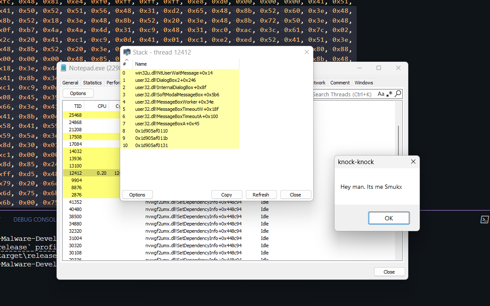

## Process Injection using NtCreateSection + NtMapViewOfSection

## Overview

This PoC program implements a process injection technique using Windows NT system calls:
- NtCreateSection
- NtMapViewOfSection
- RtlCreateUserThread



Download NtMapViewOfSection PoC: [Download](https://download.5mukx.site/#/home?url=https://github.com/Whitecat18/Rust-for-Malware-Development/tree/main/NtApi/NtMapViewOfSection)

## How does it work ?

1. **Setup**:
   - Takes a target PID as a command-line argument
   - Defines a shellcode array

2. **NTDLL Access**:
   - Loads ntdll.dll and gets function pointers for NtCreateSection, NtMapViewOfSection, and RtlCreateUserThread

3. **Section Creation**:
   - Creates a 4096-byte memory section with NtCreateSection
   - Sets it with execute/read/write permissions

4. **Memory Mapping**:
   - Maps the section into the current process with read/write permissions
   - Maps the same section into the target process with execute/read permissions
   - This creates a shared memory region between processes

5. **Injection**:
   - Copies the shellcode into the local mapped section
   - Since the section is shared, this makes it available in the target process

6. **Execution**:
   - Creates a new thread in the target process using RtlCreateUserThread
   - Sets the thread's starting address to the shellcode location
   - The shellcode executes in the target process's context

7. **Cleanup**:
   - Closes all handles to prevent resource leaks

## Requirements
- rustc 1.85.1 (4eb161250 2025-03-15)
- Rust toolchain (stable-x86_64-pc-windows-msvc (default))
- Target process PID

## Usage

```bash
cargo run --release <Target PiD>
```


## Credits / References

* https://www.ired.team/offensive-security/code-injection-process-injection/ntcreatesection-+-ntmapviewofsection-code-injection

Author: 

