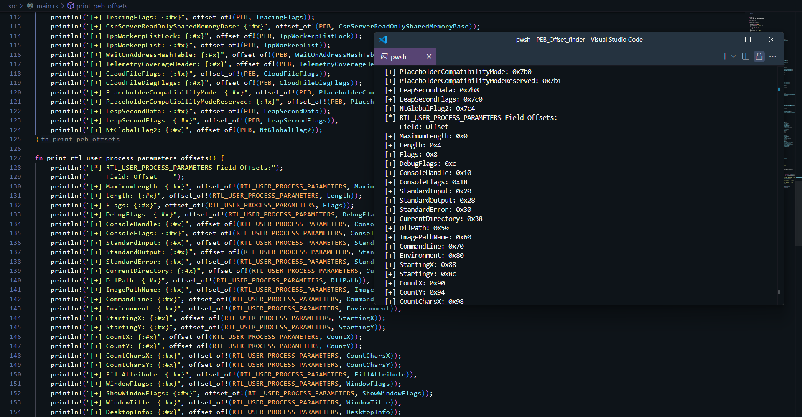

## PEB Offset Finder

This is a small program that prints the memory offsets of fields in two important Windows structures 
the Process Environment Block (PEB) and RTL_USER_PROCESS_PARAMETERS. 

If you’re digging into Windows internals or messing around with low-level system stuff, this tool is handy for figuring out where things are stored in memory.

## What’s It For?

So, why bother with this? The PEB and RTL_USER_PROCESS_PARAMETERS are like treasure maps for Windows processes. They hold some cool details like:

* The current directory (CurrentDirectory)
* Environment variables (Environment)
* Command-line arguments (CommandLine)
* Whether a debugger is attached (BeingDebugged)
* And even pointers to callback tables (KernelCallbackTable)
* And even more .....

If you are into malware development, reverse engineering, or just want to poke around Windows at a low level, knowing the exact offsets of these fields lets you access them directly in memory. This is super useful for example bypassing API by grabbing environment variables without calling GetEnvironmentVariableW? This helps you find Environment in memory.

Understanding Windows: It’s a great way to learn how Windows organizes process data under the hood.

## Credits 

* 