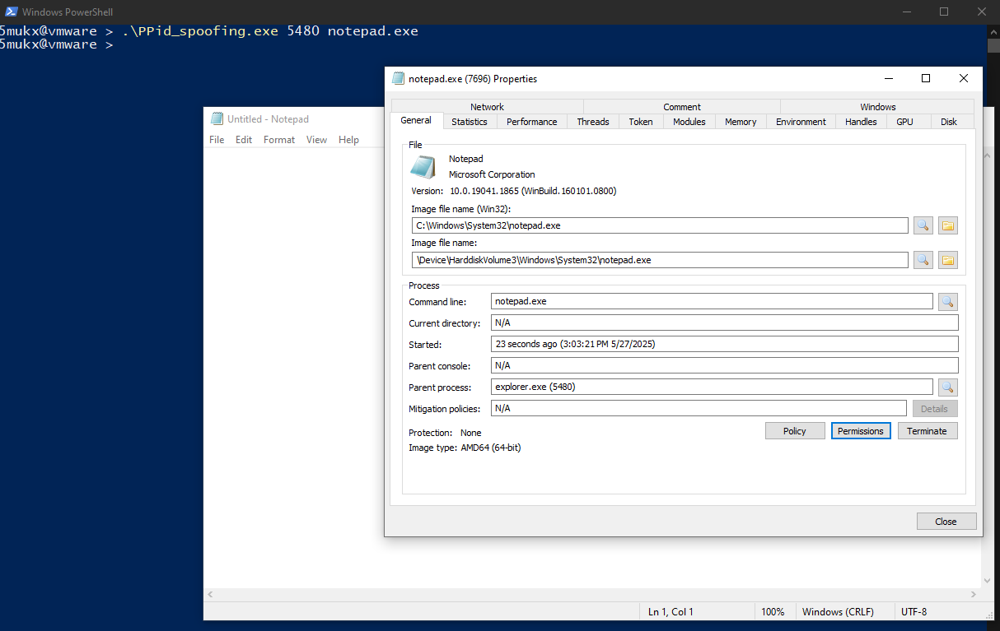

# PPID Spoofing

## Overview

PPID (Parent Process ID) spoofing is a technique used to make a newly created process appear as if it was spawned by a specified parent process, rather than the actual process creating it.



This Rust program uses the Windows API to perform PPID spoofing by leveraging `InitializeProcThreadAttributeList` and `UpdateProcThreadAttribute` to set a custom parent process handle for a new process.

## Requirements
- **Admin Privileges**: Required for enabling `SeDebugPrivilege` and accessing process handles.

## Usage
1. **Compile**:
   ```bash
   cargo build --release
   ```

2. **Run**:
   ```bash
   cargo run --release -- <ppid> <commandline>
   ```
   - `<ppid>`: The Process ID of the desired parent process (e.g., `explorer.exe`).
   - `<commandline>`: The command to execute (e.g., `"notepad.exe"` or `"cmd.exe /c dir"`).

   Example:
   ```bash
   cargo run --release -- 1234 "notepad.exe"
   ```

3. **Find a PPID**:
   ```bash
   tasklist | findstr explorer
   ```

4. **Run as Administrator**:
   - The program prompts for elevation if not run as admin.
   - Use an elevated Command Prompt or PowerShell.

## How It Works
- **Elevation**: Checks if running as admin; if not, relaunches with `runas`.
- **SeDebugPrivilege**: Enables debug privileges for process handle access.
- **PPID Spoofing**:
  - Opens the target parent process using `OpenProcess`.
  - Allocates and initializes a process attribute list with `InitializeProcThreadAttributeList`.
  - Sets the parent process handle using `UpdateProcThreadAttribute`.
  - Creates the new process with `CreateProcessW`, spoofing the PPID.
- **Cleanup**: Closes handles and frees memory.


## Download 

Download this PoC: [Download](https://download.5mukx.site/#/home?url=https://github.com/Whitecat18/Rust-for-Malware-Development/tree/main/Persistence/PPid_spoofing)

## Credits / Resources

* https://github.com/Whitecat18/Rust-for-Malware-Development/blob/main/Persistence/ppid_spoofing.rs
* https://www.ired.team/offensive-security/defense-evasion/parent-process-id-ppid-spoofing
* https://trustedsec.com/blog/ppid-spoofing-its-really-this-easy-to-fake-your-parent
