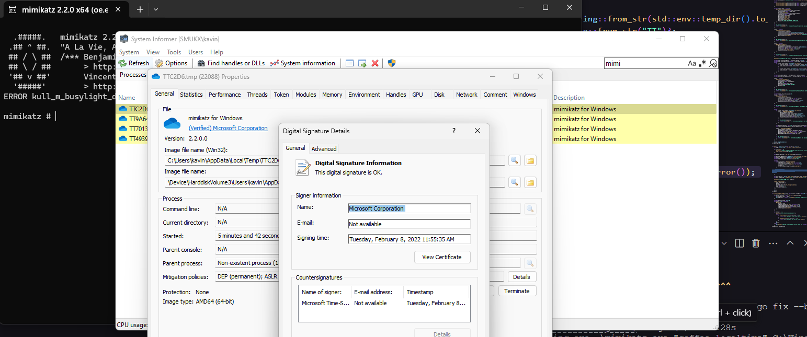

# Process Herpaderping

Process Herpaderping is a method of obscuring the intentions of a process by modifying the content on disk after the image has been mapped. This results in curious behavior by security products and the OS itself.

[⬇️ Download](https://download.5mukx.site/#/home?url=https://github.com/Whitecat18/Rust-for-Malware-Development/tree/main/Process/Herpaderping)



## Usage

1. Build the project using Cargo:
   ```bash
   cargo build --release
   ```

2. Run the executable:
   ```bash
   ./target/release/Herpaderping.exe mimikatz.exe C:\Windows\System32\OneDriveSetup.exe

   ```
