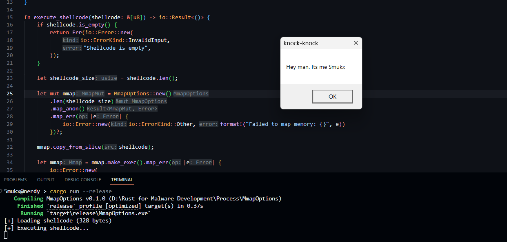

## SHELLCODE EXECUTION USING memmap2 crate

This PoC uses the memmap2's MmapOptions to create an anonymous memory mapping with read/write permissions.

## Source / Resources

* https://docs.rs/memmap2/latest/memmap2/struct.MmapOptions.html
* Refered some C Programs:
    * https://gist.github.com/libcrack/8ccc5e75e164c7959fa070ba9061e51b
