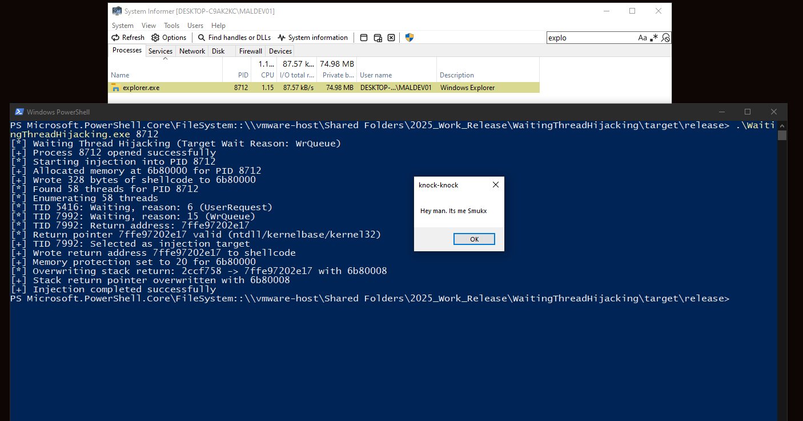

# Waiting Thread Hijacking

Waiting Thread Hijacking technique, a stealthy process injection method that hijacks a waiting thread in a target process to execute shellcode. It avoids common detection triggers like SuspendThread or SetThreadContext by manipulating a thread’s return address. Read the [article](https://research.checkpoint.com/2025/waiting-thread-hijacking/) for more information.



Download PoC: [Download](https://download.5mukx.site/#/home?url=https://github.com/Whitecat18/Rust-for-Malware-Development/tree/main/WaitingThreadHijacking)


## Compile/Run

```rust
cargo build --release
```

```rust
./target/release/WaitingThreadHijacking.exe <PID>
```

## Credits / References

* Blog - https://research.checkpoint.com/2025/waiting-thread-hijacking/
* By [Hasherezade](https://twitter.com/hasherezade) -https://github.com/hasherezade/waiting_thread_hijacking

For More PoC: [Main Menu](./README.md)