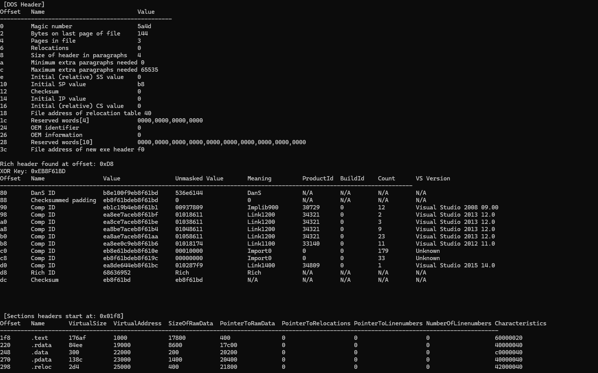

# PE_Analyzer [Main] Rust

A Rust-based PE (Portable Executable) file analyzer that provides detailed information about Windows executable files.



## Features

- Parse and analyze PE file headers
- Display file characteristics
- Show section information
- Extract import and export tables
- Analyze PE file structure

## Requirements

- Rust (latest stable version)
- Cargo package manager

## Installation

Clone the repository and build the project:

```bash
cargo build --release
```

## Usage

Run the analyzer with a PE file path as an argument:

```bash
cargo run -- <path-to-pe-file>
```


*