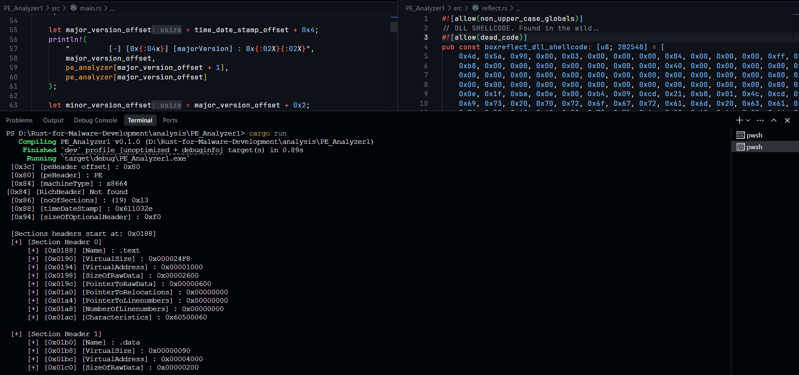

## Analysis Series

The Analysis series provides in-depth examinations of various aspects of Portable Executable (PE) files. Each entry in this series focuses on different features and functionalities, offering insights into the structure and behavior of PE files.

For more detailed analysis, you can explore the following directories:

- [Check-DBG](./check_dbg/)
- [PE_Analyzer1](./PE_Analyzer1)
- [PE_Analyzer2](./PE_Analyzer2)

