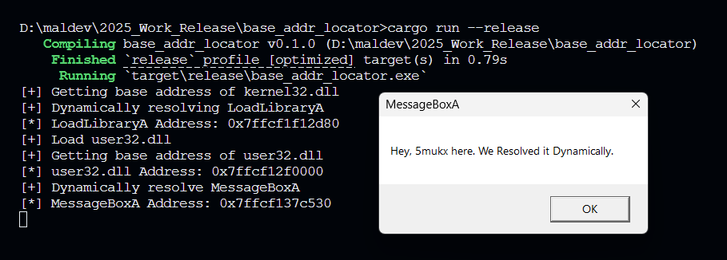

### BASE ADDRESS LOCATOR

This Rust program demonstrates a technique for dynamically resolving and calling Windows API functions without directly linking to them at compile time. Instead, it manually finds these functions in memory at runtime by,
    
1. Locating the base address of loaded DLLs `kernel32.dll` and `user32.dll` using the Process Enviroinment Block (PEB).
2. Parsing the export tables of these DLLs to find the memory address of specfic functions.
3. Calling those functions to load a library.

### PoC Images

### CREDITS / REFERENCES

Ofcourse without them it would not be possible to achieve this:

* https://notes.morph3.blog/malware-development/dynamic-api-resolution
* https://github.com/trickster0/OffensiveRust/tree/master/PEB_Walk
