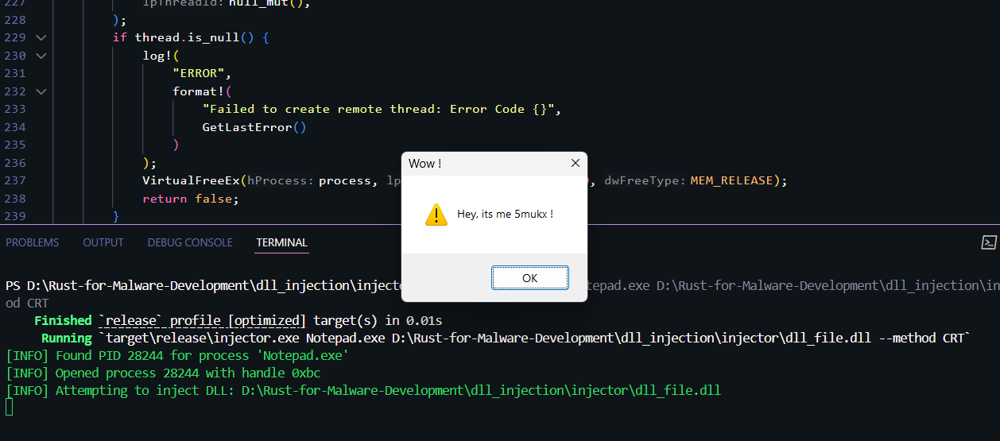

# DLL Injector

A powerful and versatile DLL injector written in rust, designed for injecting dynamic link libraries (DLLs) into running Windows processes. This tool supports multiple injection methods and process targeting by name, making it suitable for advanced users and developers exploring process manipulation.



Download DLL Injector: [Download](https://github.com/Whitecat18/Rust-for-Malware-Development/tree/main/DLL_Injector)
## Features

- **Multiple DLL Support**: Inject one or more DLLs into a target process in a single execution.
- **Flexible Injection Methods**: Choose between two injection techniques:
  - **CRT (CreateRemoteThread)**: Uses `CreateRemoteThread` to load the DLL via `LoadLibraryA`.
  - **APC (QueueUserAPC)**: Queues an asynchronous procedure call to all threads of the target process for stealthier injection.
- **Process Name Targeting**: Specify the target process by name (e.g., `Notepad.exe`) instead of PID, with automatic PID resolution.
- **DLL Load Verification**: Checks if the injected DLL is successfully loaded into the target process’s module list.
- **Robust Error Handling**: Provides detailed error messages with Windows error codes for troubleshooting.
- **Colored Output**: Uses ANSI color codes for clear, readable logging (DEBUG, INFO, WARN, ERROR).
- **Timeout Protection**: Implements a 30-second timeout for CRT injection to prevent hangs.
- **Resource Management**: Ensures proper cleanup of handles and allocated memory.

## Execution Methods

### Prerequisites
- Required dependencies in `Cargo.toml`:
  ```toml
  [dependencies]
  winapi = { version = "0.3", features = ["errhandlingapi", "handleapi", "libloaderapi", "memoryapi", "processthreadsapi", "synchapi", "winnt", "winbase", "tlhelp32", "minwindef"] }
    ```
## Usage 

```powershell
injector.exe <PID> [DLL Path 1] [DLL Path 2] ... [--method CRT|APC]
```

Example: 

* Inject one DLL: 
    ```powershell
    dll_inject.exe 1234 path\to\dll1.dll
    ```

* Inject multiple DLLs: 
    ```powershell
    dll_inject.exe 1234 dll1.dll dll2.dll
    ```

* Use APC method: 
    ```powershell
    dll_inject.exe 1234 dll1.dll --method APC
    ```


#

By: 
* 