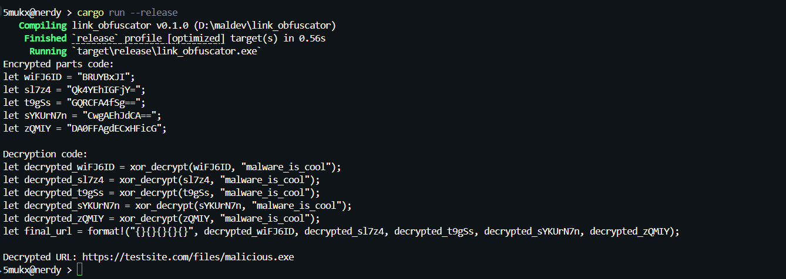

# Link Obfuscator

The Link Obfuscator is a code snippet that can be used to encrypt and split URLs into 3-5 parts (ran), making it confused for reverse engineers while reversing. It uses XOR encryption combined with base64 encoding and generates random variable names for each encrypted part, enhancing obfuscation.

## Features

* The URL is split into 3-5 parts, with each part encrypted separately, requiring reverse engineers to identify and decrypt all segments correctly.
* Variable names are randomly generated with lowercase prefixes, making it hard to trace or predict the code structure.
* The XOR and base64 encoding combination obscures the data, and without the key, brute-forcing the decryption is computationally intensive.
* The random splitting and variable naming eliminate consistent patterns, forcing reverse engineers to analyze each output individually.

## PoC

## Credits / Reference

* [5mukx](https://x.com/5mukx)
