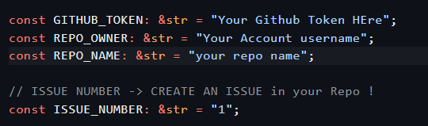

# GitHub API Data Exfiltration PoC

This Proof of Concept (PoC) demonstrates how data can be collected from a system and exfiltrated using the GitHub API. The code simulates a data stealer by gathering system information (e.g., hostname, OS version, network details) and sending it as a comment to a GitHub issue or as a file in a repository using legitimate API calls.


Download GitHub Stealer: [Download](https://download.5mukx.site/#/home?url=https://github.com/Whitecat18/Rust-for-Malware-Development/tree/main/stealer/GitHub_API)

## How It Works
1. Collects system information using Windows API calls.
2. Formats the data into a JSON payload.
3. Uses the GitHub API (with a valid token) to post the data as an issue comment or repository file.

## How to make it work !

* Create Token from settings -> https://github.com/settings/tokens
* Create a issue on any repo need
* Note down the issue number
* Do the changes here !


* To build:
    ```
    cargo build --release
    ```
    File can be found at : GITHUB_API/target/release/GITHUB_API.exe


## Credits / Reference

* Cocomelonc for Basic Idea:
    * https://cocomelonc.github.io/malware/2025/01/19/malware-tricks-44.html
* API Structure to implement WinHttp in Rust:
    * https://github.com/winlibs/glib
    * https://github.com/winlibs/glib/blob/master/gio/win32/winhttp.h
    * https://github.com/winlibs/glib/blob/master/gio/win32/gwinhttpfile.c
* WinAPI Documentation
    * https://docs.rs/winapi/latest/winapi/


