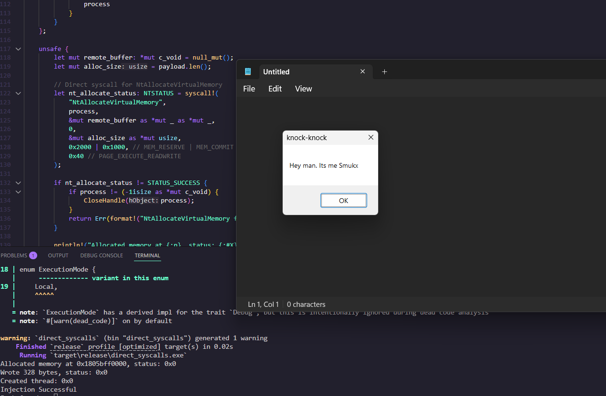

## Direct Syscalls 

### Working Methodology 

Uses ntdll.dll and GetProcAddress to fetch syscall numbers for injection.

Allocates memory in the target process, writes shellcode, and executes it using NtCreateThreadEx.

Download Here: [Download](https://download.5mukx.site/#/home?url=https://github.com/Whitecat18/Rust-for-Malware-Development/tree/main/syscalls/direct_syscalls)
## Credits 

* https://github.com/janoglezcampos/rust_syscalls.gitcode
* https://redops.at/en/blog/direct-syscalls-vs-indirect-syscalls
* https://www.ired.team/offensive-security/code-injection-process-injection/ntcreatesection-+-ntmapviewofsection-code-injection

By 