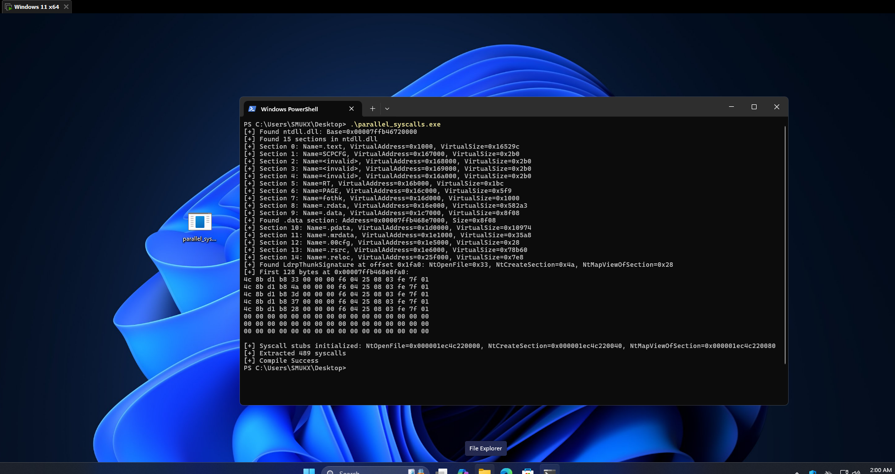

# Understanding Parallel Syscalls for EDR Bypass

This PoC implements a sophisticated EDR bypass technique known as parallel syscalls, inspired by [MDSec’s research](https://www.mdsec.co.uk/2022/01/edr-parallel-asis-through-analysis) on abusing the Windows 10 parallel loader to extract unhooked syscall stubs. The technique targets Endpoint Detection and Response (EDR) systems that hook ntdll.dll functions to monitor system interactions. By directly invoking syscalls, it bypasses these hooks, enabling stealthy execution of kernel-level operations in mature Windows environments.


This is just my way of explaining how this works. <br>For Original Read Please refer here: [MDSec’s Blog - EDR Parallel-asis through Analysis](https://www.mdsec.co.uk/2022/01/edr-parallel-asis-through-analysis/)

### What is parallel loader ? 

Parallel loader is a mechanism introduced to enhance application startup performance by loading DLLs concurrently across multiple threads, rather than sequentially on a single thread. By Exploiting Specfic behavior of this loader, the technique allows us to execute syscalls without triggering EDR Hooks which are commonly placed on critical Windows API functions in the ntdll.dll library.

### Purpose ? 

EDR systems are designed to monitor and detect suspicious activities on endpoints by intercepting interactions with the operating system. They achieve this by hooking Windows API functions, particularly the Nt/Zw syscall-based functions exported by ntdll.dll. These functions serve as the gateway for user-mode applications to request services from the Windows kernel, such as file operations, memory management, or process creation. By placing hooks on these functions, EDRs can inspect parameters, monitor call stacks, and flag or block potentially malicious behavior. However, these hooks reside in user-mode, making them vulnerable to circumvention by techniques that bypass the hooked functions and directly invoke syscalls. The parallel syscalls technique, discovered during the development of [MDSec’s Nighthawk C2 framework](https://www.mdsec.co.uk/2022/01/edr-parallel-asis-through-analysis/), is one such method that exploits an internal feature of the Windows 10 parallel loader to achieve this bypass.

The parallel loader, introduced to improve performance, creates a pool of worker threads during process initialization to map DLLs recursively in parallel. This is a departure from the synchronous, single-threaded DLL loading in earlier Windows versions. The loader’s design includes a safeguard mechanism to detect detours (hooks) on critical native API functions, as detours could indicate tampering by security software or malware. Specifically, it checks five key functions: `NtOpenFile`, `NtCreateSection`, `NtQueryAttributesFile`, `NtOpenSection`, and `NtMapViewOfSection` which are essential for loading and mapping DLLs from disk. If these functions are hooked, the loader falls back to synchronous loading to avoid potential instability. 

To perform this check, the loader maintains an array called `LdrpThunkSignature` in the .data section of ntdll.dll, which stores the first 16 bytes of the syscall stubs for these five functions. These stubs are captured early in process initialization by the `LdrpCaptureCriticalThunks` function, before any third-party DLLs (including EDR components) can install their hooks.

The technique hinges on locating and extracting the syscall numbers for three of these functions: `NtOpenFile`, `NtCreateSection`, and `NtMapViewOfSection` from the `LdrpThunkSignature` array. 

Syscall numbers are unique identifiers that the kernel uses to dispatch specific system services, and they are embedded in the syscall stubs as part of the:


```asm
mov eax, <syscall_number> 
```


instruction. By identifying the `LdrpThunkSignature` array in the .data section (using the common syscall prologue signature `4c 8b d1 b8`), the technique retrieves the unhooked syscall stubs and their corresponding syscall numbers. These three functions are particularly powerful because they provide the capability to open a file, create a memory section, and map it into the processs address space. With these, a clean, unhooked copy of ntdll.dll can be loaded from disk into memory. Once loaded, the export address table (EAT) of this fresh ntdll.dll can be parsed to extract the addresses and syscall numbers of all other Nt functions, enabling direct syscall invocation without touching the hooked versions in the original ntdll.dll.

## Usage

Run Normal: 

```
cargo run --release 
```


Run with debug: 
```
cargo run --release --features debug
```

Download Parallel Syscalls PoC: [Download](https://download.5mukx.site/#/home?url=https://github.com/Whitecat18/Rust-for-Malware-Development/tree/main/syscalls/parallel_syscalls)


## Credits / Reference

* Original Research and Implemention in C++ by MDSec: 
    * https://www.mdsec.co.uk/2022/01/edr-parallel-asis-through-analysis/
    * https://github.com/mdsecactivebreach/ParallelSyscalls

