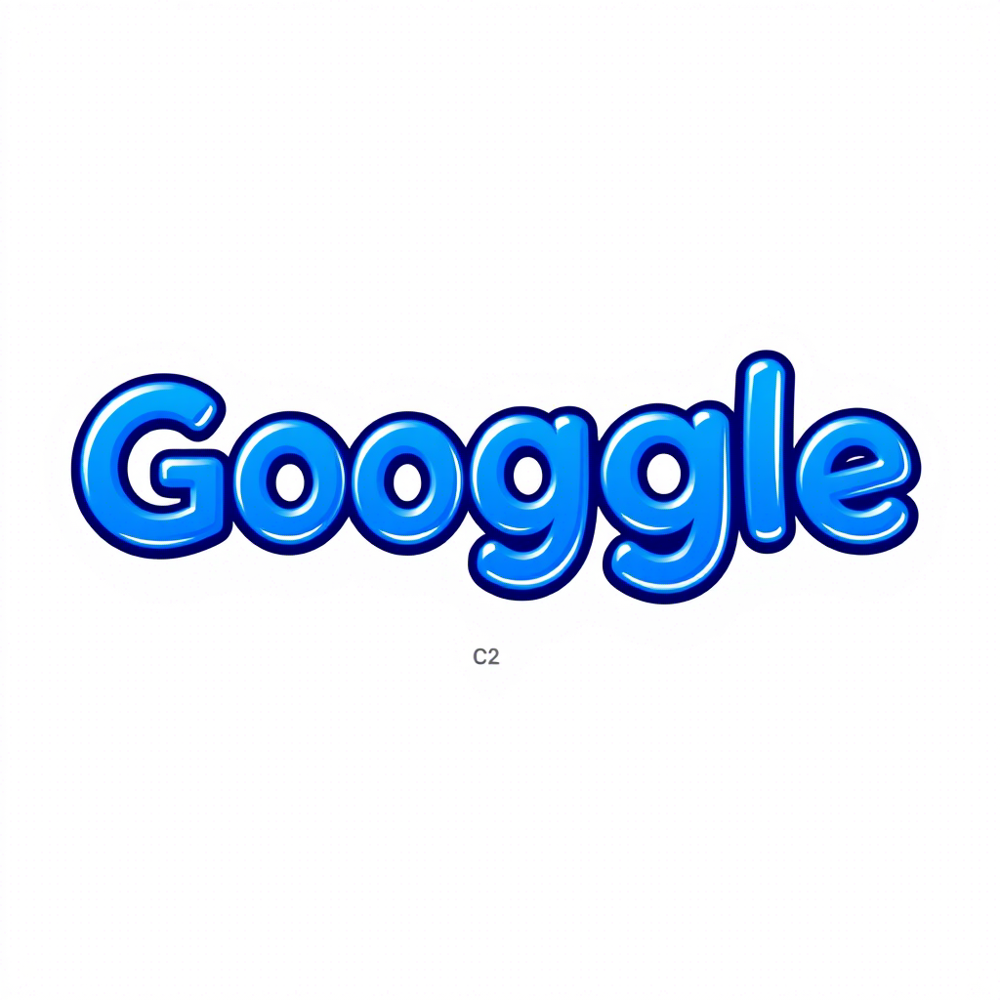
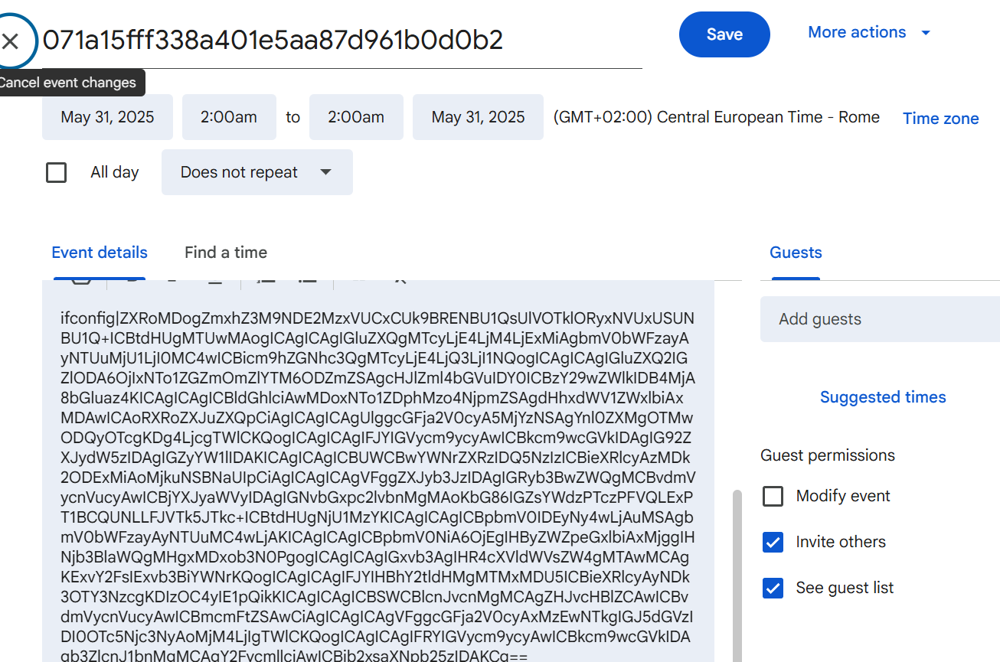

  

### Google Calendar AS A C2Server

Inspiration borrowed from https://github.com/MrSaighnal/GCR-Google-Calendar-RAT rewritten in Javascript. Technique used by **APT41**, a Chinese cyber threat group. Read [original](https://github.com/MrSaighnal/GCR-Google-Calendar-RAT) to understand how it works.

### Example

In the screenshot below you can see exfil data extracted from the victims computer base64 encoded and labeled with a hash ID with the content in the description field of the calendar

  

### Refs

https://github.com/MrSaighnal/GCR-Google-Calendar-RAT

https://cloud.google.com/blog/topics/threat-intelligence/apt41-innovative-tactics

https://cloud.google.com/blog/topics/threat-intelligence/apt41-dual-espionage-and-cyber-crime-operation?e=48754805
