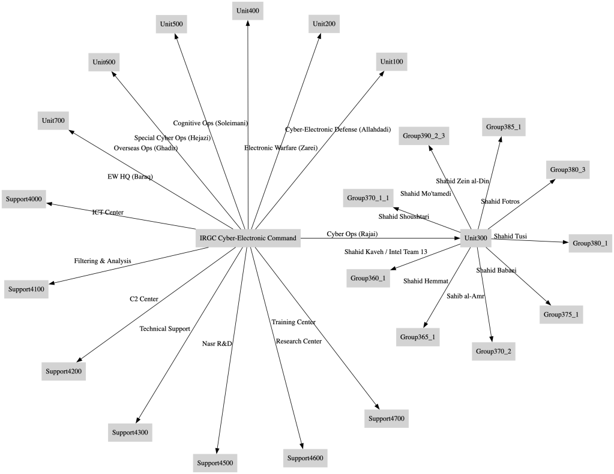

## Decoding Iran’s Cyber Military Machinery: Threat Landscape Amid Rising Tensions

### Introduction
As regional tensions flare following the Trump-era bombing of Iranian nuclear facilities, the cyber landscape has become a high-stakes theater of strategic confrontation. Iran’s Cyber-Electronic Command (CEC), under the Islamic Revolutionary Guard Corps (IRGC), commands a sprawling and compartmentalized network of cyber units with specialized missions ranging from offensive cyber operations to overseas sabotage, psychological warfare, and logistical coordination. This blog explores the structure, capabilities, and potential activation scenarios of these units in the unfolding geopolitical crisis.

### Core Command Structure: IRGC Cyber-Electronic Command (CEC)

At the heart of Iran’s state-aligned cyber machinery lies the Cyber-Electronic Command (CEC), a formidable operational structure under the Islamic Revolutionary Guard Corps (IRGC). This command acts not just as a strategic nerve center but as a fusion point where signals intelligence, cyber offense, defense, psychological operations, and battlefield electronic warfare converge into a coherent national doctrine of asymmetric power.

The IRGC-CEC is divided into distinct yet interlinked directorates, each named after a slain Iranian commander or “shahid,” imbuing the units with revolutionary legitimacy. Each unit operates with autonomy in tactics but strategic unity in mission: to safeguard Iran’s ideological interests, retaliate against perceived foreign aggression, and project influence beyond its borders.

The major branches include:

    Cyber Operations Command (Unit 300 / Shahid Rajai) – The primary executor of offensive cyber activities, managing malware campaigns, infrastructure attacks, and coordination with proxy operators like CyberAv3ngers.

    Electronic Warfare Command (Unit 100 / Shahid Zarei) – Focused on spectrum dominance, radar disruption, and signal jamming, especially in battlefield contexts.

    Cyber-Electronic Defense Command (Unit 200 / Shahid Allahdadi) – Charged with hardening Iran’s digital infrastructure, this unit develops counter-intrusion tools and internal monitoring systems.

    Cognitive Operations Command (Unit 400 / Shahid Soleimani) – Iran’s psychological warfare braintrust. This division engineers online disinformation, morale disruption, and strategic influence ops across social media and news channels.

    Special Cyber-Electronic Ops (Unit 500 / Shahid Hejazi) – A black-ops hybrid wing capable of executing cyber-electronic missions with high deniability, including on foreign soil.

    Ghadir Unit (Unit 600) – The external operations arm tasked with cyber campaigns against overseas targets—primarily Western, Israeli, and GCC infrastructure.
    Electronic Warfare HQ (Unit 700 / Baraq ‘Jangal’) – Serves as an operational logistics hub, integrating electronic warfare capabilities with traditional battlefield support.

### Specialized and Technical Units

Beneath the IRGC’s core command structure lies a lattice of highly specialized and technically adept sub-units, each calibrated for precision tasks in Iran’s asymmetric cyber warfare strategy. These groups, often bearing the names of revered martyrs, function as both operational engines and R&D arms—engineering tools, executing targeted operations, and supporting broader campaigns directed by the Cyber Operations Command.

These units are not mere auxiliary teams; they are mission-specific assets, often deployed for complex cyber intrusions, industrial control system (ICS) manipulations, and psychological disruption tactics that require surgical expertise.

Key players include:

    Shahid Kaveh Group (360/1), also known as Intelligence Team 13: Arguably one of the most operationally active units, Kaveh specializes in ICS and operational technology (OT) attacks. It has been tied to the manipulation of ladder logic in PLCs, notably targeting Israeli and U.S. water and fuel infrastructure.

    Shahid Hemmat Group (365/1): A data-centric fusion node responsible for intelligence synthesis, adversary profiling, and reconnaissance infrastructure—often feeding target packages to other operational teams.

    Sahib al-Amr Group (370/2): This unit acts as the IRGC’s psychological war room. In tandem with Unit 400, it crafts disinformation narratives, social media manipulation campaigns, and counter-dissident content.

    Shahid Babaei (375/1) and Shahid Tusi (380/1): Expert units focused on Human-Machine Interface (HMI) tampering and custom exploit creation, frequently used in high-value SCADA breaches.

    Shahid Fotros (380/3), Zein al-Din (385/1), and Mo’tamedi (390/2/3): Technical workhorses responsible for remote access tooling, protocol fuzzing, and persistent access frameworks—capable of evading traditional detection mechanisms.

    Shahid Shoushtari (370/1/1), also known as Emen Net Pasargad: A hybrid entity operating under a research and commercial façade, Shoushtari focuses on hardware-level implants and firmware-level compromise vectors, suggesting links to broader intelligence objectives.

    Shahid Khalili (360/3/1), Beheshti (385/3/2), and Atout (385/3/3): Sub-groups with a strong orientation toward credential harvesting, bespoke malware development, and advanced phishing operations. These teams support initial access phases and custom payload delivery.

Collectively, these specialized units offer vertical integration—from research and tooling to execution and cover. In a coordinated campaign, they may act in sequence: with one unit building exploits, another harvesting credentials, and another launching the intrusion—all shielded by psychological ops and diplomatic deniability. In the current climate, their activation is not a question of “if,” but “how extensively.” The modularity of these units allows the IRGC-CEC to escalate horizontally across sectors or focus vertically on one target’s complete compromise.

### Support and Infrastructure Units

    ICT Center (4000): Handles secure communications and network ops.

    Filtering & Analysis Center (4100): Domestic surveillance, threat hunting.

    Command & Control (4200) and Technical Support (4300): Integrative battlefield support and repair logistics.

    Nasr R&D Org (4500) and Foundational Research Center (4600): Toolchain innovation and zero-day research.

    Training Center (4700): Operator education and skill development.

### Current Threat Projection

The IRGC-CEC is likely to activate:

    Unit 600 (Ghadir): For retaliatory operations against U.S. water and energy infrastructure.

    Shahid Kaveh Group: For renewed ICS campaigns.

    Cognitive Ops Unit 400: For narrative war, exploiting Western social divisions.

The overlap between CyberAv3ngers propaganda campaigns and known technical IOCs from Shahid Kaveh and Ghadir Units suggests imminent hybrid operations blending defacement, sabotage, and narrative distortion.

  

### Conclusion: From Structure to Strike—What Comes Next in the Iranian Cyber Doctrine

What emerges from a close examination of Iran’s cyber warfare architecture is not a loose patchwork of hacker groups, but a systematic, hierarchical command built for strategic endurance, ideological influence, and operational precision. Unlike decentralized APTs that pivot reactively, the IRGC Cyber-Electronic Command (CEC) operates like a military-industrial cyber complex—vertically integrated, ideologically aligned, and battle-tested.

This is a machine with intent.

Each unit—from the publicly aggressive CyberAv3ngers to the deeply embedded Shahid Kaveh group—functions as part of an orchestrated continuum. There are builders of tools, collectors of access, engineers of false narratives, and operators capable of delivering kinetic-level digital disruption. The line between propaganda and payload, signal and sabotage, front-end narrative and backend logic bomb is deliberately blurred.

As strategic tensions flare in the wake of recent airstrikes and regional power realignments, Iran’s cyber apparatus is not merely on alert—it is postured. Units like Ghadir (external operations), Soleimani (cognitive warfare), and Kaveh (ICS disruption) have mission sets built precisely for this moment: coordinated, retaliatory, and plausibly deniable action against perceived existential threats.

This is not a temporary escalation. It is the emergence of cyberwarfare as a normalized domain of power projection for the Islamic Republic—one that allows Tehran to retaliate without missiles, reshape narratives without diplomacy, and compromise infrastructure without ever setting foot on enemy soil.

The strategic risk is not simply that Iran may attack. It is that Iran can now weaponize both silence and noise—to flood an environment with disinformation while silently breaching systems. To strike through logic controllers while claiming cyber victimhood. To embed ideology in malware, and military doctrine in memes.

In the face of this, the response must be equally strategic.

    Monitor Indicators of Compromise (IOCs)—not just for forensic purposes, but for strategic forecasting.

    Harden infrastructure—with particular urgency toward ICS/OT assets, cloud-based C2 channels, and edge devices.

    Decipher psychological operations—treat Telegram, Instagram, and fake news not as separate domains but as amplifiers of the kill chain.
