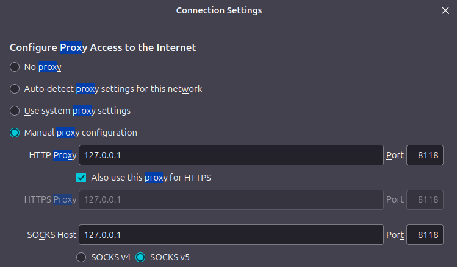

### Tor, Privoxy, and Proxychains
##


```sh
# change dns, using quad9 - change this to a nameserver other than ISP
sudo mv /etc/resolv.conf /etc/resolv.conf.bak
sudo touch /etc/resolv.conf
echo -ne 'nameserver 9.9.9.9\nnameserver 149.112.112.112' | sudo tee -a /etc/resolv.conf

podman build -t tor-proxy .

podman run -it --name tor-proxy \
    --cap-add=net_admin \
    --device /dev/net/tun \
    -v /etc/resolv.conf:/etc/resolv.conf:ro \
    -p 127.0.0.1:8118:8118 -p 127.0.0.1:9050:9050 \
    -d tor-proxy

# open shell
podman exec -it tor-proxy /bin/bash

# test tor
curl --socks5 localhost:9050 --socks5-hostname localhost:9050 https://check.torproject.org/api/ip

# test proxychains
proxychains curl https://check.torproject.org/api/ip

# verify privoxy
curl -Lx http://127.0.0.1:8118 http://checkip.amazonaws.com/
```

### Configure your browser to proxy through this container
##

<p align="center">

</p>

