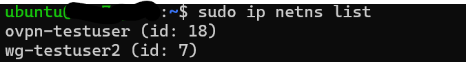
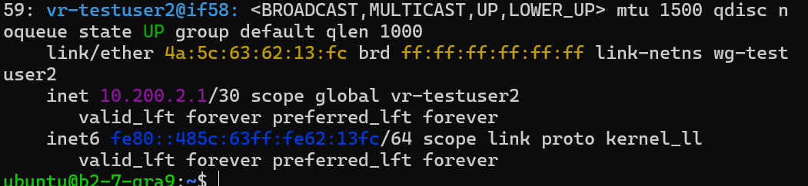
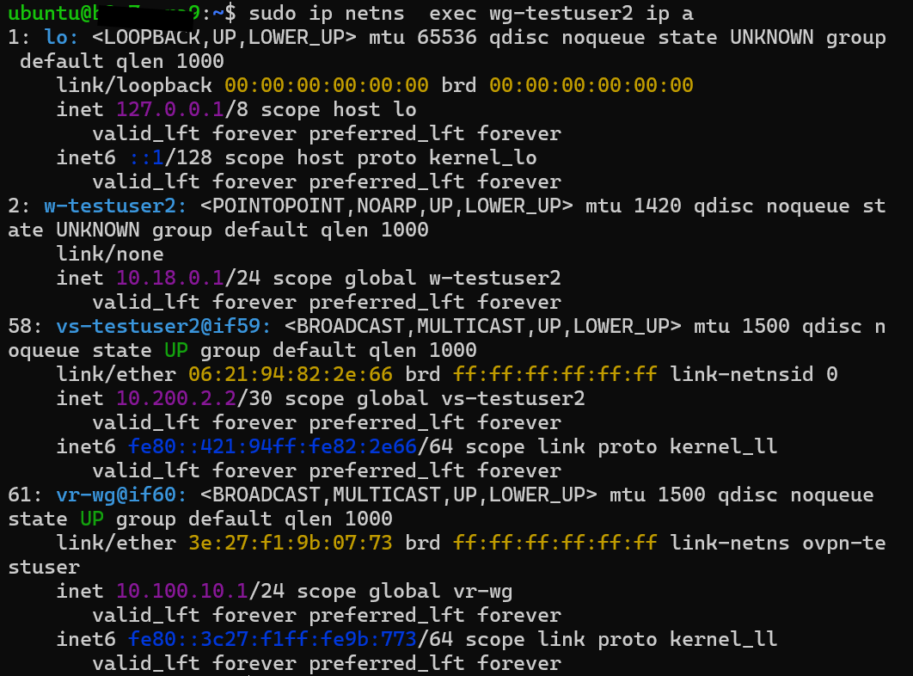
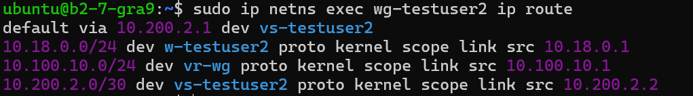
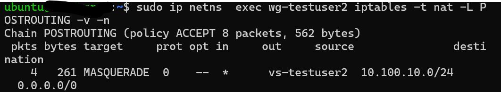

# 🧠 VPN Chaining with PBR + netns + iptables + veth

This project demonstrates a real-world **multi-tenant VPN system with full isolation**, using:

- WireGuard and OpenVPN chaining
- Network namespaces with veth pairs
- iptables, ip rules, policy-based routing (PBR)
- Shell scripts for automation
- DNS Leak Prevention
- Dedicated IP per namespace

One of the most challenging and satisfying infrastructures I’ve ever built.

---

## ⚙️ Technical Steps

### 1. Creating the namespace
```bash
sudo ip netns add "$NAMESPACE"
sudo ip netns exec "$NAMESPACE" ping 8.8.8.8 # Should timeout
```
> At this point, there's no connectivity. Routing begins here.

---



### 2. Creating veth pair (host ↔ namespace)
```bash
sudo ip link add "$VETH_ROOT" type veth peer name "$VETH_NS"
sudo ip link set "$VETH_NS" netns "$NAMESPACE"
```


---

### 3. Configuring IPs
```bash
# Host side
sudo ip addr add "$BRIDGE_IP/30" dev "$VETH_ROOT"
sudo ip link set "$VETH_ROOT" up

# Namespace side
sudo ip netns exec "$NAMESPACE" ip addr add "$NAMESPACE_IP/30" dev "$VETH_NS"
sudo ip netns exec "$NAMESPACE" ip link set "$VETH_NS" up
sudo ip netns exec "$NAMESPACE" ip link set lo up
```


---

### 4. Default route inside the namespace
```bash
sudo ip netns exec "$NAMESPACE" ip route add default via "$BRIDGE_IP"
```


---

### 5. Starting WireGuard inside namespace
```bash
sudo ip netns exec "$NAMESPACE" wg-quick up "$WG_CONF_FILE"
sudo ip netns exec "$NAMESPACE" ip addr add "$SERVER_IP/24" dev "$WIREGUARD_NAME"
```

---

### 6. NAT rules (iptables on host)
```bash
# POSTROUTING
sudo iptables -t nat -A POSTROUTING -s "$CLIENT_IP" -o ens3 -j MASQUERADE
sudo iptables -t nat -A POSTROUTING -s "$CLIENT_IP" -o "$WIREGUARD_NAME" -j MASQUERADE

# PREROUTING
sudo iptables -t nat -A PREROUTING -p udp -d "$IP_GATEWAY_HOST" --dport "$PORT" -j DNAT --to-destination $NAMESPACE_VS_IP:$PORT

# FORWARD
sudo iptables -A FORWARD -s "$NAMESPACE_VS_IP" -o ens3 -j ACCEPT
sudo iptables -A FORWARD -p udp -d "$NAMESPACE_VS_IP" --dport $PORT -j ACCEPT
sudo iptables -A FORWARD -d "$NAMESPACE_VS_IP" -m state --state RELATED,ESTABLISHED -j ACCEPT
```

---

### 7. Internal NAT inside namespace
```bash
sudo ip netns exec "$NAMESPACE" iptables -t nat -A POSTROUTING -s "$CLIENT_IP" -o "$VETH_NS" -j MASQUERADE
```


---

### 8. DNS configuration
```bash
sudo ip netns exec "$NAMESPACE" bash -c 'echo -e "nameserver 1.1.1.1\nnameserver 8.8.8.8" > /etc/resolv.conf'
```

---

## 🔗 VPN Chaining

To chain multiple VPNs:

1. Create a new `netns` with veth pair  
2. Route output of one namespace as input to the next  
3. Repeat IP, NAT, and DNS setup

Example:
```bash
# Connect namespace1 to namespace2 (VPN over VPN)
sudo ip netns exec "$NS_WIRE" ip addr add "$BRIDGE_IP/24" dev "$VETH_ROOT"
sudo ip netns exec "$NS_WIRE" ip link set "$VETH_ROOT" up

sudo ip netns exec "$NS" ip addr add "$NS_IP/24" dev "$VETH_NS"
sudo ip netns exec "$NS" ip link set "$VETH_NS" up

# NAT between namespaces
sudo ip netns exec "$NS_WIRE" iptables -t nat -A POSTROUTING -s "$BRIDGE_IP/24" -o "$VS_WIRE" -j MASQUERADE
```

---

## 📌 Final Notes

Ideal for:
- Multi-user platforms with strict isolation
- GDPR-compliant infrastructures
- Automated VPN orchestration for remote teams

📜 Built using pure Shell, iproute2, iptables.

MIT Licensed — Use freely.
