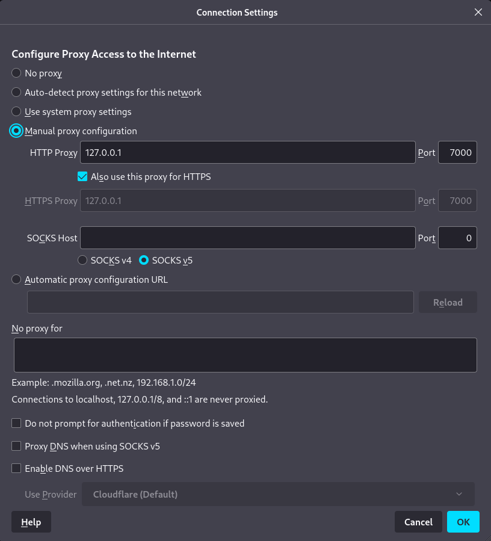

## Caido

<p align="center">
    <a href="https://github.com/robert-iw3/apps/actions/workflows/caido-ghcr.yml" alt="Docker CI">
          </a>
</p>

[What is Caido?](https://caido.io/)

```sh
podman build -t caido .
podman run --rm -p 7000:8080 -v ./:/home/caido/.local/share/caido:Z --name caido caido
```

127.0.0.1:7000 (in firefox or chrome)

https://dashboard.caido.io/#/signup

## Intercept HTTPS Traffic:

https://docs.caido.io/configuration/import_ca_certificate.html

## Proxy Settings:


