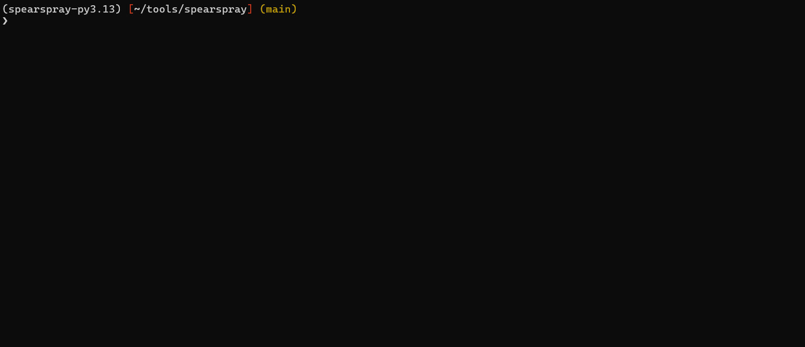
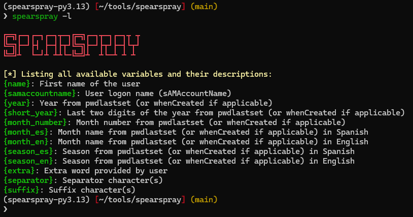

# SpearSpray

**SpearSpray** is an advanced password spraying tool designed specifically for Active Directory environments. It combines user enumeration via LDAP with intelligent pattern-based password generation to perform controlled and stealthy password spraying attacks over Kerberos.



## Table of Contents

- [Features](#features)
  - [Core Capabilities](#core-capabilities)
  - [Security & Stealth Features](#security--stealth-features)
  - [Advanced Pattern System](#advanced-pattern-system)
- [Requirements](#requirements)
- [Installation](#installation)
  - [Prerequisites](#prerequisites)
  - [From GitHub (Recommended)](#from-github-recommended)
  - [Using Poetry](#using-poetry)
  - [Direct Installation](#direct-installation)
- [Usage](#usage)
  - [Basic Usage](#basic-usage)
  - [Advanced Usage](#advanced-usage)
  - [Command Line Options](#command-line-options)
- [Pattern System](#pattern-system)
  - [Key Innovation: User-Specific Temporal Data](#key-innovation-user-specific-temporal-data)
  - [Available Variables](#available-variables)
  - [Default Patterns File (patterns.txt)](#default-patterns-file-patternstxt)
  - [Custom Pattern Examples](#custom-pattern-examples)
  - [Adding Custom Variables](#adding-custom-variables)
- [SpearSpray Philosophy: More with Less](#spearspray-philosophy-more-with-less)
- [Why Kerberos Authentication?](#why-kerberos-authentication)
- [Understanding badPwdCount Behavior](#understanding-badpwdcount-behavior)
- [Warning and Security Considerations](#warning-and-security-considerations)
- [Legal Disclaimer](#legal-disclaimer)
- [Troubleshooting](#troubleshooting)
- [Acknowledgments](#acknowledgments)
- [Contributing](#contributing)
- [License](#license)
- [Author](#author)

## Features

### Core Capabilities
- **LDAP Integration**: Direct enumeration of Active Directory users through LDAP queries
- **Custom LDAP Queries**: Define specific queries to target only certain users or groups for spraying
- **Pattern-Based Password Generation**: Flexible templating system for creating targeted password lists
- **Domain Policy Awareness**: Automatic retrieval and respect of domain password policies
- **Account Lockout Protection**: Smart filtering to avoid locking out user accounts
- **PSO Detection**: Identification and handling of users with Password Settings Objects
- **Kerberos Authentication**: Fast and efficient authentication testing via Kerberos pre-authentication

### Security & Stealth Features
- **Jitter Support**: Configurable delays between authentication attempts
- **Threshold Management**: Automatic filtering of users near lockout thresholds
- **Multi-threaded**: Configurable thread count for performance optimization
- **Rate Limiting**: Control requests per second to prevent overwhelming domain controllers
- **SSL/LDAPS Support**: Secure LDAP connections when required

### Advanced Pattern System
- **Dynamic Variables**: Support for user-specific data (name, date of last password change...)
- **Custom Separators & Suffixes**: Flexible password pattern customization
- **Extra Argument**: Integration of company-specific terms.
- **Interactive Pattern Selection**: Dynamic menu system for pattern selection

## Requirements

- Python 3.8+
- Valid Active Directory credentials
- Network access to target domain controller

## Installation

### Prerequisites

```bash
# Install system dependencies (Ubuntu/Debian)
sudo apt-get update
sudo apt-get install python3-dev libkrb5-dev libldap2-dev libsasl2-dev

# Install system dependencies (CentOS/RHEL)
sudo yum install python3-devel krb5-devel openldap-devel libsasl2-dev

# Install system dependencies (macOS)
brew install krb5 openldap
```

### container runtime

```bash
podman build -t spearspray .

podman run -it --name spearspray spearspray

spearspray -h
```

## Usage

### Command Line Options

#### LDAP Configuration
- `-d, --domain`: LDAP domain name (e.g., contoso.local) **[Required]**
- `-u, --username`: LDAP username **[Required]**
- `-p, --password`: LDAP password **[Required]**
- `-dc, --domain-controller`: FQDN or IP of domain controller **[Required]**
- `-q, --query`: Custom LDAP query (default: enabled users excluding blocked accounts)
- `--ssl`: Use SSL/LDAPS connection (port 636)
- `-lps, --ldap-page-size`: LDAP paging size (default: 200)

#### Password Spraying Configuration
- `-t, --threads`: Number of concurrent threads (default: 10)
- `-j, --jitter`: Delay between attempts: N seconds or N,M range (default: 0)
- `--max-rps`: Maximum Kerberos requests per second. If not set, no rate limiting is applied
- `-thr, --threshold`: Number of attempts to leave as buffer before account lockout (default: 2)

#### Pattern Configuration
- `-i, --input`: Patterns file path (default: `patterns.txt`)
- `-x, --extra`: Custom word to inject into password patterns via `{extra}` variable (e.g., companyName, no spaces/commas)
- `-sep, --separator`: Separator characters for `{separator}` variable in patterns (default: none)
- `-suf, --suffix`: Suffix characters for `{suffix}` variable in patterns (default: none)

#### Other Options
- `-s, --silent`: Don't display startup banner
- `--debug`: Enable debug logging with file output
- `-l, --list`: List available pattern variables and exit

### Basic Usage

You can list available pattern variables with the following command:

```bash
# List available pattern variables
spearspray -l
```



These variables are the ones you can use to create patterns in the `patterns.txt` file. If you want to know how to create your own variable, visit the section: [Adding Custom Variables](#adding-custom-variables).

Below, you can see the two simplest SpearSpray commands:

```bash
# Basic password spraying with default settings
spearspray -u lowUser -p Password123 -d contoso.local -dc dc01.contoso.local

# Add extra word for pattern generation
spearspray -u lowUser -p Password123 -d contoso.local -dc dc01.contoso.local -x "CompanyName"
```

The `--extra` (`-x`) parameter is very useful if you want to use a specific word in patterns or if you want to test the same password across all users. It all depends on the patterns you have written in `patterns.txt` that make use of the `{extra}` variable.

### Advanced Usage

SpearSpray supports a series of arguments that increase the customization of Password Spraying in all aspects and adapts to each scenario:

```bash
# Domain controllers might require an encrypted connection
spearspray -u lowUser -p Password123 -d contoso.local -dc dc01.contoso.local --ssl

# Perhaps you only want to perform Password Spraying on a specific group of users (SpearSpray allows it!)
spearspray -u lowUser -p Password123 -d contoso.local -dc dc01.contoso.local \
  -q "(&(objectCategory=person)(objectClass=user)(!(userAccountControl:1.2.840.113556.1.4.803:=2))(department=IT))"

# You want to add symbols as separators or suffixes to passwords generated by patterns
spearspray -u lowUser -p Password123 -d contoso.local -dc dc01.contoso.local -sep '@' -suf '!'
```

### Stealth Usage

You're conducting an operation or simply have a very sensitive environment and need to control SpearSpray's speed. There are several options available for this:

```bash
# You can try reducing the number of threads
spearspray -u lowUser -p Password123 -d contoso.local -dc dc01.contoso.local -t 5

# You can try adding a fixed jitter (N) or random jitter between two values (N,M)
spearspray -u lowUser -p Password123 -d contoso.local -dc dc01.contoso.local -j 3,5

# You can limit the requests per second that the tool makes
spearspray -u lowUser -p Password123 -d contoso.local -dc dc01.contoso.local --max-rps 10
```
You can also combine all these arguments together.


## Pattern System

SpearSpray uses an advanced pattern system to generate **highly targeted and personalized passwords for each user**. Unlike generic wordlists, every password attempt is customized based on the user's specific information retrieved from Active Directory.

### Key Innovation: User-Specific Temporal Data

**All temporal variables (years, months, seasons) are calculated based on each user's individual password change date (`pwdLastSet` attribute), not the current date.** This means that if a user changed their password in March 2024, the patterns will generate passwords for that user using March 2024 data. This personalized approach is applied to each user individually based on their own password change timeline, significantly increasing the likelihood of success.

### Available Variables

| Variable | Description | Example |
|----------|-------------|---------|
| `{name}` | User's first name (from displayName) | Eren |
| `{samaccountname}` | User's SAM account name | eren.yeager |
| `{year}` | Year from pwdLastSet (or whenCreated) | 2024 |
| `{short_year}` | Last two digits of year | 24 |
| `{month_number}` | Month number (zero-padded) | 03 |
| `{month_en}` | Month name in English | March |
| `{month_es}` | Month name in Spanish | Marzo |
| `{season_en}` | Season in English | Spring |
| `{season_es}` | Season in Spanish | Primavera |
| `{extra}` | Extra word provided via `-x` argument | CompanyName |
| `{separator}` | Custom separator via `-sep` argument | @ |
| `{suffix}` | Custom suffix via `-suf` argument | ! |

**Note**: The conversion mappings for temporal variables (months and seasons) are defined in `spearspray/utils/constants.py`.

### Default Patterns File (patterns.txt)

```plaintext
# User (samaccountname) as pass
{samaccountname}

# User first name + Year
{name}{separator}{year}{suffix}
# User first name + Year in short format
{name}{separator}{short_year}{suffix}
# User first name + Month number + Year in short format
{name}{separator}{month_number}{short_year}{suffix}

# Month name + Year
{month_en}{separator}{year}{suffix}
# Month name + Year in short format
{month_en}{separator}{short_year}{suffix}

# Season name + Year
{season_en}{separator}{year}{suffix}
# Season name + Year in short format
{season_en}{separator}{short_year}{suffix}

# Exact password from extra argument (e.g., -x 'Company123$!')
{extra}
# Extra argument + Year
{extra}{separator}{year}{suffix}
# Extra argument + Year in short format
{extra}{separator}{short_year}{suffix}
```

### Custom Pattern Examples

**Example scenario**: User "Eren" changed his password on March 15, 2024. If you use the extra word "Paradis", separator "@", and suffix "!", some patterns that will be generated are:

- `{extra}{suffix}` → `Paradis!`
- `{name}{separator}{year}{suffix}` → `Eren@2024!` *(based on his March 2024 password change)*
- `{month_en}{separator}{short_year}{suffix}` → `March@24!` *(March 2024 when he changed password)*
- `{season_en}{separator}{year}{suffix}` → `Spring@2024!` *(Spring 2024 season of password change)*

**Why this matters**: Now consider if Eren's colleague "Mikasa" changed her password in November 2023. Her patterns would generate completely different temporal values based on her specific password change date:
- `{name}{separator}{year}{suffix}` → `Mikasa@2023!`
- `{month_en}{separator}{short_year}{suffix}` → `November@23!`
- `{season_en}{separator}{year}{suffix}` → `Autumn@2023!`

This user-specific approach dramatically increases password spraying effectiveness compared to generic wordlists.

### Adding Custom Variables

SpearSpray allows you to extend the pattern system by adding custom variables. To add a new variable:

1. **Register the variable** in `spearspray/utils/variables_utils.py`:
```python
def register_variables(variables: "VariablesManager") -> None:
    # ...existing variables...
    variables.register("custom_var", "Description of your custom variable", "")
```

2. **Implement the variable logic** in the `variable_resolver` function:
```python
def variable_resolver(user: dict, selected_pattern: str, variables: list, extra: str, separator: str, suffix: str) -> str:
    # ...existing code...

    for var in variables:
        # ...existing variable handlers...

        elif var.name == "custom_var":
            # Your custom logic here
            values[var.name] = "your_custom_value"
```
3. If you need it, you can use the file `spearspray/utils/constants.py` to define constants. Then, in the `variable_resolver` function you simply need to call it using `constants.VARIABLE`. You can see the examples of months and seasons to see how to implement your own.


**Example**: Adding a domain variable that extracts the domain from the user's email:
```python
# In register_variables function
variables.register("domain", "Domain extracted from user email", "")

# In variable_resolver function
elif var.name == "domain":
    email = user.get("mail", "")
    values[var.name] = email.split("@")[1] if "@" in email else ""
```

You can then use `{domain}` in your patterns file to include the user's email domain in password generation.

## SpearSpray Philosophy: More with Less

SpearSpray's core philosophy is **achieving more with less** - maximizing effectiveness while minimizing attempts and detection risk.

### Smart Temporal Logic
Human behavior is nuanced. A user changing their password in **December 2024** might use `Company2025!` (thinking ahead to the fiscal year), while someone in **late March** might already reference `Spring2024!`. While SpearSpray's patterns based on `pwdLastSet` won't catch these edge cases, the logical approach still achieves higher hit rates with fewer attempts compared to generic wordlists.

### Flexible Methodology
- **🎯 Targeted**: Personalized passwords per user (default behavior)
- **🌐 Universal**: Same password across all users via `{extra}` pattern

### The "Less" Principle
- **Fewer attempts**: Smart `badPwdCount` filtering + intelligent patterns
- **Lower detection**: Kerberos pre-auth vs traditional methods
- **Reduced lockouts**: Built-in safety margins + policy awareness
- **Minimal infrastructure**: Dynamic generation vs wordlist management

## Why Kerberos Authentication?

SpearSpray uses **Kerberos pre-authentication** instead of traditional methods to reduce detection:

**Traditional methods** (NTLM/SMB/LDAP) generate highly monitored events like **4625** (failed logons).
**Kerberos pre-auth** generates **Event 4768** (TGT requested - valid credentials) and **4771** (pre-authentication failed - invalid attempts), which are less monitored by most SOCs.

**Performance advantage**: Uses **gssapi** library instead of impacket for Kerberos operations. Native C bindings provide significantly faster authentication compared to Python-only implementations.

**Speed considerations**: Due to the high performance of gssapi, SpearSpray can execute authentication attempts very rapidly. **It is strongly recommended to use rate limiting options** such as:
- `--max-rps` to limit requests per second
- `-j, --jitter` to add delays between attempts
- `-t, --threads` to control concurrency

This helps prevent overwhelming the domain controller and reduces detection risk.

**Benefits**: Less noise, blends with normal AD traffic, faster execution, lower detection risk.

## Understanding badPwdCount Behavior

### References
- [Spiceworks – badPwdCount not resetting after threshold](https://community.spiceworks.com/t/badpwdcount-not-resetting-after-threshold/939628)
- [Spiceworks – badPwdCount not resetting](https://community.spiceworks.com/t/badpwdcount-not-resetting/435486)
- [Microsoft public NG – Reset badPwdCount in ADAM](https://microsoft.public.windows.server.active-directory.narkive.com/2SHRmIY1/reset-badpwdcount-in-adam)
- [Microsoft TechNet Wiki – Active Directory: Bad Passwords and Account Lockout](https://learn.microsoft.com/en-us/archive/technet-wiki/32490.active-directory-bad-passwords-and-account-lockout)
- [Further abusing the badPwdCount attribute](https://blog.fox-it.com/2017/11/28/further-abusing-the-badpwdcount-attribute/)
- [LDAP Wiki - Active Directory Account Lockout](https://ldapwiki.com/wiki/Wiki.jsp?page=Active%20Directory%20Account%20Lockout)
- [LDAP Wiki - Active Directory Locked Accounts](https://ldapwiki.com/wiki/Wiki.jsp?page=Active%20Directory%20Locked%20Accounts)

### 1. What `badPwdCount` **is**
* A **per-DC, non-replicated** counter of consecutive bad logons for one account.
* Tied to these lockout-policy knobs:

| AD attribute | GPO label | Typical default | Purpose |
|--------------|-----------|-----------------|---------|
| `lockoutThreshold` | **Account lockout threshold** | 5 | How many bad attempts trigger lockout |
| `lockoutObservationWindow` | **Reset account lockout counter after** | 30 min | Idle time **after which the next attempt forces an internal reset** |
| `lockoutDuration` | **Account lockout duration** | 30 min | How long the account stays locked (0 = needs admin) |

### 2. How the counter really moves

| Event | Counter action | Stored on | Why |
|-------|---------------|-----------|-----|
| Wrong password **≠** user’s two most‑recent passwords | **+1** | DC that handled the request <br>(PDC‑emulator also +1 by chaining) | Normal increment |
| Wrong password **matches** **n‑1 / n‑2** in password history¹ | **No change** | Same DC | Windows 2003+ “n‑2” feature |
| Successful logon | **Sets that DC’s copy to 0** | Same DC only | Immediate reset |
| Bad attempt **after** ObservationWindow | DC first sets copy to 0, then **+1** | Same DC | “On‑demand” reset – **not** a timer |
| Manual unlock or `lockoutDuration` ends | **All DCs set to 0** | All DCs | Global reset |

¹ Requires `pwdHistoryLength` ≥ 3, Kerberos/NTLM auth. If the history is only 2, *only* the `n‑1` password is ignored.

### 3.  Don’t mix these two facts

| Situation | What LDAP shows | What the **next attempt** does |
|-----------|-----------------|--------------------------------|
| **Window NOT expired** (< 30 min since last bad)** | `badPwdCount = 4/5` | Increments → **lockout** |
| **Window expired** (≥ 30 min, or hours/days later) | `badPwdCount` still *reads* 4 | Auto‑resets 0 → +1 → counter = 1 (no lockout) |

*High numbers can “sit” for days until a DC sees more activity — the reset is triggered **by** that next attempt (or successfull login), not by a clock.*

### 4. Finding the PDC-emulator

To identify the PDC-emulator for your domain, you can use `nslookup` to query the `_ldap._tcp.pdc._msdcs.` DNS record:

```bash
# Find PDC-emulator for fabrikam.local
nslookup -type=SRV _ldap._tcp.pdc._msdcs.fabrikam.local

# Example output:
# Server: 10.150.16.10
# Address: 10.150.16.10#53
#
# _ldap._tcp.pdc._msdcs.fabrikam.local service = 0 100 389 DC01.fabrikam.local.
```

The PDC-emulator FQDN will be shown in the service record (e.g., `DC01.fabrikam.local`). Use this value with SpearSpray's `-dc` parameter to ensure you're always querying the most authoritative source for `badPwdCount` values.

**Why use the PDC-emulator?**
- **Highest badPwdCount values**: The PDC-emulator typically holds the most up-to-date and highest `badPwdCount` values due to its role in account lockout processing
- **Centralized lockout processing**: All account lockouts are processed through the PDC-emulator, making it the authoritative source for lockout-related information
- **Consistent counter tracking**: By querying the same DC (PDC-emulator) for both policy retrieval and user enumeration, you get consistent `badPwdCount` values
- **Reduced false negatives**: Other DCs might have stale or lower `badPwdCount` values, potentially leading to missed high-risk users

### 5. Recommended Safe Workflow

```bash
# 1. Ask PDC for current counters + policy
# 2. Exclude users at (threshold − thr) or above
# 3. Spray Kerberos against a single DC
# 4. Wait ≥ lockoutObservationWindow
# 5. Loop back to step 1
```

⚠️ **Important**: Despite all safety measures, password spraying always carries inherent risks. Please review the [Warning and Security Considerations](#warning-and-security-considerations) section for critical safety considerations before proceeding.

## Warning and Security Considerations

**Account Lockout Risk**: While SpearSpray implements multiple safeguards to minimize the risk of account lockouts (including domain policy retrieval, PSO detection, and badPwdCount filtering), **there is always an inherent risk when performing password spraying attacks**. Please proceed with extreme caution and always:

- Test in authorized environments only
- Start with very conservative settings (low thread counts, high jitter values)
- Monitor domain controllers for unexpected behavior
- Respect organizational security policies
- Use appropriate threshold margins to prevent lockouts
- Have a rollback plan in case of issues

**Development Notice**: This is my first security tool and while I'm continuously learning programming, I acknowledge there's still much room for improvement. Any feedback, suggestions, or contributions are greatly welcomed to help make this tool better and safer for the security community.

## Legal Disclaimer

This tool is intended for authorized penetration testing and security assessment purposes only. Users are responsible for ensuring they have explicit permission to test target systems. Unauthorized access to computer systems is illegal and may result in criminal prosecution.

## Troubleshooting

### Common Issues

1. **LDAP Connection Failed**
   - Verify domain controller IP and credentials
   - Check network connectivity
   - Try with/without SSL flag

2. **No Users Found**
   - Verify LDAP query syntax
   - Check user permissions for LDAP enumeration
   - Ensure target domain has active users

3. **Kerberos Authentication Errors**
   - Verify domain name format
   - Check time synchronization with domain controller
   - Ensure Kerberos ports (88) are accessible

## Acknowledgments

SpearSpray was inspired by and learned from several excellent security tools and their creators:

- **[kerbrute](https://github.com/TarlogicSecurity/kerbrute)** by [zer1t0](https://github.com/Zer1t0) (from [TarlogicSecurity](https://github.com/TarlogicSecurity)) - For demonstrating the importance of using Kerberos in password spraying to avoid generating common security events.
- **[sprayhound](https://github.com/Hackndo/sprayhound)** by [Hackndo](https://github.com/hackndo) (from [login-securite](https://github.com/login-securite)) - For being cautious and performing spraying only against users who won't be locked out.
- **[conpass](https://github.com/login-securite/conpass)** by [Hackndo](https://github.com/hackndo) (from [login-securite](https://github.com/login-securite)) - For their logic in checking the existence of PSO (Password Settings Objects) in users.

These tools have been invaluable sources of learning and inspiration. Special thanks to their authors for sharing their knowledge with the security community.

