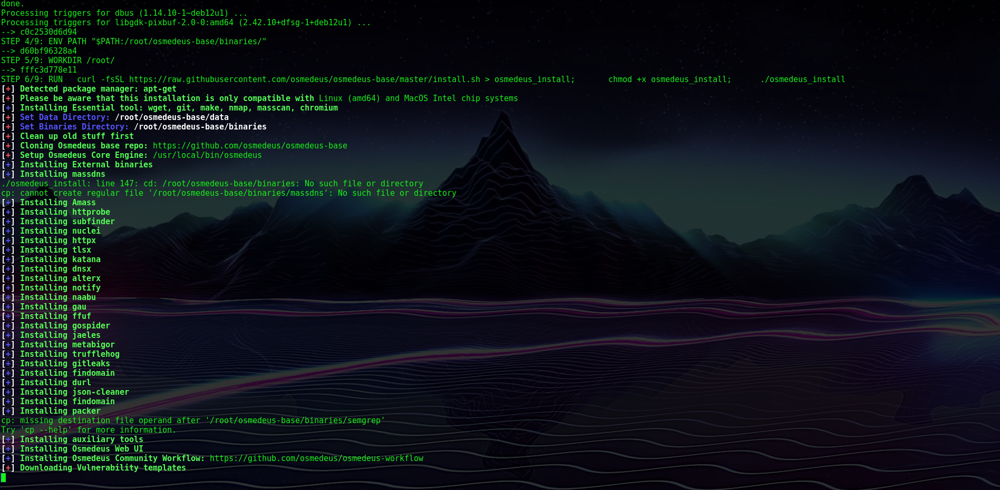
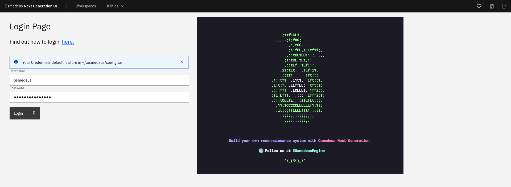

## osmedeus

Osmedeus is a Workflow Engine for Offensive Security. It was designed to build a foundation with the capability and flexibility that allows you to build your own reconnaissance system and run it on a large number of targets.

##

```sh
# build the image
podman build -t osmedeus .
```

##

<p align="center">
  
</p>

##

```sh
## Start the web server
podman run --rm -it --name osmedeus \
    -v ./osmws:/root/workspaces-osmedeus \
    -p 8000:8000 -d osmedeus server

## grepping for the password to logging in the webserver which is `https://localhost:8000/ui/`
podman exec -it osmedeus \
   grep password /root/.osmedeus/config.yaml | head -1
```

##

https://localhost:8000/ui/index.html

##

<p align="center">
  
</p>