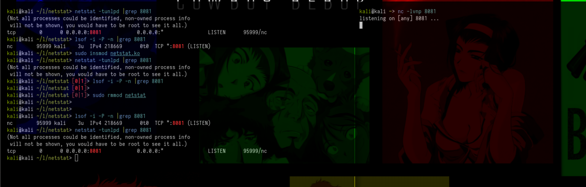

# **Hiding TCP connections from `netstat` and `lsof`**

For an attacker, it is very important to remain persistent and stealthy on a machine, post-compromise, for example, hiding its connections. In this post we will learn how to hide a port, for example 8081, from commands like `lsof` and `netstat`, for this we need to hook the `tcp4_seq_show()` and `tcp6_seq_show()` functions.

Basically when the system tries to list TCP connections, `tcp4_seq_show` or `tcp6_seq_show` are called, but with hooks, these calls are redirected to `hooked_tcp4_seq_show` or `hooked_tcp6_seq_show`, which check the connection port (stored in the sock structure); if the port is 8081, the function returns 0, hiding the connection, while for other ports the original functions are called, ensuring normal display of the TCP connection.

