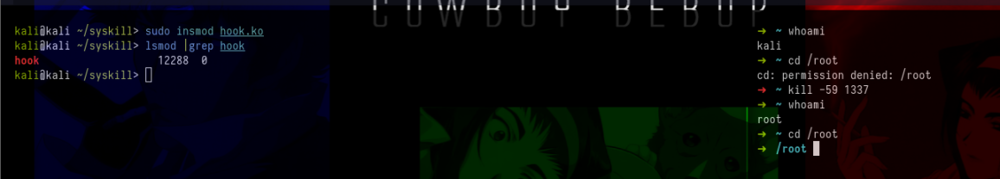

# **Becoming root by doing syscall hooking**

Assuming you are a normal user, without permission to access /root, among other files and directories in which you do not have permission, you can create an LKM that hooks the kill syscall `sys_kill`, so that every time you return to the machine with a user with the lowest possible privilege, you are root. (for this you would have to have root before, that is, load LKM as soon as you compromised the machine).

The C code above is very simple, it basically declares a pointer to the original kill syscall function, so that it can be called after the hook. It checks if the kill signal is 59, if so, it calls the `SpawnRoot` function which basically changes its current id to 0 i.e. root, otherwise the original kill syscall function is called.

