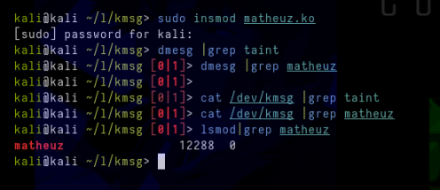
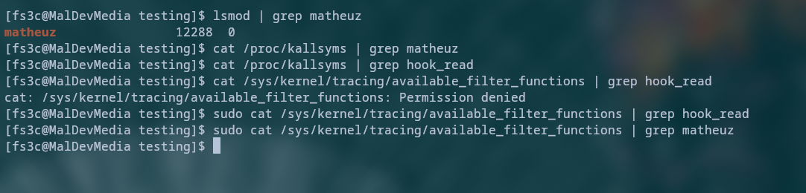

## Hiding taint message from `/dev/kmsg` and `dmesg`.

This LKM hooks the read sycall to hide messages containing the word "taint" from `/dev/kmsg` and "matheuz" including the entire line from `/proc/kallsyms`, preventing our hooks and tainted messages from being read by the user.

Remembering this is a simple poc/demo, btw that the `dmesg` command uses `/dev/kmsg`, so it will automatically hide to `dmesg` too.

## Hiding all of matheuz.ko functions from `/proc/kallsyms`.

`/proc/kallsyms` is a file that contains the symbol table and provides all of the available functions and variables. The matheuz.ko `hook_read` function looks into this file everytime a user tries to read this file and it will filter out all the output and its line with the content `matheuz` for this POC demo's purposes.

### Hiding `taint` from /dev/kmsg

### Hiding from `/proc/kallsyms`

### Example of hiding from `/sys/kernel/tracing/touched_functions`

### Example of a lkm that doesnt use the read hook to filter lines containg the module name in `touched_functions`

