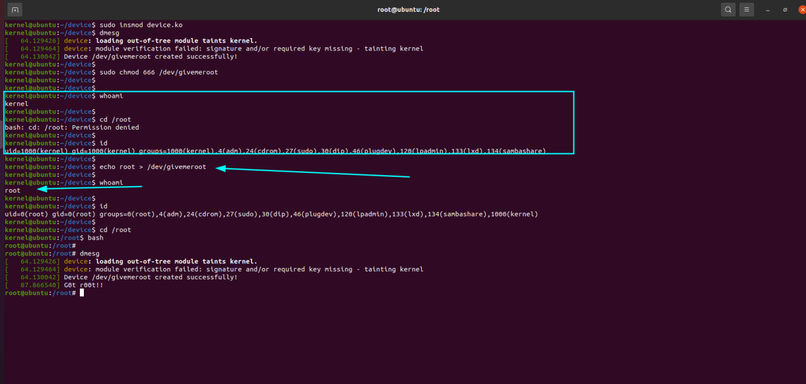

## **Creating a char device to set root for us**

NOTE: the test was done on `Ubuntu 20.04.6 LTS` on kernel `5.15.0-119-generic`, so this may not work on a newer kernel, for example 6.6x, but the idea and logic is the same.

The goal of this post is to create a simple device, which, when we do `echo root > /dev/givemeroot`, becomes root.

This can be used in  post-compromise, for example, you already got root, loaded this LKM and by accident lost root access, so since you loaded this LKM, you just need to have access to the machine again even with the lowest possible privilege and Simply use the mentioned command, and you will become root.

In short, this LKM (Loadable Kernel Module) creates a char device called `/dev/givemeroot`. The device allows users to write strings to it, and if the string is "root", the process that wrote to the device will have its credentials set to those of the root user. 

Btw, the device supports only the `write` operation, implemented via the `x_write` function, where the command is interpreted and actioned based on the input string.
