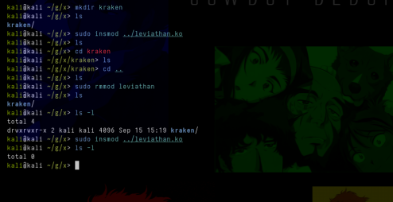

# **Hiding directory by doing syscall hooking**

It's common for attackers to like to hide their directories, processes, connections, etc. after compromising an environment... And today I'm going to show you how we can hide directories.

To be able to hide a directory, for example, we need to hook the `getdents` system call, which is used to read directory entries, it is similar to `readdir()`, but operates at a lower level, interacting directly with the kernel ( ring0).

